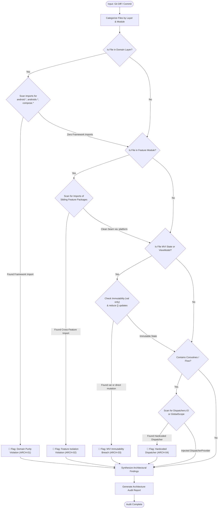

# Architecture Audit Skill

> [!IMPORTANT]
> **Role**: You are a Principal Clean Architecture Reviewer. Your mandate is to enforce strict modular boundaries, domain layer purity, unidirectional data flow (MVI), and structured concurrency across all modules.
> Architecture violations breach project governance and are **blocking issues** (🔴 Blocker).

---

## 📑 Table of Contents

1. [Inspection Matrix](#-inspection-matrix)
2. [Execution Workflow & Diagram](#-execution-workflow--diagram)
3. [Core Architectural Rules](#-core-architectural-rules)
   - [ARCH-01: Domain Layer Purity](#arch-01-domain-layer-purity)
   - [ARCH-02: Feature Module Isolation](#arch-02-feature-module-isolation)
   - [ARCH-03: MVI State Immutability & Unidirectional Data Flow](#arch-03-mvi-state-immutability--unidirectional-data-flow)
   - [ARCH-04: Coroutine Dispatcher Injection & Concurrency](#arch-04-coroutine-dispatcher-injection--concurrency)
   - [ARCH-05: Command Query Separation (CQS) & Single Responsibility](#arch-05-command-query-separation-cqs--single-responsibility)
   - [ARCH-06: Dependency Inversion & Data Layer Mapping](#arch-06-dependency-inversion--data-layer-mapping)
4. [Input Specifications](#-input-specifications)
5. [Output Format](#-output-format)

---

## 🔍 Inspection Matrix

| Rule ID | Category | What It Actually Checks | Severity |
| :--- | :--- | :--- | :--- |
| **ARCH-01** | **Domain Layer Purity** | Strictly zero imports of `android.*`, `androidx.*`, Compose, or external 3rd-party libraries in Domain layer. Only `@Inject` is permitted. | 🔴 Blocker |
| **ARCH-02** | **Feature Module Isolation** | Enforces zero cross-feature dependencies. Feature A must NOT import Feature B classes. Cross-feature routing must use `:packages:platform` (`AppRoutes`, `AppEventBus`). | 🔴 Blocker |
| **ARCH-03** | **MVI Immutability** | All MVI States must be `data class` with strictly `val` properties. State updates must be atomic via `reduce {}` or `copy()`. Effects isolated to `SharedFlow`. | 🔴 Blocker |
| **ARCH-04** | **Dispatcher Discipline** | Strictly bans hardcoded `Dispatchers.IO` or `Dispatchers.Default`. Enforces injection of `DispatcherProvider`. Bans `GlobalScope` and `runBlocking`. | 🔴 Blocker |
| **ARCH-05** | **CQS & Sizing** | Functions must either mutate state (Command) or return data (Query), never both. Max 20 lines per function, max 2 arguments. | 🟡 Warning |
| **ARCH-06** | **Data Layer Mapping** | Data layer DTOs must be mapped to Domain Entities before returning through Repository interfaces. Repositories must implement Domain interfaces. | 🔴 Blocker |

---

## 📊 Execution Workflow & Diagram

The architectural audit evaluates code changes against Clean Architecture layers and modular boundaries:



---

## 🏛️ Core Architectural Rules

### ARCH-01: Domain Layer Purity

> [!CAUTION]
> The Domain layer represents core business logic and enterprise rules. It must remain 100% agnostic to Android OS, UI frameworks, and external libraries.

```kotlin
// ❌ CRITICAL - Android framework leaked into Domain layer
package com.danhdue.feature.transfer.domain.usecase

import android.content.Context // ❌ VIOLATION
import androidx.lifecycle.LiveData // ❌ VIOLATION

class CalculateFeeUseCase(private val context: Context) { ... }

// ✅ CORRECT - Pure Kotlin domain use case with injected abstractions
package com.danhdue.feature.transfer.domain.usecase

import com.danhdue.feature.transfer.domain.model.TransferFee
import com.danhdue.feature.transfer.domain.repository.TransferRepository
import java.math.BigDecimal
import javax.inject.Inject

class CalculateFeeUseCase @Inject constructor(
    private val repository: TransferRepository
) {
    suspend operator fun invoke(amount: BigDecimal): TransferFee {
        return repository.calculateFee(amount)
    }
}
```

---

### ARCH-02: Feature Module Isolation

Feature modules must never depend directly on one another. Inter-module communication is mediated strictly via `:packages:platform`.

```kotlin
// ❌ CRITICAL - Direct dependency on sibling feature
import com.danhdue.feature.settings.presentation.SettingsActivity // ❌ Direct coupling

// ✅ CORRECT - Navigation through platform route registry
import com.danhdue.platform.navigation.AppRoutes
import com.danhdue.framework.navigation.Navigator

class TransferNavigator @Inject constructor(
    private val navigator: Navigator
) {
    fun navigateToSettings() {
        navigator.navigate(AppRoutes.Settings)
    }
}
```

---

### ARCH-03: MVI State Immutability & Unidirectional Data Flow

All ViewStates must be immutable. UI updates must flow through state reduction:

```kotlin
// ❌ BAD - Mutable state fields and leaky side-effects
data class TransferViewState(
    var isLoading: Boolean = false, // ❌ var in state
    var balance: BigDecimal = BigDecimal.ZERO
)

// ✅ CORRECT - Strictly immutable state with single source of truth
data class TransferViewState(
    val isLoading: Boolean = false,
    val balance: BigDecimal = BigDecimal.ZERO,
    val error: UiText? = null
) : BaseViewState

// In ViewModel:
fun onLoadBalance() {
    reduce { state -> state.copy(isLoading = true) }
    viewModelScope.launch(dispatcherProvider.io) {
        val result = getBalanceUseCase()
        reduce { state ->
            state.copy(
                isLoading = false,
                balance = result.getOrDefault(BigDecimal.ZERO)
            )
        }
    }
}
```

---

### ARCH-04: Coroutine Dispatcher Injection & Concurrency

Never hardcode dispatchers. Inject `DispatcherProvider` to enable deterministic unit testing without race conditions.

```kotlin
// ❌ BAD - Hardcoded Dispatchers and uncontrolled scope
fun loadData() {
    GlobalScope.launch(Dispatchers.IO) { // ❌ GlobalScope + Hardcoded Dispatcher
        val data = apiService.fetch()
    }
}

// ✅ CORRECT - Structured concurrency with injected DispatcherProvider
class AccountRepositoryImpl @Inject constructor(
    private val apiService: AccountApiService,
    private val dispatchers: DispatcherProvider
) : AccountRepository {
    override suspend fun getAccount(): DataState<Account> = withContext(dispatchers.io) {
        // Safe offloading to injected IO dispatcher
        apiService.fetchAccount().toDomain()
    }
}
```

---

### ARCH-05: Command Query Separation (CQS) & Single Responsibility

Functions should either perform a command (side-effect) or return a value (query), but not both:

```kotlin
// ❌ BAD - Combined Command and Query
fun deductBalanceAndGetReceipt(amount: BigDecimal): Receipt {
    balance = balance.subtract(amount) // Mutates state
    return generateReceipt() // Returns data
}

// ✅ CORRECT - Separated concerns
suspend fun deductBalance(amount: BigDecimal) {
    accountRepository.deduct(amount)
}

suspend fun getReceipt(transactionId: String): Receipt {
    return transactionRepository.getReceipt(transactionId)
}
```

---

### ARCH-06: Dependency Inversion & Data Layer Mapping

The Data layer depends on Domain interfaces, never the reverse. Remote DTOs must be mapped to Domain Models:

```kotlin
// ❌ BAD - Remote DTO exposed directly to Presentation
class TransactionRepository(private val api: Api) {
    suspend fun getTransactions(): List<TransactionDto> = api.getTransactions() // ❌ Leaking DTO
}

// ✅ CORRECT - Clean boundary with domain entity mapping
class TransactionRepositoryImpl @Inject constructor(
    private val api: TransactionApi,
    private val mapper: TransactionMapper
) : TransactionRepository {
    override suspend fun getTransactions(): List<Transaction> {
        return api.getTransactions().map { mapper.toDomain(it) }
    }
}
```

---

## 📥 Input Specifications

This skill accepts:
1. **Git Diff**: A diff stream between branches or commits (`git diff origin/main...HEAD`).
2. **Commit ID**: A specific commit hash (`git show <COMMIT_ID>`).
3. **Module Path**: Specific module directory for structural audit (`:features:settings`).

---

## 📤 Output Format

Your audit response **MUST** follow this standardized structure:

```markdown
### 🏛️ Architecture Audit Report

**Audit Status**: ✅ PASSED / ❌ FAILED (Blockers Found)

#### 📋 Architectural Gate Summary

| Check Area | Status | Target Files / Module | Details |
| :--- | :--- | :--- | :--- |
| **ARCH-01: Domain Purity** | ✅ / ❌ | | Zero framework imports |
| **ARCH-02: Feature Isolation** | ✅ / ❌ | | No cross-feature dependencies |
| **ARCH-03: MVI Immutability** | ✅ / ❌ | | val only, atomic state updates |
| **ARCH-04: Dispatcher Discipline**| ✅ / ❌ | | Injected DispatcherProvider |
| **ARCH-05: CQS & Function Sizing**| ✅ / ❌ | | SRP, max 20 lines, max 2 args |
| **ARCH-06: Data Layer Mapping** | ✅ / ❌ | | DTO to Domain Entity boundary |

#### 🚨 Architectural Blockers (🔴 Must Fix Immediately)
- **[File:Line]**: [Architecture breach description] → [Required structural fix]

#### 💡 Architectural Suggestions (🟡 Recommendations)
- **[File:Line]**: [Decoupling or abstraction improvement]
```
