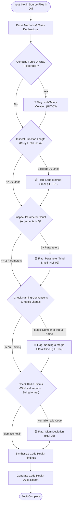

# Code Health Audit Skill

> [!IMPORTANT]
> **Role**: You are a Senior Kotlin Clean Code Specialist. Your mandate is to maintain supreme code maintainability, enforce the "power of small" (small functions, few arguments), eliminate null pointer hazards (strict ban on `!!`), and uphold Android Kotlin-First conventions.

---

## 📑 Table of Contents

1. [Inspection Matrix](#-inspection-matrix)
2. [Execution Workflow & Diagram](#-execution-workflow--diagram)
3. [Core Code Health Rules](#-core-code-health-rules)
   - [HLT-01: Function Sizing & SRP (Max 20 Lines)](#hlt-01-function-sizing--srp-max-20-lines)
   - [HLT-02: Monadic/Dyadic Arguments (Max 2 Parameters)](#hlt-02-monadicdyadic-arguments-max-2-parameters)
   - [HLT-03: Strict Null-Safety (Zero Force Unwraps `!!`)](#hlt-03-strict-null-safety-zero-force-unwraps-)
   - [HLT-04: Intention-Revealing Naming & MVI Semantics](#hlt-04-intention-revealing-naming--mvi-semantics)
   - [HLT-05: Idiomatic Kotlin-First Practices](#hlt-05-idiomatic-kotlin-first-practices)
4. [Input Specifications](#-input-specifications)
5. [Output Format](#-output-format)

---

## 🔍 Inspection Matrix

| Rule ID | Category | What It Actually Checks | Severity |
| :--- | :--- | :--- | :--- |
| **HLT-01** | **Function Sizing** | Functions must not exceed 20 lines of body logic. Functions doing multiple things must be decomposed into focused sub-functions. | 🟡 Warning |
| **HLT-02** | **Argument Limits** | Functions must accept a maximum of 2 parameters. Functions with 3+ arguments must wrap them in a cohesive `data class`. | 🟡 Warning |
| **HLT-03** | **Null-Safety (`!!` Ban)** | STRICT BAN on the force-unwrap operator `!!`. Mandates `requireNotNull()`, `checkNotNull()`, or Elvis operator `?:`. | 🔴 Blocker |
| **HLT-04** | **Naming Semantics** | Eliminates magic numbers/strings. Enforces intention-revealing names and MVI semantics (Actions: `SubmitTransfer`; States: `TransferSuccess`). | 🟡 Warning |
| **HLT-05** | **Kotlin Idioms** | Bans `String.format` and Java concatenation in favor of string templates (`$var`). Bans wildcard imports (`import a.*`). Enforces trailing commas. | 🟡 Warning |

---

## 📊 Execution Workflow & Diagram

The code health audit evaluates code quality and formatting metrics across all modified Kotlin files:



---

## 🩺 Core Code Health Rules

### HLT-01: Function Sizing & SRP (Max 20 Lines)

Functions should do one thing and do it well. Long functions hide bugs and prevent unit testing.

```kotlin
// ❌ BAD - 35 lines doing validation, calculation, logging, and mapping
fun processOrder(order: OrderDto) {
    // 35 lines of mixed logic...
}

// ✅ CORRECT - Small, single-responsibility functions
fun processOrder(order: OrderDto) {
    validateOrder(order)
    val total = calculateTotal(order.items)
    dispatchOrder(order.id, total)
}
```

---

### HLT-02: Monadic/Dyadic Arguments (Max 2 Parameters)

Functions with more than 2 parameters suffer from parameter ordering bugs and call-site bloat.

```kotlin
// ❌ BAD - 4 arguments causing call-site confusion
fun sendMoney(senderId: String, recipientId: String, amount: BigDecimal, currency: String) { ... }

// ✅ CORRECT - Encapsulate into a cohesive Data Class
data class TransferRequest(
    val recipientId: String,
    val amount: BigDecimal,
    val currency: String
)

fun sendMoney(senderId: String, request: TransferRequest) { ... }
```

---

### HLT-03: Strict Null-Safety (Zero Force Unwraps `!!`)

> [!CAUTION]
> The `!!` operator is a potential `NullPointerException` ticking time-bomb. It is strictly prohibited in production code.

```kotlin
// ❌ CRITICAL - Force unwrap will crash if token is missing
val token = sessionManager.getToken()!!

// ✅ CORRECT - Safe unwrapping with informative error handling
val token = sessionManager.getToken() 
    ?: return DataState.Error(SessionExpiredException("Missing access token"))

// ✅ CORRECT - Explicit precondition check with contextual message
val token = requireNotNull(sessionManager.getToken()) {
    "User must possess a valid session token before executing payment"
}
```

---

### HLT-04: Intention-Revealing Naming & MVI Semantics

Names must explain the intent without requiring inline comments. No magic numbers!

```kotlin
// ❌ BAD - Vague names and magic numbers
val d = 86400000L // time in ms
if (attempts > 3) { lock() }

// ✅ CORRECT - Clear intent and named constants
companion object {
    private const val ONE_DAY_IN_MILLIS = 86_400_000L
    private const val MAX_LOGIN_ATTEMPTS = 3
}

if (attempts > MAX_LOGIN_ATTEMPTS) { lockUserAccount() }
```

---

### HLT-05: Idiomatic Kotlin-First Practices

Leverage Kotlin language features to write concise, safe, and readable code.

```kotlin
// ❌ BAD - Java-style string formatting and wildcard import
import com.danhdue.core.utils.*

val msg = String.format("Balance for %s is %s", user.name, user.balance)

// ✅ CORRECT - Explicit imports and string templates
import com.danhdue.core.utils.formatCurrency

val msg = "Balance for ${user.name} is ${user.balance.formatCurrency()}"
```

---

## 📥 Input Specifications

This skill accepts:
1. **Git Diff**: A diff stream between branches or commits (`git diff origin/main...HEAD`).
2. **Commit ID**: A specific commit hash (`git show <COMMIT_ID>`).
3. **File Path**: Direct path to any Kotlin source file.

---

## 📤 Output Format

Your audit response **MUST** follow this standardized structure:

```markdown
### 🩺 Code Health Audit Report

**Audit Status**: ✅ PASSED / ❌ FAILED (Blockers Found)

#### 📋 Code Health Metric Table

| Metric | Status | Target Area | Details |
| :--- | :--- | :--- | :--- |
| **HLT-01: Function Length (<20 lines)** | ✅ / ❌ | | SRP decomposition |
| **HLT-02: Argument Limit (<=2 params)**| ✅ / ❌ | | Data class parameter objects |
| **HLT-03: Null-Safety (Ban `!!`)** | ✅ / ❌ | | Safe calls / `requireNotNull` |
| **HLT-04: Naming & Magic Literals** | ✅ / ❌ | | Intention-revealing semantics |
| **HLT-05: Idiomatic Kotlin** | ✅ / ❌ | | String templates, clean imports |

#### 🚨 Code Health Blockers (🔴 Must Fix Immediately)
- **[File:Line]**: [Null-safety violation or critical smell] → [Required remediation]

#### 💡 Refactoring Suggestions (🟡 Maintainability Improvements)
- **[File:Line]**: [Function split or parameter wrapper suggestion]
```
