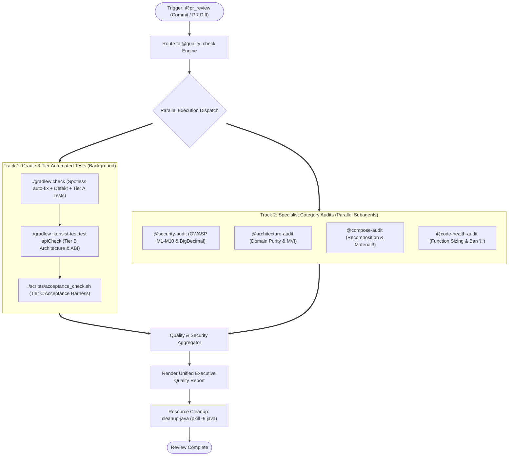

# Pull Request Review Skill

> [!IMPORTANT]
> **Unified Architecture**: PR Review is powered by the Central Orchestrator **[`@quality_check`](file:///Users/danhdueexoictif/AllProjects/digital_wallet/android_digital_wallet/.agents/skills/quality_check/SKILL.md)**.
> It combines the automated **3-Tier Testing Standard** (JUnit, Konsist, BCV, Detekt, Spotless, Acceptance Harness) with the **4 Specialized Category Audit Skills** executed in parallel.

---

## 📑 Table of Contents

1. [Inspection Matrix & Category Audit Delegation](#-inspection-matrix--category-audit-delegation)
2. [PR Review Lifecycle Diagram](#-pr-review-lifecycle-diagram)
3. [Input Methods](#-input-methods)
4. [Review Workflow](#-review-workflow)
5. [Unified Executive Quality Report Format](#-unified-executive-quality-report-format)

---

## 🔍 Inspection Matrix & Category Audit Delegation

PR review delegates semantic code inspection to 4 focused specialist skills while concurrently validating the Gradle 3-Tier suite:

| Inspection Pillar | Delegated Skill | Core Focus Areas | Severity |
| :--- | :--- | :--- | :--- |
| **Fintech & Security** | **[`@security-audit`](file:///Users/danhdueexoictif/AllProjects/digital_wallet/android_digital_wallet/.agents/skills/security-audit/SKILL.md)** | OWASP Mobile Top 10 (2024), strictly `BigDecimal` for currency, no PII logging, Keystore/`SecureCacheStore`, TLS/Cert pinning. | 🔴 Blocker |
| **Clean Architecture** | **[`@architecture-audit`](file:///Users/danhdueexoictif/AllProjects/digital_wallet/android_digital_wallet/.agents/skills/architecture-audit/SKILL.md)** | Domain layer purity (zero framework imports), feature module isolation, MVI state immutability (`val` only), injected dispatchers. | 🔴 Blocker |
| **Compose & UI** | **[`@compose-audit`](file:///Users/danhdueexoictif/AllProjects/digital_wallet/android_digital_wallet/.agents/skills/compose-audit/SKILL.md)** | Recomposition stability, `@Immutable`/`@Stable`, state hoisting (stateless content), side-effect key hygiene, Material3 tokens. | 🔴 Blocker / 🟡 Warning |
| **Code Health & Safety** | **[`@code-health-audit`](file:///Users/danhdueexoictif/AllProjects/digital_wallet/android_digital_wallet/.agents/skills/code-health-audit/SKILL.md)** | Function sizing (<20 lines), argument limits (<=2 params), strict ban on `!!`, intention-revealing naming, Kotlin idioms. | 🔴 Blocker / 🟡 Warning |
| **Automated 3-Tier Gates** | **[`@quality_check`](file:///Users/danhdueexoictif/AllProjects/digital_wallet/android_digital_wallet/.agents/skills/quality_check/SKILL.md)** | Tier A (Unit Tests), Tier B (Konsist AST, BCV ABI, Detekt, Spotless), Tier C (Acceptance & DFM split packaging). | 🔴 Blocker |

---

## 📊 PR Review Lifecycle Diagram



---

## 📥 Input Methods

PR Review supports multiple input channels:

| Input Type | Description | Command / Usage |
| :--- | :--- | :--- |
| **Working Diff** | Review staged or uncommitted local changes | `@pr_review` (analyzes current `git diff`) |
| **Commit ID** | Review changes introduced by a specific commit | `git show <COMMIT_ID>` or `@pr_review commit=<COMMIT_ID>` |
| **PR Number / Diff** | Review Pull Request changes via GitHub CLI | `gh pr diff <PR_NUMBER> \| pbcopy` |
| **Branch Range** | Review changes against the base branch | `git diff origin/main...HEAD` |

---

## 🔄 Review Workflow

1. **Invoke Quality Orchestration**:
   - Run the automated 3-Tier suite in the background:
     ```bash
     ./gradlew check :konsist-test:test apiCheck
     ```
   - Concurrently inspect the diff with the 4 Category Audit skills via `dispatching-parallel-agents`:
     - `@security-audit`
     - `@architecture-audit`
     - `@compose-audit`
     - `@code-health-audit`
2. **Run Acceptance Verification (Tier C)**:
   - For all PRs targeting `main` or release branches:
     ```bash
     ./scripts/acceptance_check.sh
     ```
3. **Synthesize & Report**:
   - Aggregate test status, OWASP compliance, architectural gates, and code health metrics.
   - Assign clear verdict: 🟢 LGTM / 🟡 NEEDS WORK / 🔴 BLOCKED.
4. **Mandatory Cleanup**:
   - Stop background Gradle daemons:
     ```bash
     cleanup-java
     # Or directly: pkill -9 java
     ```

---

## 📤 Unified Executive Quality Report Format

Refer to **[`@quality_check` Output Format](file:///Users/danhdueexoictif/AllProjects/digital_wallet/android_digital_wallet/.agents/skills/quality_check/SKILL.md#-unified-executive-quality-report-format)** for the comprehensive report structure required for all Pull Request reviews.
