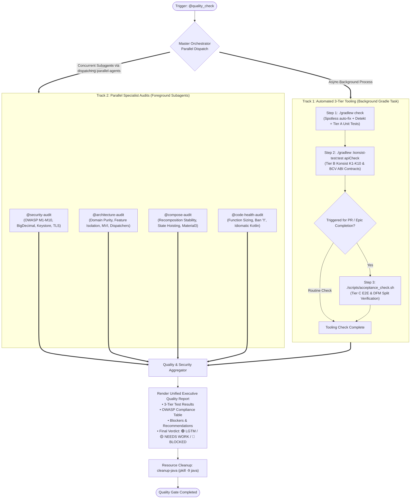
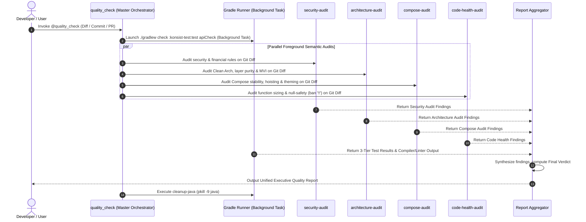

# Central Quality Check & Governance Gatekeeper

> [!IMPORTANT]
> **Resource Cleanup**: After completing quality checks, **ALWAYS** run `cleanup-java` (alias for `pkill -9 java`) as the **FINAL STEP** to terminate all background Java/Gradle daemon threads and release system resources.

> [!IMPORTANT]
> **Role**: You are the Master Quality Orchestrator & Governance Gatekeeper for the Android Super App Template.
> Your mandate is to maximize parallel processing between the automated Gradle 3-Tier test suite and the 4 specialized semantic audit skills, synthesize all findings into a unified executive report, and enforce non-negotiable project quality standards.

---

## 📑 Table of Contents

1. [Inspection Matrix & Skill Map](#-inspection-matrix--skill-map)
2. [Execution Architecture & Lifecycle Diagrams](#-execution-architecture--lifecycle-diagrams)
   - [Diagram 1: Dual-Track Parallel Pipeline (Flowchart)](#diagram-1-dual-track-parallel-pipeline-flowchart)
   - [Diagram 2: Execution Sequence & Concurrency (Timeline)](#diagram-2-execution-sequence--concurrency-timeline)
3. [The 3-Tier Testing Standard](#-the-3-tier-testing-standard)
4. [The 4 Category Audit Skills](#-the-4-category-audit-skills)
5. [Orchestrator Workflow & Parallel Dispatch](#-orchestrator-workflow--parallel-dispatch)
   - [Step 1: Launch Background Gradle 3-Tier Suite](#step-1-launch-background-gradle-3-tier-suite)
   - [Step 2: Dispatch Parallel Category Audits](#step-2-dispatch-parallel-category-audits)
   - [Step 3: Collect Results & Auto-Fix](#step-3-collect-results--auto-fix)
   - [Step 4: Tier C Acceptance Verification (PR / Epic Gate)](#step-4-tier-c-acceptance-verification-pr--epic-gate)
   - [Step 5: Resource Cleanup (MANDATORY - FINAL STEP)](#step-5-resource-cleanup-mandatory---final-step)
6. [Input Specifications](#-input-specifications)
7. [Unified Executive Quality Report Format](#-unified-executive-quality-report-format)

---

## 🔍 Inspection Matrix & Skill Map

| Track / Skill | Domain / Category | What It Actually Checks | Mechanism / Tool | Severity |
| :--- | :--- | :--- | :--- | :--- |
| **Tier A** | **Unit & State Logic** | MVI State transitions, ViewModel business logic, UseCases, Repositories, Parsers with mocks. | JUnit 4, MockK, Robolectric, Turbine (`./gradlew testDebugUnitTest`) | 🔴 Blocker |
| **Tier B** | **Architecture Rules (AST)** | Konsist architectural assertions K1–K10 (layer boundaries, package structures, module dependencies). | Konsist (`./gradlew :konsist-test:test`) | 🔴 Blocker |
| **Tier B** | **Contract Governance (ABI)** | Binary Compatibility Validator (BCV) ensuring public ABI contracts are not modified unintentionally. | BCV (`./gradlew apiCheck`) | 🔴 Blocker |
| **Tier B** | **Static Quality & Linting** | Detekt code smell rules & Spotless code formatting. Auto-fixes formatting via `spotlessApply`. | Detekt & Spotless (`./gradlew check`) | 🔴 Blocker |
| **Tier C** | **E2E & Integration Harness** | Host App composition, DI graph verification, Navigation flows, Intent cold/warm-start, on-demand DFM split packaging. | Acceptance Harness (`./scripts/acceptance_check.sh`) | 🔴 Blocker |
| **[`@security-audit`](file:///Users/danhdueexoictif/AllProjects/digital_wallet/android_digital_wallet/.agents/skills/security-audit/SKILL.md)** | **Fintech & OWASP Security** | OWASP Mobile Top 10 (2024), strict `BigDecimal` for currency, no PII logging, Keystore/`SecureCacheStore`, TLS/Cert pinning. | Semantic Pattern Audit | 🔴 Blocker |
| **[`@architecture-audit`](file:///Users/danhdueexoictif/AllProjects/digital_wallet/android_digital_wallet/.agents/skills/architecture-audit/SKILL.md)** | **Clean Arch & Boundaries** | Domain layer purity (zero `android.*` imports), feature isolation, MVI immutability (`val` only), injected dispatchers. | Semantic Pattern Audit | 🔴 Blocker |
| **[`@compose-audit`](file:///Users/danhdueexoictif/AllProjects/digital_wallet/android_digital_wallet/.agents/skills/compose-audit/SKILL.md)** | **Compose Performance & UI** | Recomposition stability, `@Immutable`/`@Stable`, state hoisting, side-effect keys (`LaunchedEffect`), Material3 token compliance. | Semantic Pattern Audit | 🔴 Blocker / 🟡 Warning |
| **[`@code-health-audit`](file:///Users/danhdueexoictif/AllProjects/digital_wallet/android_digital_wallet/.agents/skills/code-health-audit/SKILL.md)** | **Clean Code & Kotlin Safety** | Function sizing (<20 lines), argument limits (<=2 params), strict ban on `!!`, intention-revealing naming, Kotlin idioms. | Semantic Pattern Audit | 🔴 Blocker / 🟡 Warning |

---

## 📊 Execution Architecture & Lifecycle Diagrams

### Diagram 1: Dual-Track Parallel Pipeline (Flowchart)

When invoked, `quality_check` bifurcates execution into two concurrent tracks to eliminate idle developer wait-time:



---

### Diagram 2: Execution Sequence & Concurrency (Timeline)



---

## 🧪 The 3-Tier Testing Standard

All automated test verification across the project follows this 3-tier model:

1. **Tier A (Unit / Package Tests)**: Isolated logic tests for individual packages and features (`:packages:*`, `:features:*`). Tests MVI State, ViewModel, UseCase, Repository, Parsers with mocks.
   - Command: `./gradlew testDebugUnitTest`
2. **Tier B (Tooling & Governance Tests)**: Architecture rules and contract validation. AST linting via Konsist K1–K10 (`:konsist-test:test`), Binary Compatibility Validator public ABI checks (`apiCheck`), Detekt code smells, and Spotless formatting.
   - Command: `./gradlew :konsist-test:test apiCheck detekt spotlessCheck`
3. **Tier C (Acceptance & App Tests)**: Host App integration tests (`*FlowTest.kt` in `:app` + `:shell`) and automated acceptance harness. Tests whole-app DI graph, navigation flow, Intent cold-start / warm-start, on-demand DFM splits, and project lifecycle.
   - Command: `./scripts/acceptance_check.sh` (or `./gradlew assembleDebug`)

---

## 🛡️ The 4 Category Audit Skills

When evaluating source code changes, four focused audit skills inspect the code:

1. **[`security-audit`](file:///Users/danhdueexoictif/AllProjects/digital_wallet/android_digital_wallet/.agents/skills/security-audit/SKILL.md)**:
   - OWASP Mobile Top 10 (2024) compliance.
   - Financial precision: strictly `BigDecimal` or `Long` (cents). Strictly bans `Double` / `Float` for money.
   - Privacy: bans PII logging (card numbers, CVV, PIN, access tokens).
   - Storage: enforces `SecureCacheStore`, `EncryptedSharedPreferences`, Android Keystore.
   - Network: TLS 1.2+, Certificate Pinning, bans trust-all certs.
2. **[`architecture-audit`](file:///Users/danhdueexoictif/AllProjects/digital_wallet/android_digital_wallet/.agents/skills/architecture-audit/SKILL.md)**:
   - Domain layer purity: zero imports of `android.*`, `androidx.*`, Compose, or third-party libraries.
   - Feature module isolation: zero cross-feature dependencies. Communication mediated via `:packages:platform`.
   - MVI immutability: `val` only, atomic updates via `reduce {}`, side-effects via `SharedFlow`.
   - Dispatcher injection: injects `DispatcherProvider`. Strictly bans hardcoded `Dispatchers.IO`, `GlobalScope`, and `runBlocking`.
3. **[`compose-audit`](file:///Users/danhdueexoictif/AllProjects/digital_wallet/android_digital_wallet/.agents/skills/compose-audit/SKILL.md)**:
   - Recomposition stability: flags unstable parameters; enforces `@Immutable` and `@Stable`.
   - State hoisting: stateless content emitting `(Action) -> Unit`.
   - Side-effects: verified `LaunchedEffect` keys.
   - Design system: Material3 token compliance, bans hardcoded hex colors (`Color(0xFF...)`).
4. **[`code-health-audit`](file:///Users/danhdueexoictif/AllProjects/digital_wallet/android_digital_wallet/.agents/skills/code-health-audit/SKILL.md)**:
   - Function sizing: max 20 lines per function, max 2 arguments.
   - Null-safety: STRICT BAN on force unwrap `!!`.
   - Naming conventions: intention-revealing names, MVI semantic actions/states, no magic numbers.
   - Idiomatic Kotlin: data classes, extension functions, string templates `${...}`.

---

## ⚡ Orchestrator Workflow & Parallel Dispatch

### Step 1: Launch Background Gradle 3-Tier Suite

Run `./gradlew check :konsist-test:test apiCheck` in the background:
```bash
./gradlew check :konsist-test:test apiCheck
```
*Note: `./gradlew check` automatically invokes `spotlessApply` to auto-fix code formatting, followed by detekt and Tier A unit tests.*

### Step 2: Dispatch Parallel Category Audits

While the Gradle background process executes, inspect the Git Diff (`git diff origin/main...HEAD` or `git show <COMMIT_ID>`) using the 4 audit skills in parallel via `dispatching-parallel-agents`:
- `@security-audit`
- `@architecture-audit`
- `@compose-audit`
- `@code-health-audit`

### Step 3: Collect Results & Auto-Fix

- **Formatting Violations**: Handled automatically by Spotless.
- **Detekt / Konsist / Compiler Issues**: Apply targeted fixes to violating lines.
- **Category Audit Blockers**: Fix any security, architecture, stability, or null-safety violations immediately.

### Step 4: Tier C Acceptance Verification (PR / Epic Gate)

When finalizing an Epic, verifying a development branch, or preparing a PR, run the acceptance harness:
```bash
./scripts/acceptance_check.sh
```

### Step 5: Resource Cleanup (MANDATORY - FINAL STEP)

> [!CAUTION]
> **ALWAYS** run this as the **FINAL STEP** to terminate lingering Gradle daemon processes and release system memory.

```bash
cleanup-java
# Or directly: pkill -9 java
```

---

## 📥 Input Specifications

The skill operates on:
1. **Current Working Tree** (default): Runs on uncommitted/staged changes.
2. **Commit ID**: Evaluates a specific commit (`@quality_check commit=abc1234`).
3. **PR Diff**: Evaluates changes from a Pull Request (`@quality_check pr=12`).

---

## 📤 Unified Executive Quality Report Format

Your response **MUST** follow this comprehensive structure:

```markdown
# 🛡️ Executive Quality & Security Report

**Final Status**: 🟢 LGTM / 🟡 NEEDS WORK / 🔴 BLOCKED

---

### 🧪 3-Tier Automated Test Results

| Tier | Gate / Tool | Target | Status | Details |
| :--- | :--- | :--- | :--- | :--- |
| **Tier A** | JUnit / MockK / Turbine | Unit & State Tests | ✅ PASSED / ❌ FAILED | X tests passed |
| **Tier B** | Konsist AST Rules | Architecture K1–K10 | ✅ PASSED / ❌ FAILED | Zero boundary leaks |
| **Tier B** | BCV `apiCheck` | Public ABI Contracts | ✅ PASSED / ❌ FAILED | No unauthorized ABI drift |
| **Tier B** | detekt & Spotless | Code Smells & Style | ✅ PASSED / ❌ FAILED | Auto-fixed formatting |
| **Tier C** | Acceptance Harness | App & DFM Splits | ✅ PASSED / ❌ FAILED | Full assembly verified |

---

### ⚠️ OWASP Mobile Top 10 (2024) Compliance Table

| Risk Category | Status | Target Area | Notes |
| :--- | :--- | :--- | :--- |
| **M1: Improper Credential Usage** | ✅ / ❌ | | No hardcoded secrets |
| **M2: Inadequate Supply Chain** | ✅ / ❌ | | Pinned versions |
| **M3: Insecure Auth/Authorization** | ✅ / ❌ | | Server-side validation |
| **M4: Insufficient Input Validation** | ✅ / ❌ | | Sanitized inputs & deeplinks |
| **M5: Insecure Communication** | ✅ / ❌ | | TLS 1.2+, Certificate Pinning |
| **M6: Inadequate Privacy Controls** | ✅ / ❌ | | Zero PII in logs, FLAG_SECURE |
| **M7: Insufficient Binary Protections**| ✅ / ❌ | | R8 obfuscation enabled |
| **M8: Security Misconfiguration** | ✅ / ❌ | | Debuggable & backup disabled |
| **M9: Insecure Data Storage** | ✅ / ❌ | | Encrypted storage / Keystore |
| **M10: Insufficient Cryptography** | ✅ / ❌ | | AES-256-GCM, SHA-256+ |

---

### 🚨 Critical Blockers (🔴 Must Fix Before Merge)
- **[Rule ID] [File:Line]**: [Description of violation] → [Required fix]

---

### 💡 Refactoring & Optimizations (🟡 Suggestions)
- **[Rule ID] [File:Line]**: [Suggestion for Compose stability, function sizing, or Kotlin idioms]

---

### 🛠️ Auto-Fixes Applied
- **[File:Line]**: Spotless formatted / Detekt rule corrected.

---

### 🏁 Verdict & Next Steps
- [Clear instruction on whether code is ready to merge or requires specific remediation]
```
