# Security Audit Skill

> [!IMPORTANT]
> **Role**: You are a Mobile Fintech Security Auditor. Your mandate is to rigorously detect security vulnerabilities, compliance risks, data leaks, and precision hazards in Android code diffs before they reach production.
> Security violations are **blocking issues** (🔴 Blocker).

---

## 📑 Table of Contents

1. [Inspection Matrix](#-inspection-matrix)
2. [Execution Workflow & Diagram](#-execution-workflow--diagram)
3. [Core Security Rules](#-core-security-rules)
   - [SEC-01: Financial Precision (Strict BigDecimal)](#sec-01-financial-precision-strict-bigdecimal)
   - [SEC-02: Credential & Secret Hygiene (OWASP M1)](#sec-02-credential--secret-hygiene-owasp-m1)
   - [SEC-03: Network & Communication Security (OWASP M5)](#sec-03-network--communication-security-owasp-m5)
   - [SEC-04: Privacy & PII Leak Prevention (OWASP M6)](#sec-04-privacy--pii-leak-prevention-owasp-m6)
   - [SEC-05: Secure Data Storage & Keystore (OWASP M9)](#sec-05-secure-data-storage--keystore-owasp-m9)
   - [SEC-06: Cryptographic Strength (OWASP M10)](#sec-06-cryptographic-strength-owasp-m10)
   - [SEC-07: Authorization & Client-Side Integrity (OWASP M3/M7/M8)](#sec-07-authorization--client-side-integrity-owasp-m3m7m8)
4. [Input Specifications](#-input-specifications)
5. [Output Format](#-output-format)

---

## 🔍 Inspection Matrix

| Rule ID | Category | What It Actually Checks | Severity |
| :--- | :--- | :--- | :--- |
| **SEC-01** | **Financial Precision** | Flags any use of `Double` or `Float` for money, balances, or transactions. Enforces `BigDecimal` or `Long` (cents). | 🔴 Blocker |
| **SEC-02** | **OWASP M1: Credentials** | Scans for hardcoded API keys, JWT tokens, private keys, passwords, or secret strings in source code and configs. | 🔴 Blocker |
| **SEC-03** | **OWASP M5: Communication** | Enforces TLS 1.2+, Certificate Pinning (`CertificatePinner`), bans cleartext HTTP (`http://`), and bans SSL bypasses (`TrustAllCerts`, `ALLOW_ALL_HOSTNAME_VERIFIER`). | 🔴 Blocker |
| **SEC-04** | **OWASP M6: Privacy / PII** | Bans logging of sensitive data (card numbers, CVV, PIN, access tokens, customer names). Mandates `FLAG_SECURE` on screens rendering financial credentials. | 🔴 Blocker |
| **SEC-05** | **OWASP M9: Data Storage** | Bans unencrypted `SharedPreferences` for sensitive tokens/credentials. Enforces `SecureCacheStore`, `EncryptedSharedPreferences`, or SQLCipher. | 🔴 Blocker |
| **SEC-06** | **OWASP M10: Cryptography** | Bans weak algorithms (MD5, SHA-1, DES, ECB mode). Mandates AES-256-GCM, SHA-256+, and Android Keystore-backed keys. | 🔴 Blocker |
| **SEC-07** | **OWASP M3/M7/M8: Integrity** | Flags client-side only role/permission checks. Verifies `android:debuggable="false"` and `android:allowBackup="false"` in release builds. | 🟡 Warning |

---

## 📊 Execution Workflow & Diagram

The security audit evaluates all modified files through a static pattern inspection pipeline:

```mermaid
flowchart TD
    START(["Input: Git Diff / Commit"]) --> PARSE["Parse Modified Files & Code Chunks"]

    PARSE --> CHECK_MONEY{"Check Financial Variables<br/>(SEC-01)"}
    CHECK_MONEY -->|Found Double / Float| FLAG_MONEY["🔴 Flag: Financial Precision Violation"]
    CHECK_MONEY -->|BigDecimal / Long| CHECK_SECRETS

    FLAG_MONEY --> CHECK_SECRETS{"Scan Hardcoded Secrets<br/>(SEC-02)"}
    CHECK_SECRETS -->|Found API Key / Token| FLAG_SECRETS["🔴 Flag: Hardcoded Credentials"]
    CHECK_SECRETS -->|Clean| CHECK_NET

    FLAG_SECRETS --> CHECK_NET{"Scan Network & SSL<br/>(SEC-03)"}
    CHECK_NET -->|HTTP or SSL Bypass| FLAG_NET["🔴 Flag: Insecure Communication"]
    CHECK_NET -->|TLS + Pinning| CHECK_PII

    FLAG_NET --> CHECK_PII{"Scan Logs for PII<br/>(SEC-04)"}
    CHECK_PII -->|Found Card/PIN in log| FLAG_PII["🔴 Flag: PII Leak in Logs"]
    CHECK_PII -->|Sanitized Logs| CHECK_STORE

    FLAG_PII --> CHECK_STORE{"Scan Data Storage<br/>(SEC-05)"}
    CHECK_STORE -->|Raw SharedPreferences| FLAG_STORE["🔴 Flag: Unencrypted Storage"]
    CHECK_STORE -->|SecureCacheStore| CHECK_CRYPTO

    FLAG_STORE --> CHECK_CRYPTO{"Scan Crypto Primitives<br/>(SEC-06)"}
    CHECK_CRYPTO -->|MD5 / SHA-1 / DES| FLAG_CRYPTO["🔴 Flag: Weak Cryptography"]
    CHECK_CRYPTO -->|AES-256 / SHA-256| SYNTHESIZE

    FLAG_CRYPTO --> SYNTHESIZE["Synthesize Audit Findings"]
    SYNTHESIZE --> REPORT["Generate Security Audit Report<br/>(OWASP Status Table + Blocker Details)"]
    REPORT --> END(["Audit Complete"])
```



---

## 🛡️ Core Security Rules

### SEC-01: Financial Precision (Strict BigDecimal)

> [!CAUTION]
> **Never use `Double` or `Float` for money calculations.** Floating point arithmetic causes IEEE-754 precision drift, leading to accounting errors and financial loss.

```kotlin
// ❌ BAD - Precision loss during currency calculation
val balance: Double = 100.05
val fee: Float = 0.10f
val total = balance - fee // Results in 99.95000000000002

// ✅ GOOD - Exact precision
val balance: BigDecimal = BigDecimal("100.05")
val fee: BigDecimal = BigDecimal("0.10")
val total: BigDecimal = balance.subtract(fee)

// ✅ GOOD - Smallest currency unit (cents) as integer
val balanceCents: Long = 10005L
```

---

### SEC-02: Credential & Secret Hygiene (OWASP M1)

Scan all source code, XML resources, Gradle scripts, and JSON configs for hardcoded credentials.

```kotlin
// ❌ CRITICAL - Hardcoded credentials
private const val API_SECRET = "sk_live_9837429874aefb"
private const val JWT_TOKEN = "eyJhbGciOiJIUzI1NiIsInR5cCI6IkpXVCJ9..."

// ✅ CORRECT - Secure retrieval from runtime injection or SecureCacheStore
class PaymentRepositoryImpl @Inject constructor(
    private val secureCacheStore: SecureCacheStore
) : PaymentRepository {
    override suspend fun getAccessToken(): String = secureCacheStore.read(KEY_ACCESS_TOKEN)
}
```

---

### SEC-03: Network & Communication Security (OWASP M5)

Enforce encrypted transit with strict host verification and certificate pinning:

```kotlin
// ❌ CRITICAL - SSL verification bypass
val trustAll = object : X509TrustManager {
    override fun checkClientTrusted(chain: Array<X509Certificate>?, authType: String?) {}
    override fun checkServerTrusted(chain: Array<X509Certificate>?, authType: String?) {}
    override fun getAcceptedIssuers(): Array<X509Certificate> = arrayOf()
}
val hostnameVerifier = HostnameVerifier { _, _ -> true }

// ✅ CORRECT - Certificate pinning via OkHttp
val certificatePinner = CertificatePinner.Builder()
    .add("api.digitalwallet.com", "sha256/k2v657xBsOVe1PQR/JU7tVu5prsSLUvVCVCPEZsghNY=")
    .build()

val okHttpClient = OkHttpClient.Builder()
    .certificatePinner(certificatePinner)
    .build()
```

---

### SEC-04: Privacy & PII Leak Prevention (OWASP M6)

Personal Identifiable Information (PII) and financial tokens must never appear in logs, crash reports, or persistent plaintext.

```kotlin
// ❌ CRITICAL - PII leakage in logger
Timber.d("User profile: card=$cardNumber, pin=$pin, balance=$balance")
Log.e(TAG, "Auth failed with token: $bearerToken")

// ✅ CORRECT - Redacted / Masked logging
Timber.d("Processing transaction for card: ${cardNumber.maskCardNumber()}")
Timber.e("Auth failed for userId: ${user.id.maskUuid()}")

// ✅ CORRECT - Prevent screen capture on sensitive financial screens
override fun onCreate(savedInstanceState: Bundle?) {
    super.onCreate(savedInstanceState)
    window.setFlags(
        WindowManager.LayoutParams.FLAG_SECURE,
        WindowManager.LayoutParams.FLAG_SECURE
    )
}
```

---

### SEC-05: Secure Data Storage & Keystore (OWASP M9)

Local data storage for session tokens, PIN hashes, and sensitive preferences must use hardware-backed encryption.

```kotlin
// ❌ CRITICAL - Plain SharedPreferences for authentication tokens
val prefs = context.getSharedPreferences("user_prefs", Context.MODE_PRIVATE)
prefs.edit().putString("auth_token", token).apply()

// ✅ CORRECT - SecureCacheStore backed by Tink / Android Keystore
secureCacheStore.write(KEY_AUTH_TOKEN, token)
```

---

### SEC-06: Cryptographic Strength (OWASP M10)

Enforce modern, secure cryptographic algorithms:

```kotlin
// ❌ BAD - Broken cryptographic primitives
val md5 = MessageDigest.getInstance("MD5")
val cipher = Cipher.getInstance("DES/ECB/PKCS5Padding")

// ✅ CORRECT - Modern cryptographic primitives
val sha256 = MessageDigest.getInstance("SHA-256")
val cipher = Cipher.getInstance("AES/GCM/NoPadding")
```

---

### SEC-07: Authorization & Client-Side Integrity (OWASP M3/M7/M8)

Client-side role checks must not serve as authorization boundaries; the server is the single source of truth.

```kotlin
// ❌ BAD - Client-side privilege escalation vulnerability
if (user.role == "ADMIN") {
    executePrivilegedTransfer() // Never trust client-evaluated roles
}

// ✅ CORRECT - Backend evaluates token permissions and authorizes action
val result = apiService.executeTransfer(authHeader, transferRequest)
```

---

## 📥 Input Specifications

This skill accepts:
1. **Git Diff**: A diff stream between branches or commits (`git diff origin/main...HEAD`).
2. **Commit ID**: A specific commit hash (`git show <COMMIT_ID>`).
3. **Pasted Code Snippet**: Code block for pre-commit verification.

---

## 📤 Output Format

Your audit response **MUST** follow this standardized structure:

```markdown
### 🛡️ Security Audit Report

**Audit Status**: ✅ PASSED / ❌ FAILED (Blockers Found)

#### ⚠️ OWASP Mobile Top 10 (2024) Compliance Table

| Risk Category | Status | Target File / Area | Notes |
| :--- | :--- | :--- | :--- |
| **M1: Improper Credential Usage** | ✅ / ❌ | | |
| **M2: Inadequate Supply Chain** | ✅ / ❌ | | |
| **M3: Insecure Auth/Authorization** | ✅ / ❌ | | |
| **M4: Insufficient Input/Output Validation** | ✅ / ❌ | | |
| **M5: Insecure Communication** | ✅ / ❌ | | |
| **M6: Inadequate Privacy Controls** | ✅ / ❌ | | |
| **M7: Insufficient Binary Protections** | ✅ / ❌ | | |
| **M8: Security Misconfiguration** | ✅ / ❌ | | |
| **M9: Insecure Data Storage** | ✅ / ❌ | | |
| **M10: Insufficient Cryptography** | ✅ / ❌ | | |

#### 🚨 Security Blockers (🔴 Must Fix Immediately)
- **[File:Line]**: [Vulnerability description] → [Required remediation]

#### 💡 Security Recommendations (🟡 Best Practices)
- **[File:Line]**: [Suggestion for defense-in-depth]
```
