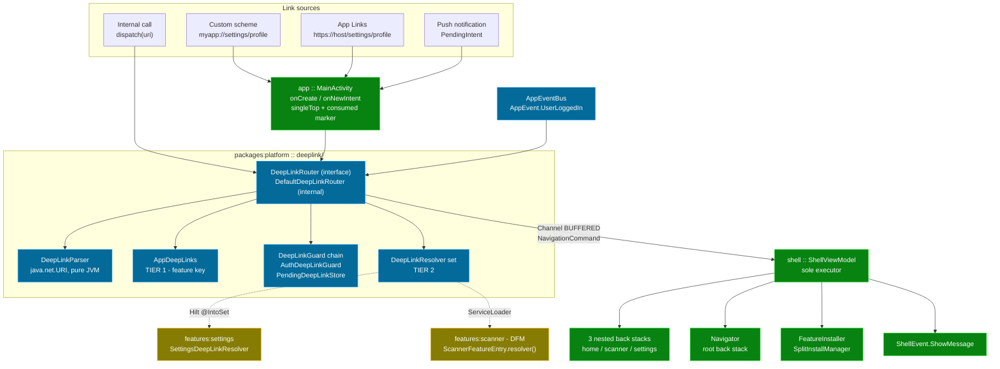
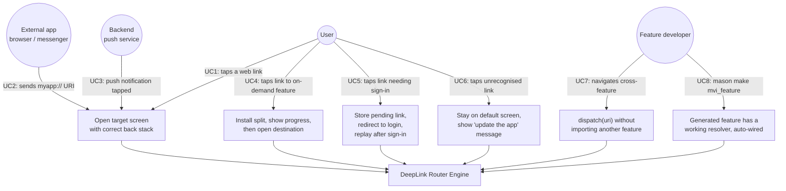
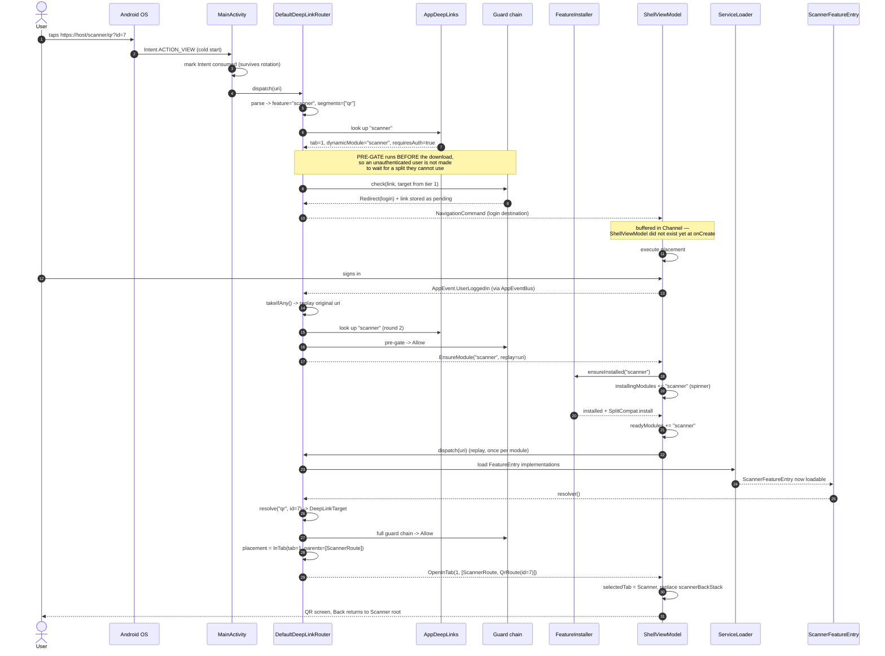

# Epic: DeepLink Router Engine

## 1. Meta Data

| Field | Value |
|---|---|
| **Epic name** | `deeplink_router_engine` |
| **Status** | Draft — tasks generated, implementation not started |
| **Target Release** | Template v-next (follows epic `android_super_app_template`) |
| **Source Spec** | [2026-09-10-deeplink-router-engine-design.md](2026-09-10-deeplink-router-engine-design.md) |
| **Predecessor epic** | [android_super_app_template](../android_super_app_template/android_super_app_template.en.md) |

---

## 2. Background

The `android_digital_wallet` template was assessed against the 4-pillar / 8-criteria Super App Governance framework. Because this repository is **native Android** (not Flutter), the framework's *original* Android-flavoured wording applies — the two criteria that the Flutter variant re-stated (1.2 Dynamic Feature Modules, 3.2 Dagger/Hilt) must be read in their original form here, since both mechanisms genuinely exist and are already implemented in this repo.

Assessment result: **5 criteria met, 3 partial. The weakest pillar by a wide margin is 2.1.**

Criterion 2.1 — *"DeepLink Router Engine"* — has two halves:

| Half | State |
|---|---|
| **Central Router** — all navigation through one router, features blind to each other | ✅ Present. `Navigator` + `NestedNavigator` + `AppRoutes` + `EntryProviderInstaller`. Konsist K1 enforced, boundary whitelist empty. |
| **URL Schema / DeepLink** — navigation driven by URL | ❌ **Entirely absent.** `AndroidManifest.xml` declares only `MAIN`/`LAUNCHER`. No `<data android:scheme>`, no `ACTION_VIEW`, no `onNewIntent`, no URI parsing, no URI → `NavKey` mapping. |

This epic builds the missing half.

### 2.1 Three template-specific constraints that make this harder than a textbook deeplink

1. **Nested per-tab back stacks.** `ShellState` holds three independent back stacks. A deeplink must decide *which* stack to write and *which* tab to select.
2. **Uninstalled Dynamic Feature Modules.** A link targeting `scanner` arrives while the code that knows that link's patterns is still inside an undownloaded split. The split must be installed before the link can even be parsed.
3. **Ownership of the URI → destination table.** Centralising it in `:platform` makes the host know every feature; distributing it to features breaks the DFM case outright.

### 2.2 Documentation drift closed by this epic

`features/scanner/build.gradle.kts` describes `shell/.../navigation/OnDemandFeatures.kt` as the registry for on-demand modules reached from an arbitrary call site. **That file was never written.** This epic closes the gap — not with a new registry file, but with `AppDeepLinks.entryPoints`, which already carries `dynamicModule`.

---

## 3. Goals & Non-Goals

### Goals

| # | Goal |
|---|---|
| **D1** | Raise criterion **2.1 from partial to fully met** — add the missing "URL Schema / DeepLink" half, keep the existing "Central Router" half untouched. |
| **D2** | **Four link sources, one pipeline**: custom scheme `myapp://`, Android App Links `https://`, push-notification payload, and internal URL-string navigation. No per-source branch. |
| **D3** | **Do not break criterion 1.2** — a link to an uninstalled on-demand feature triggers `FeatureInstaller.ensureInstalled(...)`, shows the existing progress UI, then opens the correct destination. |
| **D4** | **Do not break the "features are blind to each other" half of 2.1** — each feature declares its own URLs; no feature knows another's. Konsist K1 stays green, whitelist stays empty. |
| **D5** | **Do not regress criterion 4.1** — a feature's resolver tests must run under `:features:<x>:testDebugUnitTest` without `:app`. |
| **D6** | **Per-link declarable back-stack strategy** (`Placement`), defaulting to `InTab` with synthesised parents. Changing one link's behaviour is a one-line change inside that feature. |
| **D7** | **Extensible guard chain** — auth guard plus pending-link replay ship as the worked example; adding a guard (feature flag, KYC, kill switch) is one more `@IntoSet` binding, with no engine change. |
| **D8** | **Template-ready** — `mvi_feature` generates a working resolver and wires it; `rename_project.sh` rewrites the scheme; `myapp://` is hard-coded nowhere. |

### Non-Goals

- **`FirebaseMessagingService`.** The repo deliberately has no `google-services.json` (CI runs secret-free). Ship `DeepLinkIntentFactory` plus documentation; consumers wire their own FCM.
- **Hosting `assetlinks.json`.** Requires a real domain; the template ships a placeholder host and verification instructions only.
- **Deferred deep linking / attribution** (install referrer, fingerprint matching). Marketing-SDK territory, not a router.
- **Auto-generated typed paths** (`/order/{id}` → `OrderRoute(id)`). Resolvers parse by hand; a typed builder needs a KSP processor, which was evaluated and rejected — see Source Spec §4.2.
- **Wrapping `AppEventBus` / `Navigator` in interfaces.** Correct in principle (finding 3.2) but a separate follow-up; folding it in here would mix two reasons to change. The new engine gets it right from the start to set the precedent.
- **Changing host navigation.** navigation3 + `Navigator` / `NestedNavigator` / `NavDisplay` stay exactly as they are.
- **Hierarchical Hilt components.** DI stays one flat `SingletonComponent`.

---

## 4. Architecture & Technical Design

### 4.1 The core decision — a two-tier table riding on Konsist K9

Konsist rule **K9** already states: *a `NavKey` used outside its own feature must be declared in `:platform`.* The set of routes the host must know in advance for deeplinking to work **is exactly the set of routes that cross a feature boundary** — including every DFM entry point (`AppRoutes.ScannerRoute` is already there). These two sets coincide, and not by accident: both are "things the host must know without importing a feature".

So the table splits along the boundary that already exists:

| Tier | Location | Contents | Who edits |
|---|---|---|---|
| **1 — Entry point** | `:platform`, beside `AppRoutes` | `feature` key → `entryRoute` + `tab` + `dynamicModule` + `requiresAuth` | Only when adding a **new feature** (one line) |
| **2 — Detailed patterns** | Inside each feature | pattern → `destination` + `placement` + `requiresAuth` | The owning team; touches nobody else |

**Consequence — URL collisions are structurally impossible.** Tier 1 routes by `feature` key first, and keys are unique (enforced by unit test). Two features therefore *cannot physically* claim the same URI. Collisions remain possible only *within* one feature, between patterns that one team wrote — a local problem with a local test. A governance question becomes a structural invariant.

### 4.2 High-Level Architecture

### 4.3 Use Cases

### 4.4 Sequence — the hardest primary flow

Cold start, App Link, target is an **uninstalled on-demand DFM**, and the feature requires sign-in. This single path exercises every branch in the pipeline.

### 4.5 Key mechanisms

| Mechanism | Decision | Why |
|---|---|---|
| **Command channel** | `Channel(BUFFERED)`, single consumer `ShellViewModel` — **not** `AppEventBus` | `AppEventBus` is `SharedFlow(replay = 0)`: with no subscriber the event is dropped. That is exactly the cold-start case, where the link arrives before `ShellViewModel` exists. Deeplinks need guaranteed once-only delivery; signals do not. |
| **Sole executor** | `ShellViewModel` | Only place holding both the three nested back stacks (its own state) and the root `Navigator` (injectable: `ViewModelComponent` is a child of `ActivityRetainedComponent`). |
| **Back-stack write** | Replace, not append; no-op when the destination is already on top | "Synthesise" means *the stack must look like this* — deterministic, and opening the same link twice yields the same state. Appending grows the stack on every open. |
| **Pre-gate placement** | Auth check runs before the split download | Otherwise an unauthenticated user downloads a whole split and is then bounced to login. Cost: the guard chain may run twice, so **guards must be idempotent** (stated in KDoc). |
| **Redirect cap** | Depth 3, then `Failed(RedirectLoop)` | Guard A redirects to B, B back to A. |
| **Replay cap** | Router tracks modules it has already emitted `EnsureModule` for; one replay per module | Prevents an install→replay→install loop if `readyModules` fails to update. |
| **Failure handling** | `Failed` **never navigates** | Cold start needs no fallback: `MainActivity` already seeds `ShellRoute` and `ShellState` already defaults to the Settings tab *before* the link is processed. The default state **is** the fallback. |
| **Pending link** | In-memory, 10-minute TTL, take-once | A deeplink persisted to disk can fire days later in a different context — a security smell, not a feature. |
| **Interface discipline** | `DeepLinkRouter`, `DeepLinkGuard`, `PendingDeepLinkStore` are interfaces; impls `internal` | Directly addresses finding 3.2: `AppEventBus` and `Navigator` are concrete classes today, so the host pushes *implementations* down to features. The new seam sets the correct precedent. |

### 4.6 Attack surface

Declaring an `intent-filter` makes `MainActivity` **exported** — any app on the device can send it an arbitrary URI.

1. **`params` are untrusted input.** Never feed them directly into sensitive decisions (amount, destination account). A deeplink may *open the right screen pre-filled*; confirmation still goes through the UI and authorisation still lives in domain/API.
2. **Custom schemes are not exclusive.** Another app can claim `myapp://` and hijack links. Only App Links (`autoVerify` + `assetlinks.json`) carry an OS guarantee. Sensitive links should travel over `https://` only.
3. **`requiresAuth` is defence in depth, not an authorisation gate.** It prevents wrong UX, not an attacker — who can simply sign in with their own account.
4. **Hierarchy C gives one security property for free**: there is no path to navigate to an arbitrary route by name. Only routes a `DeepLinkResolver` explicitly declares are reachable — an **allowlist**, not reflection. A design like `myapp://route?class=com.acme.SecretRoute` would expose every internal screen; this architecture closes that door structurally, with no rule to police it.

---

## 5. Rollout Strategy & Mitigation

Inherited principle from the predecessor epic: **the app builds and runs at every step**; each phase is one reviewable PR.

| Phase | Content | Exit criterion |
|---|---|---|
| **1 — Contract + parser** (Tasks 1–4) | Everything inside `:platform`. Nobody calls it yet. | `assembleDebug` green, app behaves identically. Engine fully unit-tested in isolation. |
| **2 — Host execution** (Tasks 5–7) | `ShellState` refactor, `ShellViewModel` executes commands. | Calling `dispatch(...)` from code navigates correctly. **Internal navigation (source 4) already works.** |
| **3 — Intent entry** (Tasks 8–10) | Manifest, build placeholders, `MainActivity`, push factory. | `adb shell am start -a android.intent.action.VIEW -d "myapp://settings/profile"` opens the right screen, cold and warm. |
| **4 — Features, DFM, governance** (Tasks 11–15) | Both exemplar resolvers, Konsist K10, bricks, docs, E2E. | `mason make mvi_feature --name payments` produces a feature with a working deeplink; K10 green; criterion 2.1 fully met. |

**Why this order is safe.** Each phase is inert until the next one lands: Phase 1 ships dead code, Phase 2 makes it callable only from inside the app, and only Phase 3 opens the external attack surface. The exported `intent-filter` — the single riskiest change — arrives after the engine it feeds is already fully tested.

### Mitigation and fallback

| Risk | Mitigation |
|---|---|
| **`ShellViewModel` cannot inject `Navigator`** (an unverified assumption) | Verified as the first step of Task 6. If false: `MainActivity` collects the `OpenFullScreen` branch and the shell collects the rest — still works, only loses the single-executor property. |
| **`singleTop` changes Activity behaviour** and may expose latent state bugs | Phase 3 is its own PR; manual cold / warm / rotate / background-restore testing before merge. |
| **Non-idempotent guard** misbehaves at the pre-gate | Mandatory KDoc; an explicit idempotency unit test in the guard suite. |
| **Install → replay loop** if `readyModules` fails to update | Router tracks already-attempted modules; one replay per module, then `Failed(InstallFailed)`. |
| **App Links unverifiable on a dev machine** | Documented as OS behaviour, not an engine bug; `myapp://` always works for dev/test. |
| **Rollback** | Every phase is independently revertable. Reverting Phase 3 alone removes the external surface while leaving the engine intact and internally usable. |

---

## 6. Kanban Tasks Breakdown

### Phase 1 — Contract + parser (`:packages:platform`)

1. [Task 1: DeepLink model and parser](../../features/task_1_deeplink_parser.md)
2. [Task 2: Two-tier contract types and AppDeepLinks](../../features/task_2_deeplink_contract.md)
3. [Task 3: Guard chain, pending store, auth guard](../../features/task_3_deeplink_guard_chain.md)
4. [Task 4: DefaultDeepLinkRouter pipeline](../../features/task_4_deeplink_router_pipeline.md)

### Phase 2 — Host execution (`:shell`)

5. [Task 5: Per-module install state in ShellState](../../features/task_5_shell_per_module_state.md)
6. [Task 6: ShellViewModel executes placement commands](../../features/task_6_shell_execute_placement.md)
7. [Task 7: ShellViewModel handles EnsureModule and Failed](../../features/task_7_shell_ensure_module_and_failure.md)

### Phase 3 — Intent entry (`:app`, `buildSrc`, `scripts`)

8. [Task 8: Scheme and host build placeholders plus rename script](../../features/task_8_scheme_build_placeholders.md)
9. [Task 9: Manifest intent filters and singleTop](../../features/task_9_manifest_intent_filters.md)
10. [Task 10: MainActivity intent handling and push factory](../../features/task_10_mainactivity_intent_handling.md)

### Phase 4 — Features, DFM, governance

11. [Task 11: SettingsDeepLinkResolver — install-time exemplar](../../features/task_11_settings_resolver.md)
12. [Task 12: Scanner DFM resolver and local-testing acceptance](../../features/task_12_scanner_dfm_resolver.md)
13. [Task 13: Konsist rule K10](../../features/task_13_konsist_k10.md)
14. [Task 14: Mason brick wiring for deeplinks](../../features/task_14_mason_brick_deeplink.md)
15. [Task 15: Documentation and E2E acceptance](../../features/task_15_docs_and_e2e.md)

---

## 7. Criteria Impact

| # | Before | After |
|---|---|---|
| **2.1 DeepLink Router** | 🔴 Partial | ✅ **Fully met** — both Central Router and URL Schema / DeepLink |
| **3.2 Layered DI** | 🟡 Partial | 🟡 Partial, **improved** — new seams are interfaces with `internal` impls, setting the precedent for wrapping `AppEventBus` / `Navigator` later |
| **4.1 Sandbox** | 🟡 Partial | 🟡 **No regression** — resolver tests run inside the feature sandbox |
| 1.1 · 1.2 · 2.2 · 3.1 · 4.2 | ✅ | Unchanged |

Additionally: the `OnDemandFeatures.kt` documentation drift is closed, and `ShellState` no longer hard-codes `"scanner"`.
