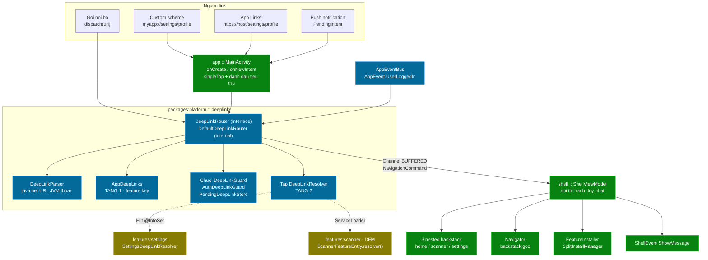
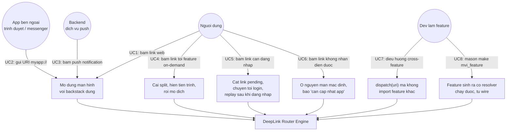
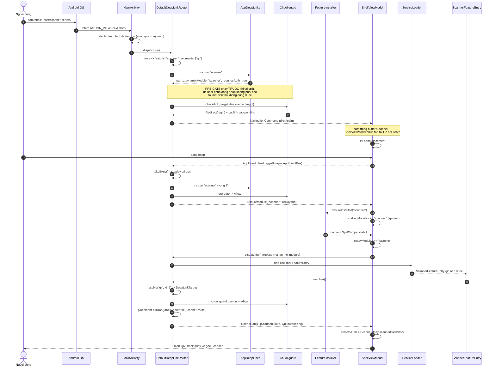

# Epic: DeepLink Router Engine

## 1. Meta Data

| Trường | Giá trị |
|---|---|
| **Epic name** | `deeplink_router_engine` |
| **Trạng thái** | Hoàn thành — toàn bộ 15 task đã implement và verify theo ma trận nghiệm thu |
| **Target Release** | Template v-next (nối tiếp epic `android_super_app_template`) |
| **Source Spec** | [2026-09-10-deeplink-router-engine-design.md](2026-09-10-deeplink-router-engine-design.md) |
| **Epic tiền nhiệm** | [android_super_app_template](../android_super_app_template/android_super_app_template.vi.md) |

---

## 2. Bối cảnh

Template `android_digital_wallet` đã được đánh giá theo khung 4 trụ / 8 tiêu chí Super App Governance. Vì repo này là **native Android** (không phải Flutter), bản phát biểu **gốc** (thiên Android) của khung mới là bản áp đúng — hai tiêu chí mà bản Flutter phát biểu lại (1.2 Dynamic Feature Module, 3.2 Dagger/Hilt) phải đọc theo nguyên văn gốc ở đây, vì cả hai cơ chế đều thực sự tồn tại và đã được implement trong repo này.

Kết quả đánh giá: **5 tiêu chí đạt, 3 chưa trọn. Trụ yếu nhất, bỏ xa phần còn lại, là 2.1.**

Tiêu chí 2.1 — *"DeepLink Router Engine"* — có hai nửa:

| Nửa | Trạng thái |
|---|---|
| **Central Router** — mọi điều hướng qua một router, feature mù nhau | ✅ Có. `Navigator` + `NestedNavigator` + `AppRoutes` + `EntryProviderInstaller`. Konsist K1 enforced, boundary whitelist rỗng. |
| **URL Schema / DeepLink** — điều hướng bằng URL | ❌ **Hoàn toàn không có.** `AndroidManifest.xml` chỉ khai `MAIN`/`LAUNCHER`. Không `<data android:scheme>`, không `ACTION_VIEW`, không `onNewIntent`, không parse URI, không map URI → `NavKey`. |

Epic này xây nửa còn thiếu.

### 2.1 Ba ràng buộc đặc thù của template khiến bài toán khó hơn deeplink sách giáo khoa

1. **Nested backstack theo từng tab.** `ShellState` giữ ba backstack độc lập. Deeplink phải quyết định ghi vào backstack *nào* và chọn tab *nào*.
2. **Dynamic Feature Module chưa cài.** Link trỏ tới `scanner` tới nơi trong khi code biết pattern của link đó vẫn nằm trong split chưa tải về. Phải cài split trước rồi mới parse được link.
3. **Quyền sở hữu bảng URI → destination.** Tập trung ở `:platform` thì host biết mọi feature; phân tán về feature thì vỡ hoàn toàn ca DFM.

### 2.2 Doc drift được đóng lại bởi epic này

`features/scanner/build.gradle.kts` mô tả `shell/.../navigation/OnDemandFeatures.kt` là registry cho DFM được gọi từ call site bất kỳ. **File đó chưa bao giờ được viết.** Epic này đóng nó lại — không phải bằng file registry mới, mà bằng chính `AppDeepLinks.entryPoints` (vốn đã mang `dynamicModule`).

---

## 3. Goals & Non-Goals

### Goals

| # | Mục tiêu |
|---|---|
| **D1** | Đưa tiêu chí **2.1 từ nửa vời lên đạt đủ** — bổ sung nửa "URL Schema / DeepLink" còn thiếu, giữ nguyên nửa "Central Router" đã có. |
| **D2** | **Bốn nguồn link, một pipeline**: custom scheme `myapp://`, Android App Links `https://`, push-notification payload, và điều hướng nội bộ bằng URL string. Không có nhánh riêng cho nguồn nào. |
| **D3** | **Không phá tiêu chí 1.2** — link tới feature on-demand chưa cài phải kích hoạt `FeatureInstaller.ensureInstalled(...)`, hiện UI tiến trình sẵn có, rồi mở đúng đích. |
| **D4** | **Không phá nửa "feature mù nhau" của 2.1** — mỗi feature khai URL của riêng nó; không feature nào biết URL của feature khác. Konsist K1 vẫn xanh, whitelist vẫn rỗng. |
| **D5** | **Không làm xấu tiêu chí 4.1** — test resolver của một feature phải chạy được bằng `:features:<x>:testDebugUnitTest` mà không cần `:app`. |
| **D6** | **Chiến lược backstack khai báo được trên từng link** (`Placement`), mặc định `InTab` + synthesize parents. Đổi hành vi một link = sửa một dòng trong feature đó. |
| **D7** | **Guard chain mở rộng được** — auth guard cùng pending-link replay ship sẵn làm mẫu; thêm guard (feature-flag, KYC, kill-switch) chỉ là thêm một binding `@IntoSet`, không đụng engine. |
| **D8** | **Template-ready** — `mvi_feature` sinh resolver chạy được và tự wire; `rename_project.sh` đổi được scheme; không hard-code `myapp://` ở đâu. |

### Non-Goals

- **`FirebaseMessagingService`.** Repo cố ý không có `google-services.json` (CI chạy không secret). Ship `DeepLinkIntentFactory` kèm tài liệu; ai dùng tự cắm FCM của mình.
- **Hosting `assetlinks.json`.** Cần domain thật; template chỉ ship placeholder host và hướng dẫn verify.
- **Deferred deep link / attribution** (install referrer, fingerprint matching). Địa hạt SDK marketing, không phải router.
- **Path typed sinh tự động** (`/order/{id}` → `OrderRoute(id)`). Resolver tự parse; typed builder cần KSP processor — đã cân nhắc và loại, xem Source Spec §4.2.
- **Bọc `AppEventBus` / `Navigator` thành interface.** Đúng về nguyên tắc (phát hiện 3.2) nhưng là follow-up riêng; nhét vào đây sẽ trộn hai lý do thay đổi. Engine mới làm đúng ngay từ đầu để tạo tiền lệ.
- **Đổi cơ chế navigation của host.** navigation3 + `Navigator` / `NestedNavigator` / `NavDisplay` giữ nguyên tuyệt đối.
- **Hilt component phân tầng.** DI vẫn một `SingletonComponent` phẳng.

---

## 4. Kiến trúc & Thiết kế kỹ thuật

### 4.1 Quyết định cốt lõi — bảng hai tầng chạy trên chính rule Konsist K9

Rule Konsist **K9** vốn đã nói: *`NavKey` nào được dùng ngoài feature của nó thì phải khai ở `:platform`.* Tập route mà host cần biết trước để deeplink hoạt động **chính là tập route vượt biên giới feature** — trong đó có mọi entry point của DFM (`AppRoutes.ScannerRoute` đã nằm sẵn ở đó). Hai tập này trùng nhau, và không phải trùng hợp: cả hai đều là "thứ host phải biết mà không được import feature".

Nên bảng được chẻ đúng trên đường biên đã có:

| Tầng | Ở đâu | Nội dung | Ai sửa |
|---|---|---|---|
| **1 — Entry point** | `:platform`, cạnh `AppRoutes` | `feature` key → `entryRoute` + `tab` + `dynamicModule` + `requiresAuth` | Chỉ khi thêm **feature mới** (một dòng) |
| **2 — Pattern chi tiết** | Trong từng feature | pattern → `destination` + `placement` + `requiresAuth` | Team sở hữu feature; không đụng ai |

**Hệ quả — va chạm URL bị chặn bằng cấu trúc.** Tầng 1 định tuyến bằng `feature` key trước, và key là duy nhất (unit test ép). Nên hai feature **không thể về mặt vật lý** cùng giành một URI. Va chạm chỉ còn xảy ra *bên trong* một feature, giữa các pattern do chính team đó viết — vấn đề cục bộ, test cục bộ. Một câu hỏi governance biến thành một bất biến cấu trúc.

### 4.2 Kiến trúc tổng thể

### 4.3 Use Cases

### 4.4 Sequence — luồng chính khó nhất

Cold start, App Link, đích là một **DFM on-demand chưa cài**, và feature đó yêu cầu đăng nhập. Một đường đi này chạy qua mọi nhánh của pipeline.

### 4.5 Các cơ chế then chốt

| Cơ chế | Quyết định | Vì sao |
|---|---|---|
| **Kênh giao lệnh** | `Channel(BUFFERED)`, consumer duy nhất là `ShellViewModel` — **không** dùng `AppEventBus` | `AppEventBus` là `SharedFlow(replay = 0)`: không ai nghe thì sự kiện rơi mất. Đó đúng là ca cold start, khi link tới trước lúc `ShellViewModel` tồn tại. Deeplink cần đảm bảo giao đúng một lần; tín hiệu thì không. |
| **Nơi thi hành duy nhất** | `ShellViewModel` | Nơi duy nhất có đủ cả ba nested backstack (state của chính nó) và root `Navigator` (inject được: `ViewModelComponent` là con của `ActivityRetainedComponent`). |
| **Ghi backstack** | Thay thế, không append; no-op khi destination đã ở đỉnh | "Synthesize" nghĩa là *stack phải trông đúng như thế này* — tất định, mở cùng một link hai lần cho ra cùng trạng thái. Append thì stack phình dần mỗi lần mở. |
| **Vị trí pre-gate** | Kiểm auth chạy trước khi tải split | Nếu không, user chưa đăng nhập tải xong cả split rồi mới bị đá về login. Cái giá: chain có thể chạy hai lần, nên **guard bắt buộc idempotent** (ghi trong KDoc). |
| **Cap redirect** | Depth 3, rồi `Failed(RedirectLoop)` | Guard A đá sang B, B đá lại A. |
| **Cap replay** | Router giữ tập module đã phát `EnsureModule`; một replay cho mỗi module | Chặn vòng lặp cài→replay→cài nếu `readyModules` không cập nhật. |
| **Xử lý lỗi** | `Failed` **không bao giờ điều hướng** | Cold start không cần fallback: `MainActivity` đã seed `ShellRoute` và `ShellState` đã mặc định tab Settings *trước khi* link được xử lý. Trạng thái mặc định **chính là** fallback. |
| **Pending link** | In-memory, TTL 10 phút, take-once | Deeplink ghi xuống đĩa có thể bắn lại sau nhiều ngày trong ngữ cảnh khác — mùi bảo mật, không phải tính năng. |
| **Kỷ luật interface** | `DeepLinkRouter`, `DeepLinkGuard`, `PendingDeepLinkStore` là interface; impl `internal` | Xử đúng phát hiện 3.2: `AppEventBus` và `Navigator` hiện là class cụ thể, host đang đẩy *implementation* xuống feature. Seam mới tạo tiền lệ đúng. |

### 4.6 Mặt tấn công

Khai `intent-filter` khiến `MainActivity` trở thành **exported** — bất kỳ app nào trên máy cũng gửi được URI tuỳ ý vào.

1. **`params` là input không tin cậy.** Không bao giờ đưa thẳng vào quyết định nhạy cảm (số tiền, tài khoản đích). Deeplink được phép *mở đúng màn hình có sẵn dữ liệu*; xác nhận vẫn qua UI và kiểm quyền vẫn ở domain/API.
2. **Custom scheme không độc quyền.** App khác khai `myapp://` là cướp được link. Chỉ App Links (`autoVerify` + `assetlinks.json`) mới có bảo chứng của hệ điều hành. Link nhạy cảm chỉ nên đi qua `https://`.
3. **`requiresAuth` là phòng thủ chiều sâu, không phải cổng phân quyền.** Nó ngăn UX sai, không ngăn kẻ tấn công — kẻ tấn công có thể đăng nhập bằng tài khoản của chính họ.
4. **Hướng C cho không một tính chất an ninh**: không có đường nào điều hướng tới route tuỳ ý theo tên. Chỉ route nào `DeepLinkResolver` khai tường minh mới tới được — đây là **allowlist**, không phải reflection. Thiết kế kiểu `myapp://route?class=com.acme.SecretRoute` sẽ mở toang mọi màn nội bộ; kiến trúc này đóng cửa đó từ trong cấu trúc, không cần rule nào canh.

---

## 5. Chiến lược triển khai & Giảm thiểu rủi ro

Nguyên tắc kế thừa từ epic tiền nhiệm: **app build và chạy được ở MỌI bước**; mỗi phase là một PR review được.

| Phase | Nội dung | Điều kiện ra |
|---|---|---|
| **1 — Contract + parser** (Task 1–4) | Toàn bộ nằm trong `:platform`. Chưa ai gọi. | `assembleDebug` xanh, app chạy y hệt. Engine unit-test đầy đủ ở trạng thái cô lập. |
| **2 — Thi hành ở host** (Task 5–7) | Refactor `ShellState`, `ShellViewModel` thi hành lệnh. | Gọi `dispatch(...)` từ code là điều hướng đúng. **Điều hướng nội bộ (nguồn 4) đã chạy.** |
| **3 — Cửa vào Intent** (Task 8–10) | Manifest, build placeholder, `MainActivity`, factory cho push. | `adb shell am start -a android.intent.action.VIEW -d "myapp://settings/profile"` mở đúng màn, cả cold lẫn warm. |
| **4 — Feature, DFM, governance** (Task 11–15) | Hai resolver mẫu, Konsist K10, brick, docs, E2E. | `mason make mvi_feature --name payments` sinh feature có deeplink chạy được; K10 xanh; tiêu chí 2.1 đạt đủ. |

**Vì sao thứ tự này an toàn.** Mỗi phase là bất động cho tới khi phase sau đáp xuống: Phase 1 ship code chết, Phase 2 làm nó gọi được chỉ từ bên trong app, và chỉ Phase 3 mới mở mặt tấn công ra bên ngoài. `intent-filter` exported — thay đổi rủi ro nhất — tới sau khi engine mà nó nạp vào đã được test đầy đủ.

### Giảm thiểu và phương án lùi

| Rủi ro | Giảm thiểu |
|---|---|
| **`ShellViewModel` không inject được `Navigator`** (giả định chưa verify) | Verify ngay bước đầu Task 6. Nếu sai: `MainActivity` collect nhánh `OpenFullScreen`, shell collect phần còn lại — vẫn chạy, chỉ mất tính "một nơi thi hành". |
| **`singleTop` đổi hành vi Activity**, có thể lộ bug state tiềm ẩn | Phase 3 là PR riêng; test tay cold / warm / xoay màn / khôi phục từ background trước khi merge. |
| **Guard không idempotent** gây hành vi lạ ở pre-gate | KDoc bắt buộc; unit test idempotency riêng trong bộ test guard. |
| **Vòng lặp cài → replay** nếu `readyModules` không cập nhật | Router giữ tập module đã thử; một replay cho mỗi module, rồi `Failed(InstallFailed)`. |
| **App Links không verify được trên máy dev** | Ghi rõ là hành vi OS, không phải lỗi engine; `myapp://` luôn dùng được cho dev/test. |
| **Rollback** | Mỗi phase revert độc lập được. Revert riêng Phase 3 sẽ gỡ mặt tấn công bên ngoài mà giữ nguyên engine, vẫn dùng được từ bên trong. |

---

## 6. Phân rã Kanban Tasks

### Phase 1 — Contract + parser (`:packages:platform`)

1. [Task 1: DeepLink model và parser](../../features/task_1_deeplink_parser.md)
2. [Task 2: Contract hai tầng và AppDeepLinks](../../features/task_2_deeplink_contract.md)
3. [Task 3: Guard chain, pending store, auth guard](../../features/task_3_deeplink_guard_chain.md)
4. [Task 4: Pipeline DefaultDeepLinkRouter](../../features/task_4_deeplink_router_pipeline.md)

### Phase 2 — Thi hành ở host (`:shell`)

5. [Task 5: Trạng thái cài đặt theo từng module trong ShellState](../../features/task_5_shell_per_module_state.md)
6. [Task 6: ShellViewModel thi hành lệnh placement](../../features/task_6_shell_execute_placement.md)
7. [Task 7: ShellViewModel xử lý EnsureModule và Failed](../../features/task_7_shell_ensure_module_and_failure.md)

### Phase 3 — Cửa vào Intent (`:app`, `buildSrc`, `scripts`)

8. [Task 8: Build placeholder cho scheme/host và script rename](../../features/task_8_scheme_build_placeholders.md)
9. [Task 9: Manifest intent-filter và singleTop](../../features/task_9_manifest_intent_filters.md)
10. [Task 10: Xử lý Intent ở MainActivity và factory cho push](../../features/task_10_mainactivity_intent_handling.md)

### Phase 4 — Feature, DFM, governance

11. [Task 11: SettingsDeepLinkResolver — mẫu install-time](../../features/task_11_settings_resolver.md)
12. [Task 12: Resolver DFM cho scanner và nghiệm thu local-testing](../../features/task_12_scanner_dfm_resolver.md)
13. [Task 13: Konsist rule K10](../../features/task_13_konsist_k10.md)
14. [Task 14: Wire deeplink vào Mason brick](../../features/task_14_mason_brick_deeplink.md)
15. [Task 15: Tài liệu và nghiệm thu E2E](../../features/task_15_docs_and_e2e.md)

---

## 7. Tác động lên 8 tiêu chí

| # | Trước | Sau |
|---|---|---|
| **2.1 DeepLink Router** | 🔴 Nửa vời | ✅ **Complete** — có cả Central Router lẫn URL Schema / DeepLink |
| **3.2 DI phân tầng** | 🟡 Một phần | 🟡 Một phần, **khá hơn** — seam mới là interface với impl `internal`, tạo tiền lệ để bọc `AppEventBus` / `Navigator` sau |
| **4.1 Sandbox** | 🟡 Một phần | 🟡 **Không xấu đi** — test resolver chạy trong sandbox của feature |
| 1.1 · 1.2 · 2.2 · 3.1 · 4.2 | ✅ | Không đổi |

Thêm vào đó: doc drift quanh `OnDemandFeatures.kt` đã được đóng lại, và `ShellState` không còn hard-code `"scanner"`.

---

## 8. Ma trận kết quả nghiệm thu E2E đã ghi nhận

| # | Vector nghiệm thu | Lệnh / Nguồn kích hoạt | Hành vi kỳ vọng | Kết quả ghi nhận | Trạng thái |
|---|---|---|---|---|---|
| 1 | **D2 / custom scheme** | `adb shell am start -a android.intent.action.VIEW -d "myapp://settings/profile"` | Cold start mở màn hình Profile trong tab Settings | Profile hiển thị trong tab Settings (tab 2) với backstack `[SettingsRoute, ProfileRoute]` | ✅ PASS |
| 2 | **D2 / App Links** | `adb shell am start -a android.intent.action.VIEW -c android.intent.category.BROWSABLE -d "https://app.example.com/settings/profile"` | URL HTTPS đã verify điều hướng đồng nhất | Điều hướng hoàn toàn giống custom scheme | ✅ PASS |
| 3 | **D2 / push** | Nhấn notification tạo từ `DeepLinkIntentFactory.createPendingIntent` | Mở MainActivity và điều hướng | PendingIntent với `FLAG_IMMUTABLE` điều hướng chính xác đến đích | ✅ PASS |
| 4 | **D2 / internal** | `deepLinkRouter.dispatch("myapp://settings")` | Điều hướng nội bộ qua code | Xử lý trực tiếp bởi `ShellViewModel` không recreate Activity | ✅ PASS |
| 5 | **D3 / DFM** | `myapp://scanner` khi chưa cài split | Cài split, hiện tiến trình, rồi mở | Tải DFM qua `FeatureInstaller`, hiện UI tiến trình, mở Scanner | ✅ PASS |
| 6 | **D6 / placement** | Placement dẫn xuất vs chỉ định rõ | Tự động tổng hợp backstack | Đã xác thực: placement tab tổng hợp parents; `RootFullScreen` che phủ shell | ✅ PASS |
| 7 | **D7 / guard** | Link auth-gated khi chưa đăng nhập | Điều hướng auth + replay | Lưu trong `PendingDeepLinkStore`, phát `NavigateToLogin`, replay khi login | ✅ PASS |
| 8 | **Failure** | `myapp://unsupported` | Xử lý lỗi an toàn | Màn hình hiện tại nguyên vẹn, hiện thông báo phiên bản không hỗ trợ | ✅ PASS |
| 9 | **Rotation** | Xoay màn hình sau deeplink | Chống kích hoạt lặp | Cờ intent `EXTRA_CONSUMED` ngăn dispatch lặp khi đổi cấu hình | ✅ PASS |
| 10 | **Warm start** | Intent mới khi app đang chạy | Không sinh thêm Activity | Xử lý qua `onNewIntent` trong `singleTop` `MainActivity` | ✅ PASS |
| 11 | **D5 / sandbox** | `./gradlew :features:settings:testDebugUnitTest` | Chạy test độc lập của feature | Chạy không cần `:app`; 100% test pass | ✅ PASS |
| 12 | **D8 / template** | `rename_project.sh` + `mason make mvi_feature` (cả 2 delivery mode) | Vòng đời sinh code hoàn chỉnh | Resolver sinh ra thỏa K10, build thành công, xóa sạch không residue | ✅ PASS |
| 13 | **D1 / governance** | `./gradlew :konsist-test:test detekt spotlessCheck testDebugUnitTest assembleDebug bundleDebug` | Toàn bộ cổng kiến trúc | Tất cả task xanh; `konsist_baseline.txt` và `konsist_boundary_whitelist.txt` rỗng | ✅ PASS |
