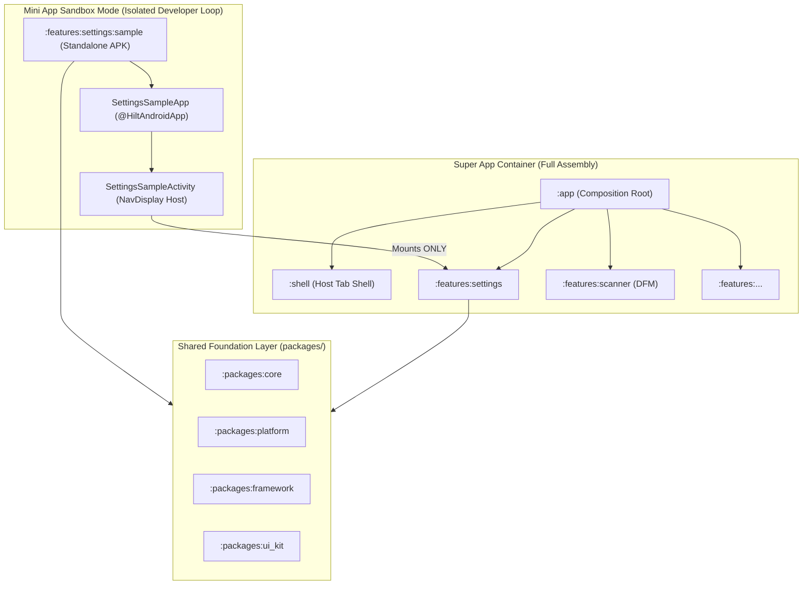
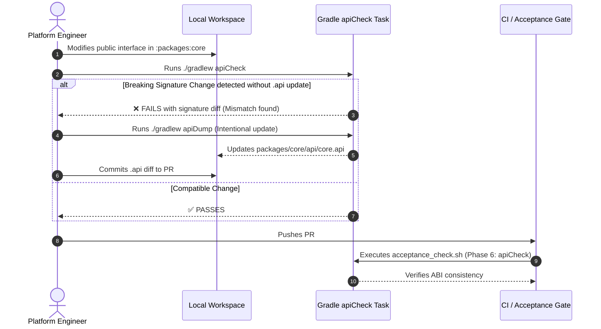

# Super App Governance: Mini App Sandbox & Binary Contract Validation Design Spec

**Date:** 2026-09-10  
**Status:** Approved by User  
**Scope:** Pillar 4 (Lifecycle Governance & CI/CD) of the Super App Architecture  

---

## 1. Overview & Business Intent

In a production-grade Super App platform, two critical operational risks threaten long-term scalability:
1. **Developer Velocity Friction:** When Mini App developers must build, compile, and run the entire Super App container (`:app` + all features) just to verify a minor UI tweak in their feature, iteration cycles slow down by 5–10x.
2. **Runtime Contract Breakages:** When platform or foundation modules (`:packages:*`) alter public method signatures, class names, or data contracts, independently compiled Mini Apps suffer runtime crashes (`NoSuchMethodError`, `IncompatibleClassChangeError`) in production.

This design establishes two core governance mechanisms to solve both problems:
1. **Mini App Sandbox Development (`commons.android-sample`):** A standardized, zero-boilerplate convention plugin and scaffold allowing every Mini App (`:features:<name>`) to run in an isolated, lightweight Standalone APK (`:features:<name>:sample`) without booting the Super App container.
2. **Internal API Contract Governance (BCV):** JetBrains' Binary Compatibility Validator integrated across the 5 Shared Package modules (`:packages:core`, `:packages:platform`, `:packages:network`, `:packages:framework`, `:packages:ui_kit`) with automated pre-merge CI verification (`apiCheck`).

---

## 2. Architecture & Component Design

### 2.1 Mini App Sandbox Development Architecture



#### 2.1.1 Convention Plugin: `commons.android-sample`
Located in `buildSrc/src/main/kotlin/commons/AndroidSampleConventionPlugin.kt`:
* **Plugin ID:** `commons.android-sample`
* **Underlying Plugins Applied:**
  * `com.android.application`
  * `org.jetbrains.kotlin.android`
  * `org.jetbrains.kotlin.plugin.compose`
  * `com.google.devtools.ksp`
  * `dagger.hilt.android.plugin`
* **Automated Configuration:**
  * Computes `applicationId = "${AppConfig.applicationId}.sample.${project.parent?.name ?: project.name}"`
  * Inherits `compileSdk`, `minSdk`, `targetSdk`, `versionCode`, and `versionName` directly from `AppConfig`.
  * Enables Jetpack Compose and Java 17 / JVM target.
  * Adds common baseline dependencies:
    * `:packages:core`
    * `:packages:platform`
    * `:packages:framework`
    * `:packages:ui_kit`
    * Jetpack Compose BOM & Material 3
    * AndroidX Navigation 3 & Lifecycle ViewModel
    * Dagger Hilt & Timber
* **Sample Module Build File (`features/settings/sample/build.gradle.kts`):**
  ```kotlin
  plugins {
      id(Deps.COMMONS_ANDROID_SAMPLE)
  }

  dependencies {
      implementation(project(":features:settings"))
  }
  ```

#### 2.1.2 Exemplar Sandbox Implementation (`:features:settings:sample`)
* **`SettingsSampleApp.kt`:**
  Annotated with `@HiltAndroidApp`. Subclasses `CoreApplication`. Initializes minimal diagnostics (`Timber`) without initializing production super app telemetry or multi-feature aggregation.
* **`SettingsSampleActivity.kt`:**
  Annotated with `@AndroidEntryPoint`. Sets up a minimal Compose `Scaffold` hosting a `NavDisplay` whose backstack starts at `SettingsRoute`.
  Injects `Set<EntryProviderInstaller>` provided solely by `:features:settings:di:SettingsNavigationModule`.
* **External Navigation Mocking:**
  When a user taps an action in the settings screen that would navigate out of the module (e.g. Deeplink to Scanner or Login), the sample scaffold intercepts the route via a custom `LocalNavigationOverride` and displays a debug Toast/Snackbar (`[Sandbox] Navigating to: <Destination>`) instead of crashing.

---

### 2.2 Internal API Contract Governance (BCV) Architecture

#### 2.2.1 Tooling & Plugin Integration
* **Plugin:** `org.jetbrains.kotlinx.binary-compatibility-validator` version `0.17.0`
* **Dependency Definition:** Declared in `buildSrc/src/main/kotlin/Versions.kt` and `buildSrc/build.gradle.kts`.
* **Root Application in `build.gradle.kts`:**
  ```kotlin
  plugins {
      id("org.jetbrains.kotlinx.binary-compatibility-validator") version GlobalVersions.BCV
  }

  apiValidation {
      // Ignored projects: non-package modules
      ignoredProjects += listOf(
          "app",
          "shell",
          "konsist-test",
          "libraries:testutils"
      )
      
      // Auto-ignore all feature modules and their samples
      ignoredProjects += subprojects
          .filter { it.path.startsWith(":features") }
          .map { it.name }

      // Package filtering
      ignoredPackages += listOf(
          "com.danhdue.core.internal",
          "com.danhdue.platform.internal"
      )

      // Annotations for non-public API
      nonPublicMarkers += listOf(
          "com.danhdue.core.annotation.InternalApi"
      )
  }
  ```

#### 2.2.2 Monitored Package Surface
The public bytecode API of the following 5 modules is tracked via Git-committed `.api` signature files:
1. `packages/core/api/core.api`
2. `packages/platform/api/platform.api`
3. `packages/network/api/network.api`
4. `packages/framework/api/framework.api`
5. `packages/ui_kit/api/ui_kit.api`

#### 2.2.3 Operational Workflow


---

### 2.3 Mason Brick & Scaffolding Automation

The `bricks/mvi_feature` template is enhanced to generate both the feature library and its companion sandbox module:
```text
bricks/mvi_feature/
├── __brick__/
│   └── features/
│       └── {{feature_name.snakeCase()}}/
│           ├── build.gradle.kts
│           ├── src/
│           └── sample/
│               ├── build.gradle.kts
│               └── src/main/
│                   ├── AndroidManifest.xml
│                   ├── res/values/strings.xml
│                   └── kotlin/com/danhdue/features/{{feature_name.snakeCase()}}/sample/
│                       ├── {{feature_name.pascalCase()}}SampleApp.kt
│                       ├── {{feature_name.pascalCase()}}SampleActivity.kt
│                       └── di/{{feature_name.pascalCase()}}SampleModule.kt
```

`hooks/post_gen.dart` automatically registers both modules into `settings.gradle.kts`:
```kotlin
include(":features:{{feature_name.snakeCase()}}")
include(":features:{{feature_name.snakeCase()}}:sample")
```

---

### 2.4 Konsist Architecture Rule Compatibility

The existing Konsist gate (`:konsist-test`) rules K1–K10 remain hard-enforced and accommodate `:sample` modules:
1. **Rule K1 (No cross-feature imports):** `:features:foo:sample` imports solely `com.danhdue.features.foo.*`. It imports zero sibling features (`com.danhdue.features.bar.*`), maintaining clean K1 compliance.
2. **Rule K6 (Only host modules aggregate multiple features):** `:features:foo:sample` imports exactly 1 feature, so `importedFeatures.size <= 1`. It never aggregates multiple features.
3. **Rule K8 (No feature imports host `:app` or `:shell`):** `:sample` modules have zero dependencies on `:app` or `:shell`.
4. **Scope Sanity (`ArchScope.kt`):** Updated to classify `:features:*:sample` under sample/sandbox runners, ensuring they do not leak into production APK bundles.

---

## 3. Implementation Plan & Phases

| Phase | Milestone | Deliverables |
| :--- | :--- | :--- |
| **Phase 1** | **Convention Plugin Scaffolding** | Create `commons.android-sample` convention plugin in `buildSrc`. |
| **Phase 2** | **Exemplar Sandbox Implementation** | Build and verify `:features:settings:sample` runnable APK. |
| **Phase 3** | **BCV Integration** | Configure root `apiValidation`, run `./gradlew apiDump`, generate 5 `.api` snapshot files. |
| **Phase 4** | **CI & Acceptance Script Wiring** | Add Phase 6 (`apiCheck`) to `scripts/acceptance_check.sh`. |
| **Phase 5** | **Mason Brick Enhancement** | Update `bricks/mvi_feature` template & hooks to scaffold `sample/` automatically. |
| **Phase 6** | **Konsist Gate Verification & End-to-End** | Run full verification suite (`apiCheck`, `:konsist-test`, `detekt`, `assembleDebug`). |

---

## 4. Verification & Success Criteria

1. **Standalone Sandbox Verification:**
   * Executing `./gradlew :features:settings:sample:assembleDebug` succeeds and produces an installable APK.
   * `aapt dump badging` verifies `package: name='com.danhdue.androiddigitalwallet.sample.settings'`.
2. **Contract Governance Verification:**
   * Modifying any `public` function in `:packages:core` without running `apiDump` causes `./gradlew apiCheck` to fail with an explicit diff.
   * Running `./gradlew apiDump` produces clean `.api` files that match the codebase surface.
3. **Quality Gate Compliance:**
   * `./gradlew check` and `./gradlew :konsist-test:test` pass with 0 errors.
   * `scripts/acceptance_check.sh` passes all 6 phases.
