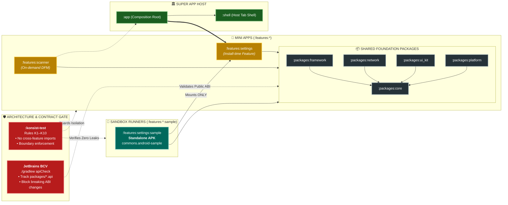
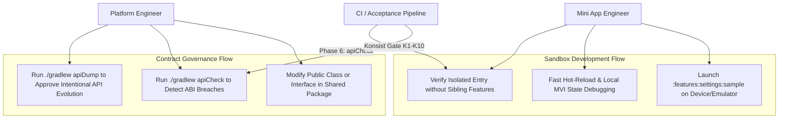
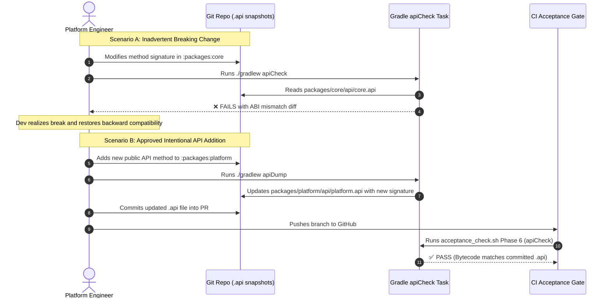

# Epic Overview: Super App Sandbox Development & Binary Contract Governance

## 1. Meta Data
- **Epic Name:** `sandbox_and_contract_governance`
- **Status:** In Progress
- **Target Release:** 1.0.0
- **Source Spec:** [2026-09-10-sandbox-and-contract-governance-design.md](2026-09-10-sandbox-and-contract-governance-design.md)
- **Architecture Reference:** [docs/architecture/ARCHITECTURE.md](../../../docs/architecture/ARCHITECTURE.md)

---

## 2. Background
In enterprise-scale Super App platforms, independent feature teams ("Mini Apps") require two critical governance capabilities:
1. **Isolated Developer Feedback Loop (Sandbox):** Developers should not need to compile or run the heavy Super App container (`:app` + all sibling features) just to iterate on a single feature. They need a lightweight, standalone application runner (`:features:<name>:sample`) that launches their feature in isolation within seconds.
2. **Strict Public ABI/API Contract Enforcement (BCV):** Foundation packages (`:packages:core`, `:packages:platform`, `:packages:network`, `:packages:framework`, `:packages:ui_kit`) provide the shared interfaces and contracts consumed by all Mini Apps. An unannounced or inadvertent breaking change in public signatures risks fatal runtime crashes (`NoSuchMethodError`, `IncompatibleClassChangeError`) across independently built splits.

This epic introduces both the **Mini App Sandbox Framework** and **Binary Compatibility Validation (BCV)** to enforce lifecycle governance and contract safety across the template.

---

## 3. Goals & Non-Goals

### Goals
- **G1 (Sandbox Plugin):** Provide a standardized `commons.android-sample` convention plugin in `buildSrc` to configure standalone sample runners with zero boilerplate.
- **G2 (Exemplar Implementation):** Build `:features:settings:sample` demonstrating standalone APK compilation, mock hosting, and Navigation 3 entry mounting.
- **G3 (ABI Snapshot Tracking):** Integrate JetBrains' Binary Compatibility Validator (BCV) at the root level, generating `.api` dump files for all 5 shared package modules.
- **G4 (CI Breaking Change Gate):** Wire `apiCheck` into `scripts/acceptance_check.sh` (Phase 6) and `./gradlew check` to block breaking changes before merge.
- **G5 (Mason Brick Generation):** Update `bricks/mvi_feature` to automatically scaffold `sample/` submodules for newly generated Mini Apps.
- **G6 (Konsist Architecture Gate Compliance):** Ensure `:sample` modules strictly respect Konsist rules K1 (no cross-feature imports), K6 (single feature binding), and K8 (no host dependency).

### Non-Goals
- **NG1:** Building standalone runners for on-demand Dynamic Feature Modules (`:features:scanner`) which inherently rely on Google Play Feature Delivery splits.
- **NG2:** Replacing the production `:app` composition root or modifying existing release APK packaging.
- **NG3:** Tracking public API changes inside internal `:features:*` modules (feature internals remain encapsulated; only shared packages are governed).

---

## 4. Architecture & Technical Design

### 4.1 High-Level Architecture

### 4.2 Use Cases

### 4.3 Sequence Diagram: Public API Evolution vs. Breaking Change

---

## 5. Rollout Strategy & Mitigation

1. **Non-Intrusive Sandbox Scaffolding:** `:sample` modules are pure developer testbeds configured as separate application artifacts (`applicationIdSuffix = ".sample.<feature>"`). They are never aggregated into the production release bundle and do not impact release APK size or security.
2. **ABI Baseline Freezing:** Initial baseline `.api` files are dumped and reviewed before enforcing `apiCheck` on CI, ensuring zero immediate build breakage on clean repositories.
3. **Graceful Fallback:** If an intentional ABI evolution is required, running `./gradlew apiDump` produces transparent Git diffs, allowing architects to inspect public contract changes during peer code review.

---

## 6. Kanban Tasks Breakdown

- [Task 1: Convention Plugin commons.android-sample](../../features/task_1_commons_android_sample_plugin.md)
- [Task 2: Exemplar Sandbox Implementation :features:settings:sample](../../features/task_2_settings_sample_app.md)
- [Task 3: Binary Compatibility Validator (BCV) Integration](../../features/task_3_bcv_plugin_and_api_dump.md)
- [Task 4: CI & Acceptance Script Automation (Phase 6 apiCheck)](../../features/task_4_acceptance_check_phase_6_api_check.md)
- [Task 5: Mason Brick Automation for Sample Modules](../../features/task_5_mason_brick_sample_scaffolding.md)
- [Task 6: Konsist Gate Rules & E2E Verification](../../features/task_6_konsist_scope_and_e2e_verification.md)
