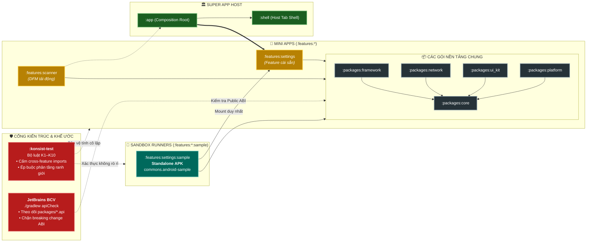
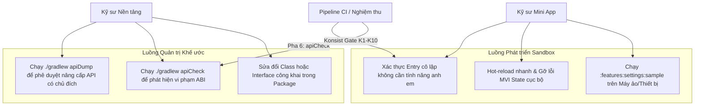
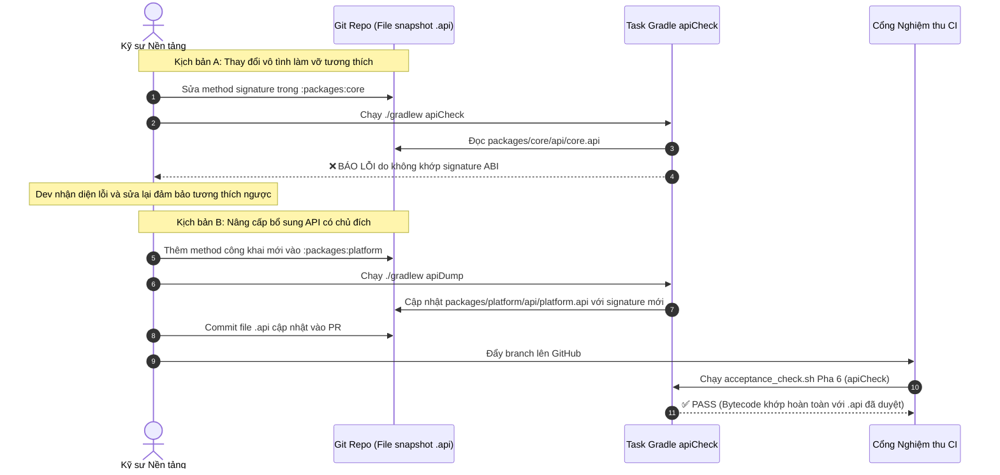

# Tổng quan Epic: Môi trường Sandbox Cho Mini App & Quản trị Hợp đồng Nhị phân (BCV)

## 1. Meta Data
- **Tên Epic:** `sandbox_and_contract_governance`
- **Trạng thái:** In Progress (Đang thực hiện)
- **Phiên bản mục tiêu:** 1.0.0
- **Tài liệu đặc tả nguồn (Source Spec):** [2026-09-10-sandbox-and-contract-governance-design.md](2026-09-10-sandbox-and-contract-governance-design.md)
- **Tài liệu kiến trúc chuẩn:** [docs/architecture/ARCHITECTURE.md](../../../docs/architecture/ARCHITECTURE.md)

---

## 2. Bối cảnh (Background)
Trong các nền tảng Super App quy mô doanh nghiệp, các đội ngũ phát triển tính năng độc lập ("Mini App") đòi hỏi hai năng lực quản trị tối quan trọng:
1. **Chu trình phát triển cô lập cho kỹ sư (Sandbox Development):** Lập trình viên không nên và không cần phải biên dịch hay chạy toàn bộ container Super App cồng kềnh (`:app` + tất cả các Mini App khác) chỉ để gỡ lỗi một thay đổi giao diện nhỏ. Họ cần một bộ chạy ứng dụng độc lập, siêu nhẹ (`:features:<name>:sample`) có thể khởi động tính năng của mình trong vài giây.
2. **Kiểm soát khế ước ABI/API công khai nghiêm ngặt (BCV):** Các gói nền tảng chung (`:packages:core`, `:packages:platform`, `:packages:network`, `:packages:framework`, `:packages:ui_kit`) cung cấp các interface và contract dùng chung cho mọi Mini App. Một thay đổi vô tình làm phá vỡ signature công khai sẽ dẫn đến lỗi crash nghiêm trọng lúc chạy (`NoSuchMethodError`, `IncompatibleClassChangeError`) trên các bản build độc lập.

Epic này thiết lập đồng thời **Khung Sandbox cho Mini App** và cơ chế **Binary Compatibility Validator (BCV)** nhằm thực thi quản trị vòng đời và an toàn khế ước trên toàn bộ template.

---

## 3. Mục tiêu & Giới hạn (Goals & Non-Goals)

### Mục tiêu (Goals)
- **G1 (Plugin Sandbox):** Cung cấp convention plugin chuẩn hóa `commons.android-sample` trong `buildSrc` để cấu hình các module chạy sample độc lập không tốn boilerplate.
- **G2 (Triển khai mẫu Exemplar):** Xây dựng module `:features:settings:sample` chứng minh khả năng biên dịch APK độc lập, mock host và mount entry Navigation 3.
- **G3 (Theo dõi snapshot ABI):** Tích hợp công cụ Binary Compatibility Validator (BCV) của JetBrains ở cấp root, sinh các file dump `.api` cho cả 5 module package nền tảng.
- **G4 (Cổng chặn phá vỡ API trên CI):** Đưa lệnh `apiCheck` vào `scripts/acceptance_check.sh` (Pha 6) và `./gradlew check` để tự động chặn các thay đổi làm gãy tương thích trước khi merge.
- **G5 (Tự động hóa Mason Brick):** Cập nhật template `bricks/mvi_feature` để tự động tạo khung thư mục `sample/` cho mọi Mini App mới được sinh ra.
- **G6 (Tuân thủ cổng kiến trúc Konsist):** Đảm bảo các module `:sample` tuân thủ nghiêm ngặt các quy tắc Konsist K1 (không cross-feature), K6 (chỉ gắn 1 feature duy nhất), và K8 (không phụ thuộc Host).

### Giới hạn (Non-Goals)
- **NG1:** Không xây dựng runner độc lập cho các Dynamic Feature Module tải động lúc runtime (`:features:scanner`) vì bản chất module này phụ thuộc vào Google Play Feature Delivery splits.
- **NG2:** Không thay thế Composition Root `:app` hay sửa đổi cấu hình đóng gói APK Release production.
- **NG3:** Không theo dõi API công khai nội bộ trong các module `:features:*` (nội bộ feature được đóng gói khép kín; chỉ các package nền tảng mới nằm trong diện quản trị khế ước).

---

## 4. Kiến trúc & Thiết kế Kỹ thuật

### 4.1 Kiến trúc Tổng thể (High-Level Architecture)

### 4.2 Trường hợp Sử dụng (Use Cases)

### 4.3 Biểu đồ Trình tự: Nâng cấp API vs. Phá vỡ Tương thích (Sequence Diagram)

---

## 5. Chiến lược Phát hành & Giảm thiểu Rủi ro (Rollout & Mitigation)

1. **Cô lập Sandbox an toàn:** Các module `:sample` thuần túy là môi trường test cho kỹ sư, được cấu hình với Application ID độc lập (`applicationIdSuffix = ".sample.<feature>"`). Chúng tuyệt đối không bị gộp vào bundle production và không ảnh hưởng dung lượng hay tính bảo mật của Super App.
2. **Đóng băng Baseline ABI ban đầu:** Toàn bộ file snapshot `.api` ban đầu được dump và rà soát kỹ lưỡng trước khi kích hoạt cổng `apiCheck` trên CI, đảm bảo không gây gián đoạn build trên codebase hiện tại.
3. **Quy trình fallback rõ ràng:** Khi có sự thay đổi ABI có chủ đích, việc chạy `./gradlew apiDump` tạo diff Git trực quan, giúp các Architect dễ dàng review sự thay đổi interface trong PR.

---

## 6. Phân rã Công việc Kanban (Kanban Tasks Breakdown)

- [Task 1: Plugin Convention commons.android-sample](../../features/task_1_commons_android_sample_plugin.md)
- [Task 2: Triển khai Module Sandbox Mẫu :features:settings:sample](../../features/task_2_settings_sample_app.md)
- [Task 3: Tích hợp Binary Compatibility Validator (BCV)](../../features/task_3_bcv_plugin_and_api_dump.md)
- [Task 4: Tự động hóa CI & Kịch bản Nghiệm thu (Pha 6 apiCheck)](../../features/task_4_acceptance_check_phase_6_api_check.md)
- [Task 5: Nâng cấp Mason Brick Tự động Sinh Module Sample](../../features/task_5_mason_brick_sample_scaffolding.md)
- [Task 6: Kiểm soát Quy tắc Konsist & Nghiệm thu End-to-End](../../features/task_6_konsist_scope_and_e2e_verification.md)
