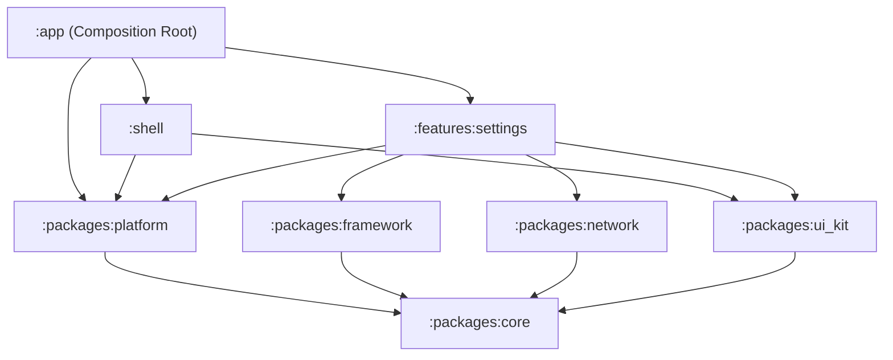

# Design Spec: Settings Screen UI, Dark Mode & OTA Dynamic Localization

**Date**: 2026-09-06  
**Status**: Approved (Brainstorming Phase)  
**Authors**: Antigravity & DanhDue ExOICTIF  
**Target Architecture**: Clean Architecture + MVI + Multi-Module Android (Kotlin 2.x, Jetpack Compose, Dagger Hilt)

---

## 1. Context & Motivation

This specification defines the implementation of the rich Settings screen for `android_super_app_template`, matching the visual design and functional requirements of the reference super app templates (iOS & Flutter).

### Key Features:
1. **Full Settings Screen UI**:
   - 4 grouped card sections with rounded corners (`16.dp`):
     - **TÀI KHOẢN (Account)**: Chỉnh sửa hồ sơ, Đổi mật khẩu, Xác thực 2 yếu tố (2FA).
     - **TÙY CHỌN (Preferences)**: Tiền tệ / Đơn vị (`USD ($)`), Ngôn ngữ (hiển thị ngôn ngữ hiện tại, mở Bottom Sheet), Chế độ tối (Switch).
     - **NHÀ PHÁT TRIỂN (Developer)**: Chế độ gỡ lỗi (Switch).
     - **THÔNG TIN ỨNG DỤNG (App Information)**: Liên hệ hỗ trợ, Về ứng dụng (`1.0.0`).
   - Standalone **Đăng xuất (Logout)** card button at the bottom.
2. **Dark Mode Toggle**:
   - Managed centrally via `AppThemeManager` in `:packages:platform`.
   - Persisted in `CacheStore` (`:packages:core`).
   - Reactive theme updates across the entire app hierarchy without Activity recreation.
   - Publishes `AppEvent.ThemeModeChanged` to `AppEventBus`.
3. **OTA Dynamic Localization with Modal Bottom Sheet**:
   - Bundled default languages: **English (`en`)** and **Vietnamese (`vi`)** in `strings.xml`.
   - Remote languages (**日本語 `ja_JP`**, **한국어 `ko_KR`**) fetched on-demand from the backend.
   - **Background Bootstrap Sync**: On entering Settings (`init`), calls `POST /api/v1/settings/sync/bootstrap` in the background (no loading dialog) to retrieve available languages and check for stale translations.
   - **State-aware Language Switching**:
     - If language is **cached/bundled**: Switch locale immediately (optimistic UI), and check for delta updates in background.
     - If language is **not cached**: Display a modal `LoadingDialog` ("Đang tải ngôn ngữ..."), fetch remote translations via `GET /api/v1/translations/{code}`, save flattened dot-notation map into `CacheStore`, apply locale, and dismiss dialog. If fetch fails, keep previous language and display a soft error message.
     - **Same-Language Skip**: Redundant switches on the active language are skipped.

---

## 2. System Architecture & Module Boundaries

The implementation strictly honors the governed module hierarchy (Konsist K1–K9):



### 2.1 `:packages:platform` (Cross-Feature Seam)
1. **`AppThemeMode` & `AppThemeManager`**:
   - `AppThemeMode`: enum `{ SYSTEM, LIGHT, DARK }`
   - `AppThemeManager`: Singleton injected with `CacheStore` and `AppEventBus`.
   - State flows: `val themeMode: StateFlow<AppThemeMode>`, `val isDarkMode: StateFlow<Boolean>`.
   - Functions: `fun toggleDarkMode(enabled: Boolean)`, `fun setThemeMode(mode: AppThemeMode)`.
   - Emits `AppEvent.ThemeModeChanged(mode)` on `AppEventBus`.
2. **`AppLocalizationManager`**:
   - Tracks `val currentLanguageCode: StateFlow<String>`.
   - In-memory translation overrides: `val dynamicOverrides: StateFlow<Map<String, String>>`.
   - Function `fun translate(key: String, default: String? = null): String`: Checks `dynamicOverrides[key]`, then falls back to `default ?? key`.
   - Function `fun setLocale(code: String)`:
     - Updates `currentLanguageCode` and loads cached translations for `code`.
     - Updates Android per-app locale via `AppCompatDelegate.setApplicationLocales(...)`.
     - Persists selection to `CacheStore`.
     - Emits `AppEvent.AppLanguageChanged(code)` on `AppEventBus`.
   - Function `fun applyDynamicTranslations(code: String, translations: Map<String, String>, isFull: Boolean)`:
     - Persists translations in `CacheStore`.
     - Updates `dynamicOverrides` if `code` is currently active.
3. **`AppEvent` additions**:
   ```kotlin
   data class ThemeModeChanged(val mode: AppThemeMode) : AppEvent
   data class AppLanguageChanged(val languageCode: String) : AppEvent
   ```

---

## 3. Remote APIs & Data Layer (`:features:settings`)

### 3.1 Remote Endpoints
1. **Bootstrap Sync**:
   - `POST https://digital-wallet-93c4ba68a41d.herokuapp.com/api/v1/settings/sync/bootstrap`
   - Request Body:
     ```json
     {
       "cached_translations": [
         { "resource_id": "en_US", "version": "0.0.1" }
       ]
     }
     ```
   - Response Body:
     - `available_languages`: list of supported languages (`language_code`, `language_name`, `version`, `is_default`, `is_active`).
     - `stale_translations`: list of resources needing updates.
2. **Translations Download (Delta/Full)**:
   - `GET https://digital-wallet-93c4ba68a41d.herokuapp.com/api/v1/translations/{language_code}?since_version={version}`
   - Returns nested translations JSON tree, `mode` (`full` | `delta`), and `version`.

### 3.2 Moshi DTOs & JSON Flattening
- `BootstrapRequestDto`, `CachedTranslationDto`, `BootstrapResponseDto`, `AvailableLanguageDto`.
- `TranslationResponseDto`:
  - Custom deserializer/helper `flattenJsonToDotNotation()` transforms nested keys (e.g. `{"settings": {"preferences": {"darkMode": "ダークモード"}}}`) into flat map entries `settings.preferences.darkMode = "ダークモード"`.

### 3.3 Local Storage (`SettingsLocalDataSource`)
- Uses `CacheStore` (`packages/core`):
  - `translations_{code}`: JSON string of flat translations map.
  - `version_{code}`: Current version string.
  - `available_languages`: Cached list of available languages.
- `isLanguageCached(code)`: `true` for bundled `en`/`vi` or when cached in `CacheStore`.

---

## 4. Domain Layer (`:features:settings`)

Pure Kotlin, 0 Android framework imports (Konsist Rule K3).

### 4.1 Entities
- `AvailableLanguage(code: String, name: String, version: String?, isDefault: Boolean, isCached: Boolean)`
- `LanguageSyncStatus`: `Loading`, `CachedApplied`, `Success`, `Error(message: String)`

### 4.2 Repository Interface
```kotlin
interface SettingsRepository {
    suspend fun bootstrap(): Result<List<AvailableLanguage>>
    suspend fun getAvailableLanguages(): List<AvailableLanguage>
    suspend fun isLanguageCached(code: String): Boolean
    suspend fun fetchAndCacheTranslations(code: String): Result<Map<String, String>>
}
```

### 4.3 Use Cases
- `BootstrapSettingsUseCase`: Invoked silently on screen init, fetches bootstrap data and caches available languages.
- `ChangeLanguageUseCase`: Implements the state machine with optimistic UI for cached languages and loading dialog for uncached languages.
- `ToggleDarkModeUseCase`: Delegates to `AppThemeManager`.

---

## 5. Presentation Layer (`:features:settings`)

### 5.1 MVI Architecture
- **`SettingsState`**: Holds `isDarkMode`, `currentLanguageCode`, `currentLanguageName`, `availableLanguages`, `isLanguagePickerVisible`, `isLoadingLanguage`, `isDeveloperMode`, `appVersion`.
- **`SettingsAction`**:
  - `Init`: Triggers silent bootstrap.
  - `ToggleDarkMode(enabled: Boolean)`
  - `OpenLanguagePicker`, `DismissLanguagePicker`
  - `SelectLanguage(language: AvailableLanguage)`
  - `ToggleDeveloperMode(enabled: Boolean)`
  - `OpenProfile`, `Logout`
- **`SettingsEvent`**: `NavigateToProfile`, `ShowToast(message: String)`

### 5.2 UI Components
1. **`SettingsScreen`**:
   - Grouped into 4 cards (`SettingsSectionCard`) on background surface.
   - `SettingsItemRow` with circular pastel badge icons, title, and trailing elements (Chevron, Switch, Value text).
   - Bottom standalone red **Đăng xuất** button.
   - `LoadingDialog` shown when `isLoadingLanguage == true`.
2. **`LanguagePickerBottomSheet`**:
   - Material 3 `ModalBottomSheet` with bold centered header **Ngôn ngữ**.
   - Language options with active checkmark `✓`.
   - On item click: dismisses sheet and dispatches `SelectLanguage`.

---

## 6. Verification & Testing Strategy

1. **Unit Tests (`:features:settings:testDebugUnitTest`)**:
   - `ChangeLanguageUseCaseTest`: Verifies optimistic switch for cached languages, loading emission for uncached languages, same-language skip, and failure rollback.
   - `SettingsViewModelTest`: Verifies actions (`Init`, `ToggleDarkMode`, `SelectLanguage`, `OpenProfile`, `Logout`).
2. **Architecture Gate (`:konsist-test:test`)**:
   - Strict validation of all Konsist rules K1–K9.
3. **Quality & Spotless**:
   - `./gradlew spotlessCheck` with 0 warnings.
4. **App Build & Assembly**:
   - `./gradlew assembleDebug` must succeed cleanly.
