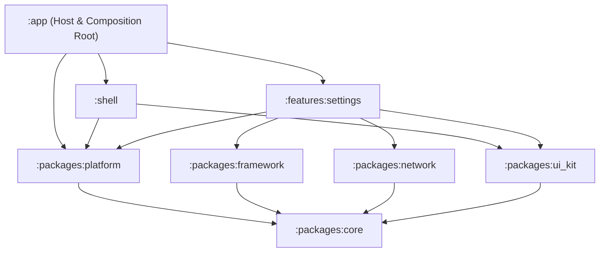
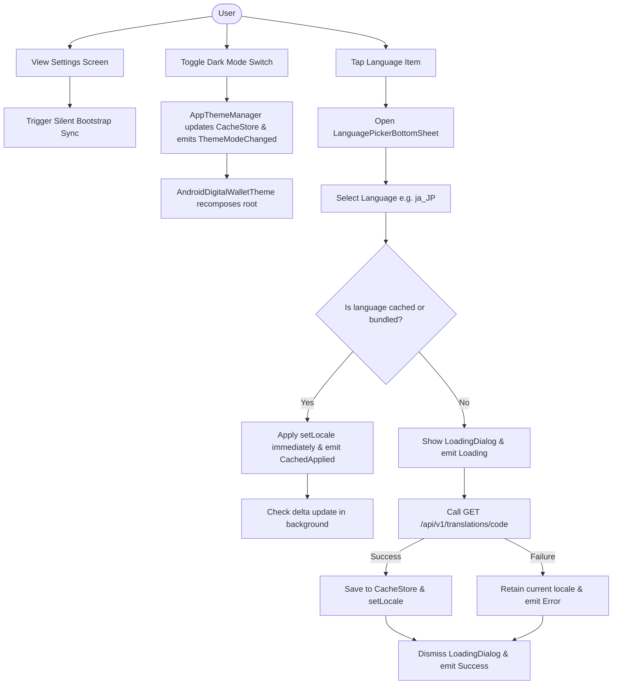
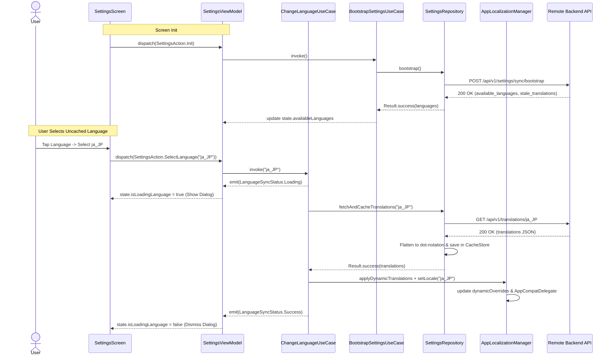

# Epic: Settings Screen UI, Dark Mode & OTA Dynamic Localization

## 1. Meta Data
- **Epic Name**: `settings_language_darkmode`
- **Status**: Planning (Ready for Task Confirmation)
- **Target Release**: v1.0.0
- **Source Spec**: [2026-09-06-settings-language-darkmode-design.md](2026-09-06-settings-language-darkmode-design.md)
- **Target Architecture**: Clean Architecture + MVI + Multi-Module Android (Kotlin 2.x, Jetpack Compose Material 3, Dagger Hilt)

---

## 2. Background
The application currently has a stub Settings screen and basic language configuration. In order to achieve full feature parity with the reference super app templates (iOS & Flutter), the Settings feature must be upgraded to:
1. Provide a modern, card-grouped Settings screen matching the provided UI designs (Account, Preferences, Developer, App Info, Logout).
2. Enable centralized Dark Mode management that reacts instantly across the entire application hierarchy.
3. Support on-the-air (OTA) dynamic localization: bundling English (`en`) and Vietnamese (`vi`) by default, while downloading additional languages (e.g. Japanese `ja_JP`, Korean `ko_KR`) on demand from the backend API, complete with silent bootstrap synchronization and state-aware optimistic UI transitions.

---

## 3. Goals & Non-Goals

### Goals
- **UI Parity**: 100% visual fidelity with design screenshots using Jetpack Compose (4 rounded card sections with pastel circular icon badges, chevrons, switches, and a standalone red logout button).
- **Global Theme Management**: `AppThemeManager` in `:packages:platform` backed by `CacheStore` (`:packages:core`) and broadcasting `AppEvent.ThemeModeChanged` on `AppEventBus`.
- **OTA Dynamic Localization**:
  - `POST /api/v1/settings/sync/bootstrap` called silently in background on screen initialization.
  - Modal Bottom Sheet (`LanguagePickerBottomSheet`) with checkmark indicator on active language.
  - Optimistic UI switch for cached/bundled languages; modal `LoadingDialog` for uncached languages with fallback on failure.
  - `GET /api/v1/translations/{code}?since_version={version}` supporting delta/full translation downloads flattened into dot-notation `Map<String, String>`.
- **Quality & Architecture**: Strict compliance with Konsist rules K1–K9, comprehensive BDD -> TDD coverage for all new components.

### Non-Goals
- Implementing full backend authentication/2FA logic for navigation items (these remain interactive route stubs).
- Complex currency exchange engine (displays currency preferences).

---

## 4. Architecture & Technical Design

### High-Level Architecture

### Use Cases Flowchart

### Sequence Diagram: Language Switching & Bootstrap

---

## 5. Rollout Strategy & Mitigation
- **Phased Rollout**: Infrastructure first (`:packages:platform`), then data/domain layers, followed by UI and composition.
- **Graceful Fallback**: If remote translation download fails, the app retains the currently active language and surfaces a non-blocking toast, avoiding app crashes or blank screens.
- **Cache Persistence**: Cached translations survive app restarts via Jetpack DataStore (`CacheStore`).

---

## 6. Kanban Tasks Breakdown
1. [Task 1: Platform Theme & Localization Infrastructure](../../features/task_1_platform_theme_localization_infrastructure.md)
2. [Task 2: Settings Remote APIs & Data Layer Integration](../../features/task_2_settings_data_layer_api_integration.md)
3. [Task 3: Settings Domain Orchestration Use Cases](../../features/task_3_settings_domain_orchestration_usecases.md)
4. [Task 4: Settings Presentation MVI ViewModel](../../features/task_4_settings_presentation_mvi_viewmodel.md)
5. [Task 5: Settings Card UI & Language Bottom Sheet](../../features/task_5_settings_card_ui_language_bottom_sheet.md)
6. [Task 6: Root Composition & App-Wide Wiring Verification](../../features/task_6_root_composition_app_wiring.md)
