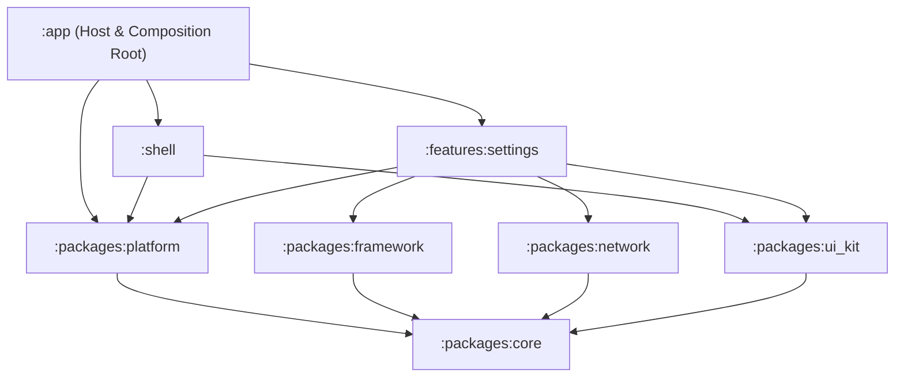
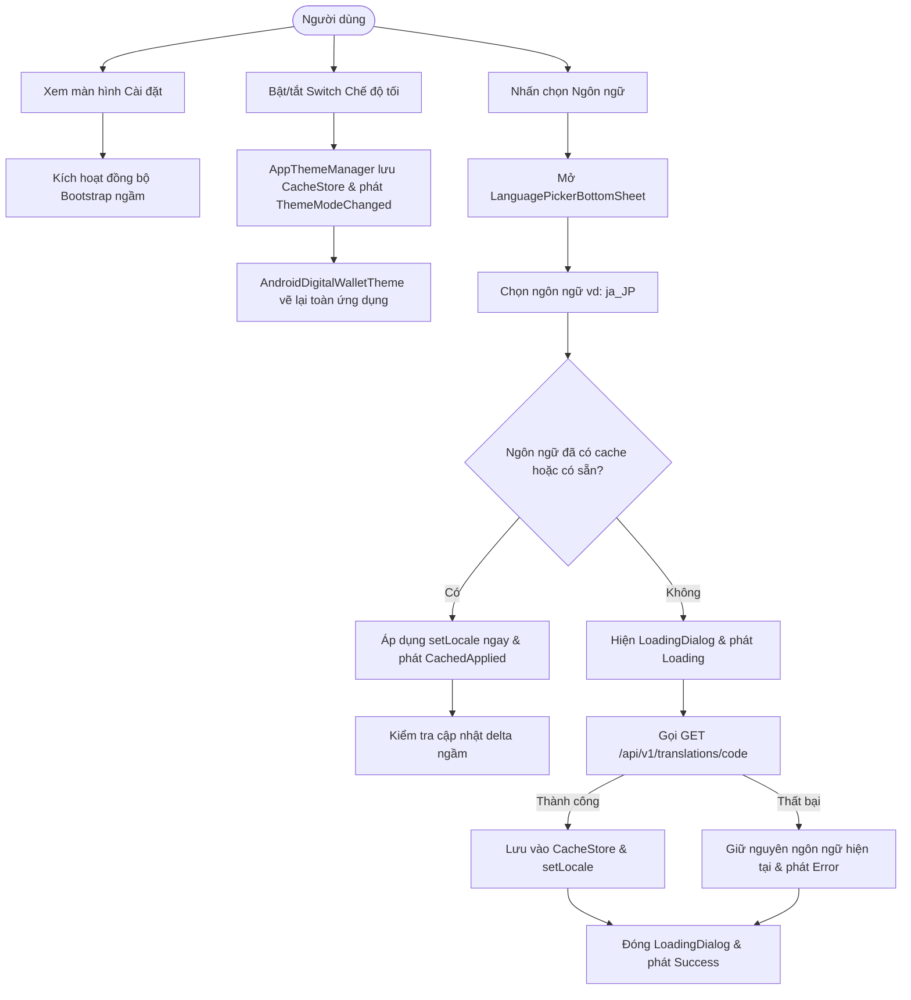
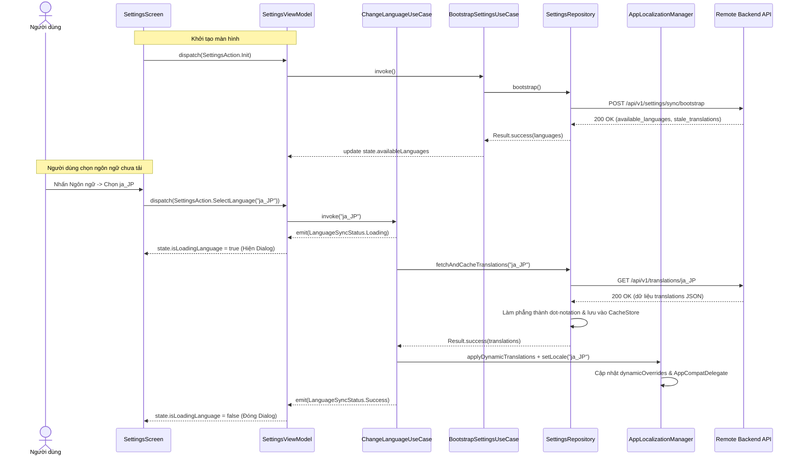

# Epic: Giao diện Cài đặt (Settings), Chế độ Tối (Dark Mode) & Đa ngôn ngữ Động (OTA Localization)

## 1. Thông tin chung (Meta Data)
- **Tên Epic**: `settings_language_darkmode`
- **Trạng thái**: Đang lập kế hoạch (Sẵn sàng xác nhận Task)
- **Phiên bản mục tiêu**: v1.0.0
- **Tài liệu đặc tả nguồn**: [2026-09-06-settings-language-darkmode-design.md](2026-09-06-settings-language-darkmode-design.md)
- **Kiến trúc mục tiêu**: Clean Architecture + MVI + Multi-Module Android (Kotlin 2.x, Jetpack Compose Material 3, Dagger Hilt)

---

## 2. Bối cảnh (Background)
Ứng dụng hiện tại có màn hình Cài đặt cơ bản dạng stub. Để đạt được tính tương thích và đồng bộ tính năng với template super app tham chiếu (iOS & Flutter), tính năng Cài đặt cần được nâng cấp để:
1. Cung cấp giao diện màn hình Cài đặt hiện đại, phân nhóm theo card bo tròn chuẩn thiết kế (Tài khoản, Tùy chọn, Dành cho nhà phát triển, Thông tin ứng dụng, Đăng xuất).
2. Quản lý Dark Mode tập trung, phản hồi tức thì trên toàn bộ cây giao diện của ứng dụng.
3. Hỗ trợ đa ngôn ngữ động qua mạng (OTA dynamic localization): đóng gói sẵn tiếng Anh (`en`) và tiếng Việt (`vi`) trong `strings.xml`, đồng thời tải động các ngôn ngữ bổ sung (ví dụ: tiếng Nhật `ja_JP`, tiếng Hàn `ko_KR`) theo nhu cầu từ backend API, đi kèm cơ chế đồng bộ ngầm lúc khởi tạo (silent bootstrap) và chuyển đổi giao diện mượt mà (optimistic UI).

---

## 3. Mục tiêu & Giới hạn (Goals & Non-Goals)

### Mục tiêu (Goals)
- **Chuẩn giao diện (UI Parity)**: Đạt 100% độ chính xác về mặt thị giác so với thiết kế với Jetpack Compose (4 nhóm card bo góc với icon tròn màu pastel, chevron, switch toggle, và nút đăng xuất màu đỏ riêng biệt).
- **Quản lý Theme toàn cục (Global Theme Management)**: `AppThemeManager` trong `:packages:platform` được lưu trữ bởi `CacheStore` (`:packages:core`) và phát sự kiện `AppEvent.ThemeModeChanged` qua `AppEventBus`.
- **Đa ngôn ngữ động qua mạng (OTA Dynamic Localization)**:
  - Gọi ngầm `POST /api/v1/settings/sync/bootstrap` lúc khởi tạo màn hình Cài đặt.
  - Hiển thị Modal Bottom Sheet (`LanguagePickerBottomSheet`) với dấu tích chọn ngôn ngữ đang kích hoạt.
  - Áp dụng ngay (optimistic UI) cho ngôn ngữ đã lưu cache hoặc có sẵn; hiển thị modal `LoadingDialog` khi tải ngôn ngữ mới và có cơ chế rollback an toàn nếu lỗi mạng.
  - Tải `GET /api/v1/translations/{code}?since_version={version}` hỗ trợ cập nhật delta/full và làm phẳng thành `Map<String, String>` dạng dot-notation.
- **Chất lượng & Kiến trúc**: Tuân thủ tuyệt đối các quy tắc Konsist K1–K9, độ phủ kiểm thử đầy đủ theo quy trình BDD -> TDD cho tất cả các thành phần mới.

### Giới hạn (Non-Goals)
- Triển khai toàn bộ logic xác thực/2FA ở backend cho các mục điều hướng (các mục này duy trì dưới dạng stub điều hướng).
- Công cụ chuyển đổi tỷ giá tiền tệ phức tạp (chỉ hiển thị tùy chọn loại tiền tệ).

---

## 4. Kiến trúc & Thiết kế kỹ thuật (Architecture & Technical Design)

### Kiến trúc tổng thể (High-Level Architecture)

### Sơ đồ luồng ca sử dụng (Use Cases Flowchart)

### Sơ đồ tuần tự: Chuyển đổi ngôn ngữ & Đồng bộ Bootstrap

---

## 5. Chiến lược triển khai & Giảm thiểu rủi ro (Rollout Strategy & Mitigation)
- **Triển khai từng giai đoạn (Phased Rollout)**: Xây dựng tầng hạ tầng trước (`:packages:platform`), kế đến tầng dữ liệu & domain, sau cùng là UI và tích hợp gốc.
- **Dung sai lỗi an toàn (Graceful Fallback)**: Nếu tải bản dịch từ xa thất bại, ứng dụng vẫn giữ nguyên ngôn ngữ hiện hành và hiện thông báo lỗi nhẹ nhàng, không gây gián đoạn hay crash ứng dụng.
- **Lưu trữ bền vững (Cache Persistence)**: Các bản dịch đã tải được lưu an toàn qua Jetpack DataStore (`CacheStore`).

---

## 6. Phân rã công việc Kanban (Kanban Tasks Breakdown)
1. [Task 1: Hạ tầng Theme & Đa ngôn ngữ Platform](../../features/task_1_platform_theme_localization_infrastructure.md)
2. [Task 2: Tích hợp API Từ xa & Tầng Dữ liệu Settings](../../features/task_2_settings_data_layer_api_integration.md)
3. [Task 3: Các Use Case Điều phối Nghiệp vụ Settings](../../features/task_3_settings_domain_orchestration_usecases.md)
4. [Task 4: MVI ViewModel Tầng Presentation](../../features/task_4_settings_presentation_mvi_viewmodel.md)
5. [Task 5: Giao diện Card Settings & Bottom Sheet Chọn Ngôn ngữ](../../features/task_5_settings_card_ui_language_bottom_sheet.md)
6. [Task 6: Tích hợp Toàn diện Ứng dụng & Kiểm định Chất lượng](../../features/task_6_root_composition_app_wiring.md)
