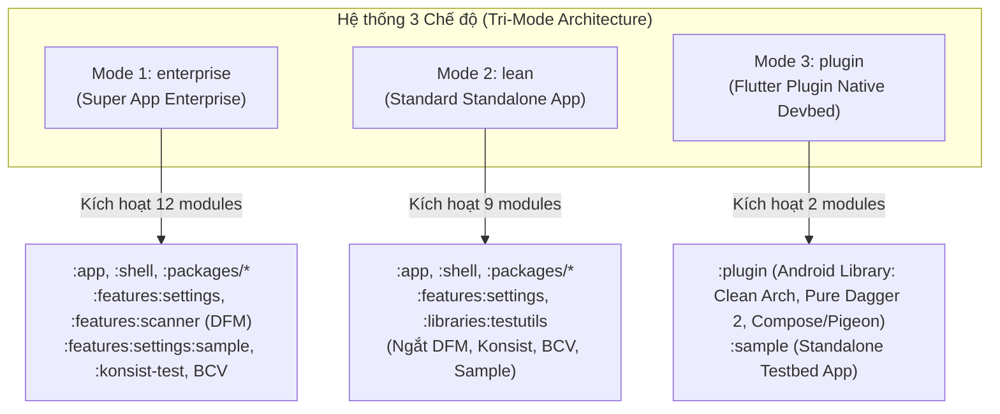

# Tri-Mode Android Native Template & Flutter Plugin Native Devbed — Design Spec

## 1. Metadata
- **Epic / Feature**: `tri_mode_template_and_flutter_plugin_devbed`
- **Date**: 2026-09-11
- **Status**: Approved — Ready for Spec Review & Next Step Routing
- **Target Repository**: `android_digital_wallet` (`/Users/danhdueexoictif/AllProjects/digital_wallet/android_digital_wallet`)
- **Reference Flutter Template**: `bloc_digital_wallet` (`/Users/danhdueexoictif/AllProjects/digital_wallet/bloc_digital_wallet`)
  - Spec: `.devtool/epic/flutter_super_app_template/2026-09-06-flutter-super-app-template-design.md`
  - Spec: `.devtool/epic/super_app_governance/super_app_governance.vi.md`

---

## 2. Context & Problem Statement

### 2.1 Hiện trạng của Android Native Template
Template hiện tại (`android_digital_wallet`) được thiết kế ở mức độ quản trị cao nhất (**Enterprise Super App**):
- Sử dụng kiến trúc đa module phân rã triệt để (`:app`, `:shell`, `:packages:core`, `:packages:framework`, `:packages:network`, `:packages:platform`, `:packages:ui_kit`, `:features:settings`, `:features:settings:sample`, `:features:scanner`, `:libraries:testutils`, `:konsist-test`).
- Tích hợp Dynamic Feature Module (DFM `:features:scanner` - Play Feature Delivery) với cơ chế đảo ngược phụ thuộc (DFM phụ thuộc `:app`), `FeatureEntry` nạp qua `ServiceLoader`.
- Áp dụng các cổng kiểm soát kiến trúc nghiêm ngặt: Konsist Gate K1–K10, JetBrains Binary Compatibility Validator (BCV `apiCheck`/`apiDump`), Detekt, Spotless.
- Dagger Hilt được sử dụng xuyên suốt từ Host App cho tới các feature modules.

### 2.2 Nhu cầu Thực tế và Các Điểm Nghẽn
1. **Quá tải đối với ứng dụng độc lập (Standalone App / MVP):**
   Một startup, team nhỏ hoặc dự án làm app đơn lẻ (không phải Super App) khi clone template này về phải gánh toàn bộ chi phí biên dịch của DFM, Konsist, BCV, và Sandbox runner, làm chậm tốc độ build và tăng độ phức tạp không cần thiết.
2. **Nhu cầu làm "Phòng thí nghiệm Native" (Devbed) cho Flutter Plugin:**
   Trong dự án Flutter Super App Template (`bloc_digital_wallet`), hệ thống Mason Bricks (`pac_native_plugin`, `pac_add_native_ui`) định nghĩa các Flutter Plugin có phần Native Android viết theo Clean Architecture 4 tầng (`Platform/Domain/Data/Presentation`), hỗ trợ cả Headless (Pigeon) lẫn UI (Jetpack Compose qua `PlatformView`).
   - **Thách thức:** Khi viết native code cho Flutter Plugin, lập trình viên không thể dùng Hilt (vì Flutter App chủ không cài Hilt plugin hay `@HiltAndroidApp`).
   - **Yêu cầu Background:** Lập trình viên cần một môi trường native độc lập để viết và test các tác vụ chạy nền (WorkManager `Worker`, Android `Service`, `BroadcastReceiver`) bằng **Dagger 2 thuần** mà **không cần khởi chạy Flutter Engine** (tránh tốn 100MB–200MB RAM và độ trễ khởi động khi app bị kill).

---

## 3. Kiến trúc 3 Chế độ (Tri-Mode Architecture)

Dự án được nâng cấp để hỗ trợ 3 chế độ cấu hình độc lập, phục vụ 3 tập đối tượng mục tiêu:



### 3.1 Ma trận So sánh Chi tiết 3 Chế độ

| Tiêu chí | Mode 1: `enterprise` | Mode 2: `lean` | Mode 3: `plugin` |
|---|---|---|---|
| **Mục đích sử dụng** | Super App quy mô lớn, nhiều team phát triển, mini-app ecosystem | App độc lập, MVP, startup, team nhỏ (cần build siêu tốc) | Phát triển native code cho Flutter Plugin (`pac_native_plugin`) |
| **Output chính** | Base APK + Dynamic Feature Splits (AAB) | Single APK / AAB hoàn chỉnh | Android Library (`.aar` / source nhúng vào Flutter) |
| **Modules kích hoạt** | `:app`, `:shell`, `:packages:*`, `:features:settings`, `:features:settings:sample`, `:features:scanner`, `:libraries:testutils`, `:konsist-test` | `:app`, `:shell`, `:packages:*`, `:features:settings`, `:libraries:testutils` | `:plugin` (Android Library), `:sample` (Standalone Testbed App) |
| **Hệ thống DI** | Dagger Hilt (`@IntoSet` multibindings + ServiceLoader) | Dagger Hilt tiêu chuẩn | **Pure Dagger 2** (`@Component`, `@Module`, `@Inject`, KSP) — **Không dùng Hilt** |
| **Dynamic Feature (DFM)** | Bật (`:features:scanner` qua `android.dynamicFeatures`) | **Tắt hoàn toàn** | **Không sử dụng** |
| **Governance & Quality Gates** | Konsist Rules (K1–K10) + BCV (`apiCheck`) | Tắt Konsist & BCV | Tắt Konsist & BCV; giữ Spotless / Detekt chuẩn |
| **Giao diện UI** | Jetpack Compose + Navigation3 Host | Jetpack Compose + Navigation3 Host | **Jetpack Compose Screen bọc trong `PlatformView`** |
| **Khả năng chạy Background** | Hilt Worker / Services | Hilt Worker / Services | **Chạy độc lập 100% qua Dagger 2, zero Flutter Engine overhead** |
| **Khả năng map sang Flutter** | Không trực tiếp | Không trực tiếp | **Khớp 100% với thư mục `android/` của Flutter Plugin** |

---

## 4. Thiết kế Chi tiết Module `:plugin` và `:sample` (Mode 3)

### 4.1 Cơ chế DI: Dagger 2 thuần (Pure Dagger without Hilt)
- **Lý do loại trừ Hilt:** Hilt biến đổi bytecode `Activity` và yêu cầu `@HiltAndroidApp` trên `Application` của app chủ. Một Flutter Plugin phân phối qua pub.dev/git không thể ép app Flutter chủ phải cấu hình Hilt Gradle Plugin.
- **Giải pháp Dagger 2 thuần:**
  - Áp dụng KSP (`id("com.google.devtools.ksp")`) và thư viện Dagger 2 runtime (`com.google.dagger:dagger`).
  - `@Component` và `@Module` được khởi tạo nội bộ trong plugin:
    ```kotlin
    @Singleton
    @Component(modules = [PluginModule::class])
    interface PluginComponent {
        fun inject(worker: DataSyncWorker)
        fun getDataUseCase(): GetDataUseCase
        fun getPluginViewModelFactory(): PluginViewModelFactory
    }
    ```
  - Cung cấp `PluginComponentProvider` (Thread-safe Singleton Holder) nhận `Context`:
    ```kotlin
    object PluginComponentProvider {
        @Volatile private var instance: PluginComponent? = null

        fun get(context: Context): PluginComponent =
            instance ?: synchronized(this) {
                instance ?: DaggerPluginComponent.builder()
                    .pluginModule(PluginModule(context.applicationContext))
                    .build().also { instance = it }
            }

        @VisibleForTesting
        fun reset() { instance = null }
    }
    ```

### 4.2 Khả năng Chạy Background Độc lập (Zero Flutter Engine)
Khi Android OS kích hoạt các tác vụ nền (Background) trong lúc ứng dụng đã bị tắt hoặc kill:
- `WorkManager` (`CoroutineWorker`):
  ```kotlin
  class DataSyncWorker(
      context: Context,
      params: WorkerParameters
  ) : CoroutineWorker(context, params) {
      private val syncUseCase = PluginComponentProvider.get(context).getDataUseCase()

      override suspend fun doWork(): Result {
          return if (syncUseCase.execute()) Result.success() else Result.retry()
      }
  }
  ```
- **Lợi ích:** Không cần khởi chạy Headless `FlutterEngine`, tiết kiệm 150MB+ RAM và tránh nguy cơ bị hệ điều hành Android kill ngay lập tức vì vượt ngưỡng bộ nhớ nền.

### 4.3 Cấu trúc Thư mục Module `:plugin`
```
plugin/
├── build.gradle.kts                           # com.android.library, KSP, Dagger 2, Compose (khi có UI)
└── src/
    ├── main/
    │   ├── AndroidManifest.xml
    │   └── kotlin/com/danhdue/plugin/
    │       ├── di/                            # PURE DAGGER 2 (Zero Hilt, Context-based)
    │       │   ├── PluginComponent.kt         # @Singleton @Component(modules = [PluginModule::class])
    │       │   ├── PluginModule.kt            # Cung cấp Context, Repositories, Coroutines Dispatchers
    │       │   └── PluginComponentProvider.kt # Thread-safe singleton holder (cho Worker/Service)
    │       ├── platform/                      # TẦNG GIAO TIẾP FLUTTER (Headless & PlatformView)
    │       │   ├── MyPlugin.kt                # FlutterPlugin lifecycle (onAttachedToEngine, onDetachedFromEngine)
    │       │   ├── Messages.g.kt              # [Khi No-UI] Pigeon type-safe contracts
    │       │   ├── MyPluginHostApiImpl.kt     # [Khi No-UI] Pigeon implementation gọi xuống Domain UseCases
    │       │   └── MyPlatformViewFactory.kt   # [Khi With-UI] Factory khởi tạo PlatformView
    │       ├── domain/                        # PURE KOTLIN (Zero Android/Flutter dependencies)
    │       │   ├── model/                     # Data classes thuần túy
    │       │   ├── repository/                # Interfaces (vd: PluginRepository)
    │       │   └── usecase/                   # @Inject constructor các nghiệp vụ (vd: GetDataUseCase)
    │       ├── data/                          # HỆ THỐNG / THIẾT BỊ / BACKGROUND
    │       │   ├── repository/                # Implementations (@Inject constructor)
    │       │   ├── datasource/                # SDK phần cứng, Room, Network
    │       │   └── worker/                    # [Background Worker] WorkManager chạy độc lập không cần Flutter
    │       │       └── DataSyncWorker.kt
    │       └── presentation/                  # [CHỈ KHI WITH-UI] JETPACK COMPOSE MVI
    │           ├── base/                      # Base MVI độc lập (StateFlow + Channel, không Hilt)
    │           │   ├── MviViewModel.kt
    │           │   ├── ViewAction.kt
    │           │   ├── ViewState.kt
    │           │   └── ViewEvent.kt
    │           ├── MyPluginViewModel.kt       # ViewModel độc lập với @Inject constructor
    │           ├── MyPluginScreen.kt          # Giao diện Jetpack Compose (@Composable)
    │           └── MyPlatformView.kt          # Bọc ComposeView vào io.flutter.plugin.platform.PlatformView
    └── test/                                  # Unit tests độc lập (Mockk, JUnit 4, Turbine)
```

### 4.4 Module Standalone Testbed Runner `:sample`
```
sample/
├── build.gradle.kts                           # com.android.application, dependencies: implementation(project(":plugin"))
└── src/main/
    ├── AndroidManifest.xml
    └── kotlin/com/danhdue/sample/
        └── MainActivity.kt                    # ComponentActivity trực tiếp mount MyPluginScreen hoặc test Worker/Pigeon
```

---

## 5. Quản trị Chuyển đổi Chế độ qua Scripts (Scripts & Automation)

### 5.1 Phân định Trách nhiệm Công cụ (Hybrid Approach)
1. **Shell Script (`scripts/configure_mode.sh` & `scripts/rename_project.sh`):**
   - Đảm nhiệm việc biến đổi cấu hình dự án, chuyển đổi giữa 3 mode, patch `settings.gradle.kts`, `app/build.gradle.kts`, và dọn dẹp thư mục.
   - **Ưu thế:** Chạy ngay lập tức trên macOS / Linux / CI mà **không yêu cầu lập trình viên phải cài đặt Dart SDK hay Mason CLI**.
2. **Mason Bricks (`bricks/`):**
   - Đảm nhiệm việc sinh mã nguồn (Scaffolding) các module Clean Architecture, tạo plugin mới hoặc nâng cấp UI.

### 5.2 Script Quản lý Chế độ: `scripts/configure_mode.sh`
Cú pháp:
```bash
scripts/configure_mode.sh <enterprise|lean|plugin> [--prune]
```

#### Cơ chế Xử lý Chi tiết:
1. **Khi chọn `enterprise`:**
   - Khôi phục đầy đủ 12 modules trong `settings.gradle.kts`:
     ```kotlin
     include(":app")
     include(":packages:core")
     include(":packages:network")
     include(":packages:platform")
     include(":packages:framework")
     include(":packages:ui_kit")
     include(":shell")
     include(":libraries:testutils")
     include(":features:settings")
     include(":features:settings:sample")
     include(":features:scanner")
     include(":konsist-test")
     ```
   - Trong `app/build.gradle.kts`: Bật `dynamicFeatures += setOf(":features:scanner")`.
   - Trong root `build.gradle.kts`: Đảm bảo plugin BCV (`kotlinx-binary-compatibility-validator`) được nạp.
2. **Khi chọn `lean`:**
   - Comment hoặc loại bỏ các dòng sau trong `settings.gradle.kts`:
     ```kotlin
     // include(":features:settings:sample")
     // include(":features:scanner")
     // include(":konsist-test")
     ```
   - Trong `app/build.gradle.kts`: Gỡ bỏ `:features:scanner` khỏi `dynamicFeatures`.
   - Trong root `build.gradle.kts`: Tắt kiểm tra BCV.
   - Nếu có cờ `--prune`: Xóa hẳn thư mục vật lý `features/scanner`, `features/settings/sample`, `konsist-test`.
3. **Khi chọn `plugin`:**
   - Viết lại `settings.gradle.kts` chỉ kích hoạt đúng 2 module:
     ```kotlin
     include(":plugin")
     include(":sample")
     ```
   - Tắt toàn bộ các module `:app`, `:shell`, `:packages:*`, `:features:*`, `:konsist-test`.
   - Nếu có cờ `--prune`: Dọn sạch các thư mục module không thuộc `:plugin` và `:sample`.

### 5.3 Tích hợp vào `scripts/rename_project.sh`
Thêm tùy chọn `--mode <enterprise|lean|plugin>`:
```bash
scripts/rename_project.sh <app_name> <bundle_id> [<display_name>] [--mode <enterprise|lean|plugin>] [--force] [--dry-run]
```
- Mặc định: `--mode enterprise` (bảo toàn 100% hiện trạng nếu người dùng không chỉ định).
- Khi truyền `--mode lean` hoặc `--mode plugin`: Script thực hiện rename namespace/package trước, sau đó tự động gọi `configure_mode.sh <mode>` để đưa dự án về đúng hình thái mong muốn.

---

## 6. Hệ thống Mason Bricks của Android Template

| Brick Name | Vị trí xuất mã | Mục đích sử dụng | Chế độ hỗ trợ |
|---|---|---|---|
| **`mvi_feature`** | `features/{{name.snakeCase()}}/` | Sinh module tính năng đầy đủ (Data/Domain/Presentation + Hilt `@IntoSet` hoặc DFM) | `enterprise`, `lean` |
| **`mvi_subfeature`** | `features/{{feature}}/src/.../presentation/` | Bổ sung màn hình MVI vào feature có sẵn | `enterprise`, `lean` |
| **`native_plugin`** | `packages/{{name.snakeCase()}}/` hoặc `plugin/` | Sinh module Android Library chuẩn Clean Arch + Pure Dagger 2 (`has_ui: true/false`) | `plugin` |
| **`add_native_ui`** | Module plugin mục tiêu | Nâng cấp 1 chạm từ No-UI sang With-UI (bổ sung Compose Screen, ViewModel, PlatformView) | `plugin` |

---

## 7. Kế hoạch Kiểm thử & Nghiệm thu (Verification Matrix)

| STT | Hạng mục kiểm thử | Lệnh / Thao tác kiểm tra | Tiêu chí Nghiệm thu (Pass Criteria) |
|:---:|---|---|---|
| 1 | **Kiểm tra Mode `enterprise` (Mặc định)** | `./scripts/configure_mode.sh enterprise` | `settings.gradle.kts` kích hoạt 12 module. Lệnh `./gradlew :konsist-test:test detekt spotlessCheck assembleDebug` chạy pass 100%. |
| 2 | **Chuyển sang Mode `lean`** | `./scripts/configure_mode.sh lean` | Các module DFM, sample runner, và Konsist được tắt. `./gradlew assembleDebug` thành công, thời gian build nhanh hơn rõ rệt. |
| 3 | **Chuyển sang Mode `plugin`** | `./scripts/configure_mode.sh plugin` | `settings.gradle.kts` chỉ còn `:plugin` và `:sample`. Các module host khác bị ngắt hoàn toàn. |
| 4 | **Compile & Unit Test `:plugin` độc lập** | `./gradlew :plugin:test :plugin:assembleRelease` | Biên dịch thành công Android Library (`.aar`), KSP sinh mã Dagger 2 chuẩn xác, Unit test (UseCase/Repository) pass. |
| 5 | **Kiểm thử Background Worker (Zero Flutter)** | `./gradlew :plugin:testDebugUnitTest --tests "*Worker*"` | Worker kích hoạt và lấy dependencies qua `PluginComponentProvider` thành công mà không chạm đến FlutterEngine. |
| 6 | **Compile App Testbed `:sample`** | `./gradlew :sample:assembleDebug` | Build APK testbed thành công, nhúng được `:plugin` và hiển thị Jetpack Compose UI trên thiết bị/emulator. |
| 7 | **Kiểm thử Tính Idempotent (Chuyển đổi vòng quanh)** | `enterprise` $\rightarrow$ `lean` $\rightarrow$ `plugin` $\rightarrow$ `enterprise` | Chuyển đổi qua lại giữa các mode không làm mất code, không để lại syntax error trong Gradle, build thành công ở mỗi trạng thái. |
| 8 | **Tích hợp `rename_project.sh` với cờ `--mode`** | `./scripts/rename_project.sh my_app com.acme.myapp --mode lean --dry-run` | Nhận diện đúng cờ `--mode lean`, áp dụng đổi tên đồng thời cấu hình dự án ở chế độ Lean. |
| 9 | **Kiểm thử Mason Bricks Native Plugin** | `mason make native_plugin --name biometric_auth --has_ui true` | Sinh đúng cấu trúc 4 tầng Clean Arch + Dagger 2 + Jetpack Compose PlatformView vào thư mục chỉ định. |

---

## 8. Định tuyến Bước Tiếp theo (Next Step Routing)
Vì tài liệu này định nghĩa một nâng cấp kiến trúc quy mô lớn (Epic-scale) bao gồm:
1. Cơ chế Tri-Mode và các script tự động hóa cấu hình (`configure_mode.sh`, `rename_project.sh`).
2. Xây dựng module mẫu `:plugin` (Android Library với Clean Architecture, Pure Dagger 2, Compose PlatformView, Background Worker) và testbed `:sample`.
3. Hệ thống Mason Bricks chuẩn hóa cho Native Plugin (`native_plugin`, `add_native_ui`).

$\rightarrow$ **Khuyến nghị định tuyến:** Chuyển sang **`epic-designer`** để lập High-Level Design (HLD) chi tiết và phân rã thành các Kanban Task files (`task_*.md`).
