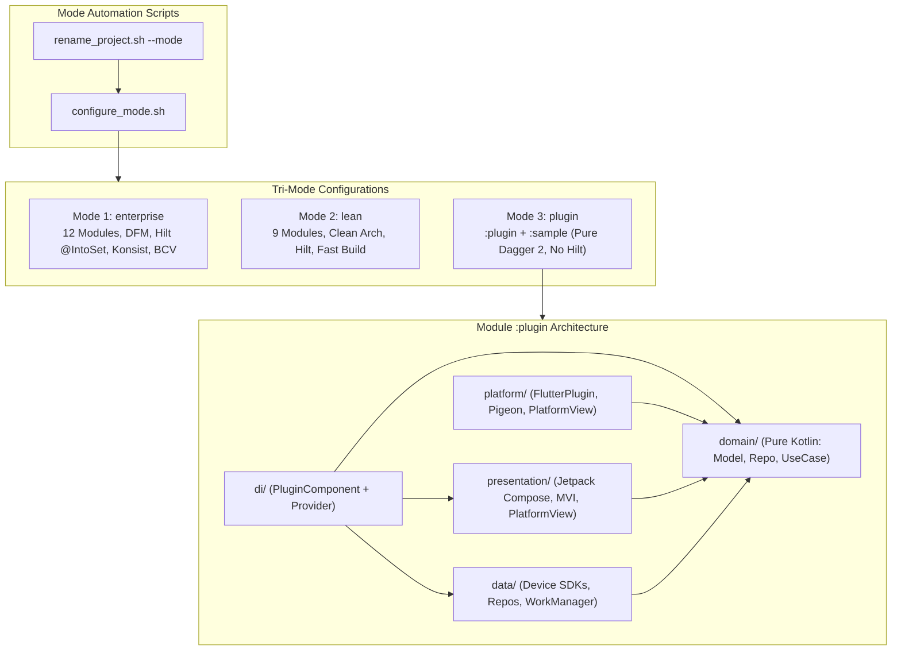
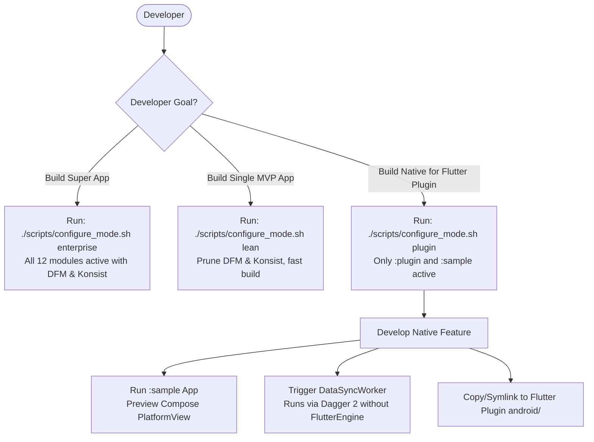
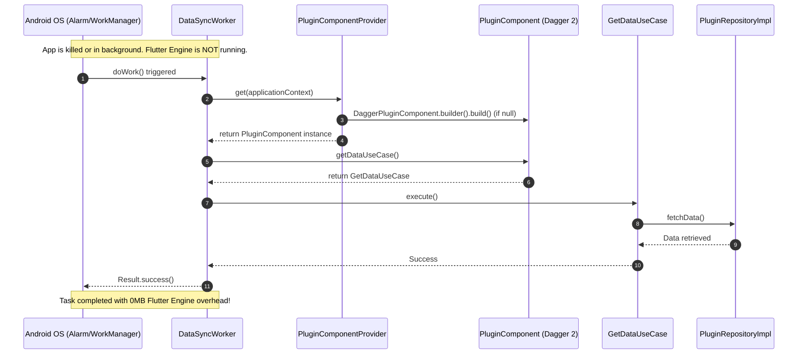

# Epic: Tri-Mode Android Native Template & Flutter Plugin Native Devbed

## 1. Meta Data
- **Epic**: `tri_mode_and_flutter_plugin_devbed`
- **Status**: Ready for Implementation
- **Target Release**: 1.0.0
- **Source Spec**: [2026-09-11-tri-mode-template-and-flutter-plugin-devbed-design.md](2026-09-11-tri-mode-template-and-flutter-plugin-devbed-design.md)
- **Reference Flutter Template**: `bloc_digital_wallet` (specs: `flutter_super_app_template`, `super_app_governance`)

---

## 2. Background
The current `android_digital_wallet` repository is heavily governed for **Enterprise Super Apps**:
1. It aggregates 12 modules, dynamic features (DFM `:features:scanner`), Hilt `@IntoSet` multibindings, Konsist architecture gates (K1–K10), and JetBrains Binary Compatibility Validator (BCV).
2. While ideal for massive distributed teams, this setup introduces build overhead for standard standalone apps, MVPs, and startups.
3. Furthermore, when developing the native Android part of Flutter Plugins (such as those generated by `pac_native_plugin` in `bloc_digital_wallet`), developers face two critical limitations:
   - **No Hilt on Host:** Flutter host apps do not apply the Hilt Gradle plugin or use `@HiltAndroidApp`. The plugin must be self-contained using **Pure Dagger 2**.
   - **Zero Flutter Engine Background Execution:** When Android OS wakes up the app via `WorkManager` (`Worker`), `JobScheduler`, or `Service`, running a headless `FlutterEngine` consumes 150MB+ RAM and introduces startup latency. Native tasks must execute purely in Kotlin with DI without initializing Flutter.

This Epic delivers a **Tri-Mode Architecture** (`enterprise`, `lean`, `plugin`) along with automated scripts, an exemplary `:plugin` module with pure Dagger 2, a lightweight testbed runner `:sample`, and corresponding Mason Bricks.

---

## 3. Goals & Non-Goals

### Goals
- **G1: Tri-Mode Configuration:** Implement `scripts/configure_mode.sh` and integrate `--mode <enterprise|lean|plugin>` into `scripts/rename_project.sh` to seamlessly switch project modules and Gradle build features.
- **G2: Lean Mode Optimization:** Provide a lightweight, fast-compiling standalone app profile by disabling DFM, Konsist, BCV, and sample runners without breaking Clean Architecture.
- **G3: Flutter Plugin Devbed (`:plugin`):** Provide a standardized Android Library module adhering to 4-layer Clean Architecture (`Platform`, `Domain`, `Data`, `Presentation`) with Pure Dagger 2 (zero Hilt) and Compose `PlatformView` / Pigeon IPC.
- **G4: Headless Native Background Execution:** Enable WorkManager `Worker`, `Service`, and `BroadcastReceiver` to execute independently through `PluginComponentProvider` without spinning up the Flutter Engine.
- **G5: Standalone Runner (`:sample`):** Provide an independent Android application runner to preview Jetpack Compose UI and debug native APIs without opening Flutter.
- **G6: Mason Bricks Parity:** Scaffold `native_plugin` and `add_native_ui` bricks matching 1:1 with Flutter's Mason Bricks suite.

### Non-Goals
- **NG1:** We do not generate standalone iOS apps or Flutter apps from this Android repository (handled in their respective repositories).
- **NG2:** We do not replace Dagger Hilt in `enterprise` or `lean` modes; Hilt remains the standard for consumer Android apps.
- **NG3:** We do not remove the existing governance rules (Konsist/BCV) from the `enterprise` mode.

---

## 4. Architecture & Technical Design

### 4.1 High-Level Architecture

### 4.2 Use Cases Flowchart

### 4.3 Sequence Diagram: Native Background Execution (Zero Flutter Engine)

---

## 5. Rollout Strategy & Mitigation

1. **Idempotent Script Execution:**
   `scripts/configure_mode.sh` uses regex pattern matching to ensure re-running the script with the same mode produces no unintended diffs.
2. **Backward Compatibility Guard:**
   The default mode in both `scripts/configure_mode.sh` and `scripts/rename_project.sh` is `enterprise`, ensuring zero breaking changes for existing CI/CD pipelines.
3. **Soft Toggle vs Hard Prune:**
   By default, `configure_mode.sh` comments out modules in `settings.gradle.kts` without deleting files on disk. The `--prune` flag is strictly opt-in for developers creating clean new repositories.
4. **Automated Verification:**
   The 9-point verification matrix verifies each mode switch, testbed build, and background worker test before merging.

---

## 6. Kanban Tasks Breakdown

- [Task 1: Infrastructure & Mode Configuration Script (`configure_mode.sh`)](../../features/task_1_configure_mode_script.md)
- [Task 2: Project Renaming Integration (`rename_project.sh` with `--mode`)](../../features/task_2_rename_project_mode_integration.md)
- [Task 3: Scaffold Clean Architecture `:plugin` Module with Pure Dagger 2](../../features/task_3_scaffold_plugin_module_pure_dagger.md)
- [Task 4: Implement Flutter Platform Layer & Jetpack Compose `PlatformView`](../../features/task_4_flutter_platform_and_compose_view.md)
- [Task 5: Scaffold Standalone Testbed Runner `:sample` App](../../features/task_5_scaffold_sample_runner_app.md)
- [Task 6: Create Native Plugin Mason Bricks (`native_plugin` & `add_native_ui`)](../../features/task_6_native_plugin_mason_bricks.md)
- [Task 7: End-to-End Verification Matrix & Documentation](../../features/task_7_e2e_verification_and_docs.md)
