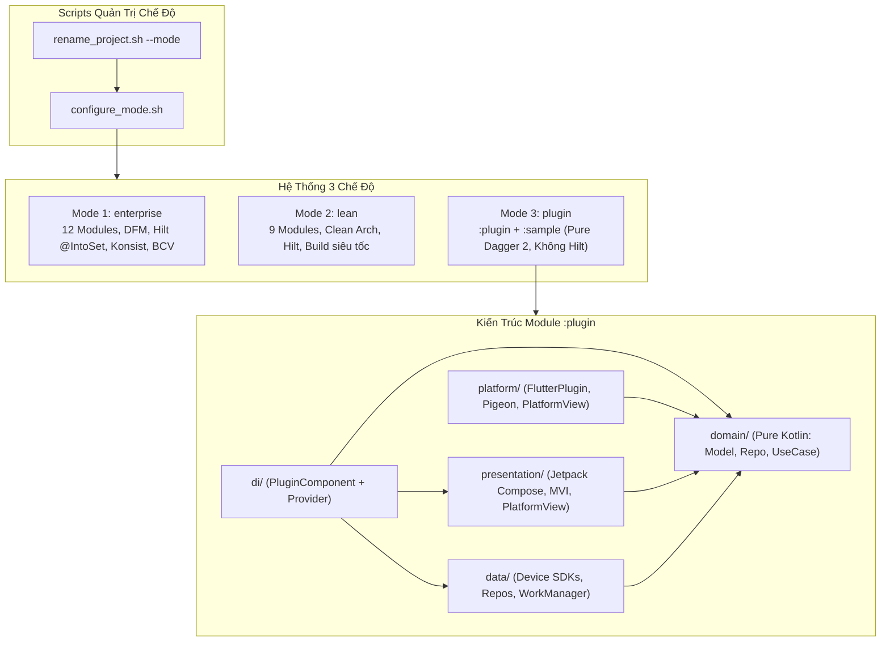
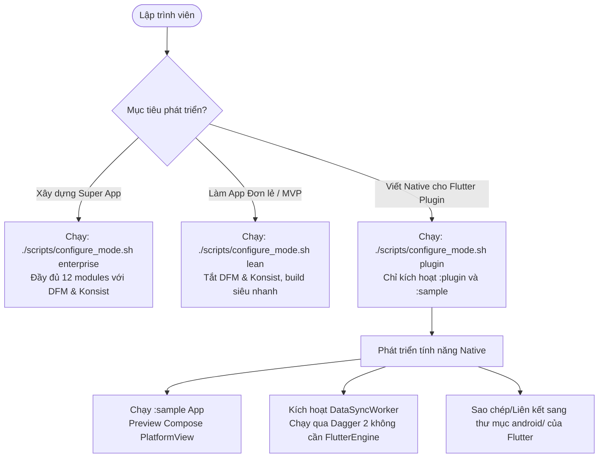
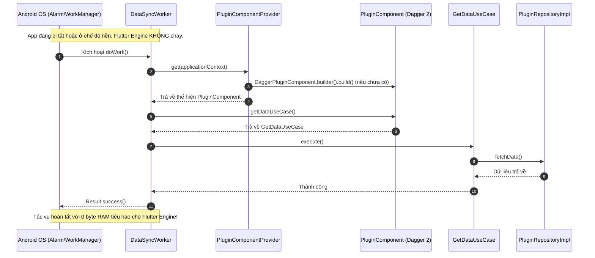

# Epic: Tri-Mode Android Native Template & Flutter Plugin Native Devbed (Bản Tiếng Việt)

## 1. Meta Data
- **Epic**: `tri_mode_and_flutter_plugin_devbed`
- **Trạng thái**: Sẵn sàng triển khai (Ready for Implementation)
- **Phiên bản mục tiêu**: 1.0.0
- **Tài liệu đặc tả nguồn (Source Spec)**: [2026-09-11-tri-mode-template-and-flutter-plugin-devbed-design.md](2026-09-11-tri-mode-template-and-flutter-plugin-devbed-design.md)
- **Template Flutter tham chiếu**: `bloc_digital_wallet` (specs: `flutter_super_app_template`, `super_app_governance`)

---

## 2. Bối cảnh & Vấn đề (Background)
Hiện tại, dự án `android_digital_wallet` được xây dựng với mức độ kiểm soát quản trị kiến trúc cao nhất phục vụ cho **Enterprise Super App**:
1. Dự án tích hợp 12 modules, hỗ trợ Dynamic Feature Module (DFM `:features:scanner`), Hilt `@IntoSet` multibindings, Konsist architecture gates (K1–K10), và JetBrains Binary Compatibility Validator (BCV).
2. Mặc dù rất lý tưởng cho các tập đoàn hoặc team quy mô lớn, cấu trúc này lại gây tốn thời gian biên dịch (build overhead) đối với các dự án app độc lập, MVP, hoặc startup.
3. Đặc biệt, khi phát triển phần Native Android cho các **Flutter Plugin** (như các plugin sinh từ brick `pac_native_plugin` trong template Flutter `bloc_digital_wallet`), lập trình viên gặp phải hai rào cản kỹ thuật lớn:
   - **Không thể dùng Hilt:** App Flutter chủ không cài plugin Hilt và không có `@HiltAndroidApp`. Do đó, plugin phải tự chủ hoàn toàn về DI bằng **Dagger 2 thuần (Pure Dagger)**.
   - **Thực thi tác vụ nền độc lập (Zero Flutter Engine):** Khi hệ điều hành Android kích hoạt tác vụ nền qua `WorkManager` (`Worker`), `JobScheduler`, hoặc `Service`, nếu phải khởi chạy một Headless `FlutterEngine` sẽ làm tốn 150MB+ RAM và gây trễ khởi động nghiêm trọng, dễ bị OS kill do thiếu bộ nhớ. Tác vụ nền bắt buộc phải chạy thuần túy dưới native với DI độc lập mà không cần chạm tới Flutter Engine.

Epic này cung cấp **Hệ thống 3 Chế độ (Tri-Mode Architecture)** (`enterprise`, `lean`, `plugin`) đi kèm các script tự động hóa, một module mẫu `:plugin` chuẩn Clean Architecture với Dagger 2 thuần, một runner testbed `:sample` siêu nhẹ và bộ Mason Bricks tương ứng.

---

## 3. Mục tiêu & Giới hạn (Goals & Non-Goals)

### Mục tiêu (Goals)
- **G1: Cấu hình 3 Chế độ:** Triển khai `scripts/configure_mode.sh` và tích hợp cờ `--mode <enterprise|lean|plugin>` vào `scripts/rename_project.sh` để chuyển đổi mượt mà giữa các module và cấu hình Gradle.
- **G2: Tối ưu Chế độ Lean:** Cung cấp profile ứng dụng độc lập, build siêu tốc bằng cách tắt DFM, Konsist, BCV, và sample runners nhưng vẫn giữ vững Clean Architecture.
- **G3: Devbed cho Flutter Plugin (`:plugin`):** Cung cấp module Android Library chuẩn Clean Architecture 4 tầng (`Platform`, `Domain`, `Data`, `Presentation`) với Pure Dagger 2 (không Hilt) và Compose `PlatformView` / Pigeon IPC.
- **G4: Thực thi Background không cần Flutter:** Cho phép WorkManager `Worker`, `Service`, và `BroadcastReceiver` chạy độc lập qua `PluginComponentProvider` mà không cần bật Flutter Engine.
- **G5: Standalone Runner (`:sample`):** Cung cấp app Android độc lập để preview Jetpack Compose UI và debug API native mà không cần mở Flutter.
- **G6: Đồng bộ Mason Bricks:** Tạo các brick `native_plugin` và `add_native_ui` khớp 1:1 với bộ Mason Bricks của template Flutter.

### Giới hạn (Non-Goals)
- **NG1:** Không sinh mã iOS hoặc Flutter App từ repo Android này (đã được quản lý ở repo riêng).
- **NG2:** Không thay thế Dagger Hilt ở chế độ `enterprise` hoặc `lean`; Hilt vẫn là chuẩn mực cho ứng dụng Android độc lập.
- **NG3:** Không xóa bỏ các quy tắc quản trị hiện có (Konsist/BCV) trong chế độ `enterprise`.

---

## 4. Kiến trúc & Thiết kế Kỹ thuật (Architecture & Technical Design)

### 4.1 Kiến trúc Tổng thể (High-Level Architecture)

### 4.2 Lưu đồ Các Ca Sử Dụng (Use Cases Flowchart)

### 4.3 Biểu đồ Trình tự: Chạy Background Độc lập (Zero Flutter Engine)

### 4.4 Kịch bản Kiểm thử Hành vi Toàn diện (BDD Test Scenarios)
Toàn bộ hành vi hệ thống qua các ca sử dụng, chuyển đổi trạng thái, edge cases bất đồng bộ, và khả năng chịu tải khi chạy nền được đặc tả bằng Gherkin tại:
👉 **[Tài liệu BDD Scenarios (bdd_scenarios.md)](bdd_scenarios.md)**

---

## 5. Giá trị Kép của BDD Living Documentation (`bdd_scenarios.md`)
Tài liệu [bdd_scenarios.md](bdd_scenarios.md) mang lại **Giá trị Kép (Dual Value Purpose)**:
1. **Bảo trì cho Kỹ sư (Living Documentation)**: Giúp bất kỳ kỹ sư mới nào tiếp cận dự án cũng nắm bắt ngay lập tức mục tiêu nghiệp vụ, chuyển đổi trạng thái và quy tắc chịu tải mà không cần đọc từng dòng mã nguồn.
2. **Nạp Ngữ cảnh Tức thì cho AI Agent (Instant Agent Context Injection)**: Cung cấp bản hợp đồng hành vi cô đọng, rõ ràng để nạp thẳng vào context window của AI Agent, loại bỏ hoàn toàn hiện tượng ảo giác (hallucination) và đảm bảo tuân thủ nghiêm ngặt khi lập trình hoặc sửa lỗi.

---

## 6. Chiến lược Phát hành & Giảm thiểu Rủi ro (Rollout Strategy)

1. **Thực thi Script An toàn (Idempotent):**
   `scripts/configure_mode.sh` sử dụng các mẫu regex chuẩn để đảm bảo chạy lại nhiều lần cùng một mode không tạo ra diff rác.
2. **Bảo toàn Khả năng Tương thích Ngược:**
   Chế độ mặc định của cả `configure_mode.sh` và `rename_project.sh` luôn là `enterprise`, đảm bảo không làm gián đoạn các luồng CI/CD hiện có.
3. **Soft Toggle vs Hard Prune:**
   Mặc định script chỉ comment các dòng include trong `settings.gradle.kts` mà không xóa file. Cờ `--prune` chỉ áp dụng khi lập trình viên chủ động dọn dẹp vật lý.
4. **Kiểm thử Tự động Hóa:**
   Ma trận kiểm thử 9 bước kiểm tra toàn diện trước khi bàn giao.

---

## 7. Phân rã Kanban Tasks (Kanban Tasks Breakdown)

- [Task 1: Script Cấu hình Chế độ (`configure_mode.sh`)](../../features/task_1_configure_mode_script.md)
- [Task 2: Tích hợp Cờ `--mode` vào Script Đổi tên Dự án (`rename_project.sh`)](../../features/task_2_rename_project_mode_integration.md)
- [Task 3: Dựng Module `:plugin` Clean Architecture với Pure Dagger 2](../../features/task_3_scaffold_plugin_module_pure_dagger.md)
- [Task 4: Xây dựng Tầng Platform Flutter & Jetpack Compose `PlatformView`](../../features/task_4_flutter_platform_and_compose_view.md)
- [Task 5: Xây dựng Module Runner Testbed `:sample`](../../features/task_5_scaffold_sample_runner_app.md)
- [Task 6: Xây dựng Bộ Mason Bricks cho Native Plugin (`native_plugin` & `add_native_ui`)](../../features/task_6_native_plugin_mason_bricks.md)
- [Task 7: Kiểm thử Toàn diện E2E và Cập nhật Tài liệu](../../features/task_7_e2e_verification_and_docs.md)
