# Architecture: MVI Mechanism
*(Feature-First Clean Architecture)*

Tài liệu này mô tả luồng dữ liệu (Data Flow) và quy ước đặt tên (Naming Convention) được sử dụng trong dự án.

## 1. Các thuật ngữ cốt lõi (Core Concepts)

Một số khái niệm sử dụng được quy ước sau:

| Thành phần | Loại | Hướng di chuyển | Ý nghĩa & Nhiệm vụ |
| :--- | :--- | :--- | :--- |
| **Action** | **INPUT** | **View ➡️ ViewModel** | **Hành động của người dùng.** <br> Trigger logic xử lý (VD: Click nút, Gõ phím). |
| **State** | **DATA** | **ViewModel ➡️ View** | **Trạng thái UI.** <br> Dữ liệu cần thiết để vẽ màn hình (Persistent). View lắng nghe State để Re-compose. |
| **Event** | **OUTPUT** | **ViewModel ➡️ View** | **Sự kiện một lần (Side Effect).** <br> Các lệnh điều khiển UI không lưu trạng thái (VD: Toast, Navigation, Dialog). |


## 2. Sơ đồ luồng dữ liệu (Data Flow Diagram)

Luồng đi là **Một chiều (Unidirectional Data Flow)**:

```mermaid
graph LR
    %% --- ĐỊNH NGHĨA CÁC LỚP (LAYERS) ---
    subgraph Presentation_Layer [Presentation Layer]
        View[Compose Screen]
        ViewModel[ViewModel]
    end

    subgraph Domain_Layer [Domain Layer]
        UseCase[Use Case]
        %% Interface nằm ở Domain để đảm bảo Dependency Rule
        RepoInterface([Repository Interface])
    end

    subgraph Data_Layer [Data Layer]
        %% Impl nằm ở Data, phụ thuộc vào Interface ở Domain
        RepoImpl[Repository Impl]
        DataSource[Remote/Local Data Source]
    end

    %% --- LUỒNG DỮ LIỆU (DATA FLOW) ---

    %% Bước 1: Từ UI đi xuống
    View -- "1. Gửi Action (Input)" --> ViewModel
    ViewModel -- "2. Gọi UseCase" --> UseCase
    UseCase -- "2a. Gọi Repo Interface" --> RepoInterface

    %% Mũi tên nét đứt thể hiện việc Implementation (Data) thực thi Interface (Domain)
    RepoInterface -. "implements" .-> RepoImpl
    RepoImpl -- "2b. Gọi Data Source (API/DB)" --> DataSource

    %% Bước 2: Từ Data trả ngược lên
    DataSource -- "3a. Trả DTO/Raw Data" --> RepoImpl
    RepoImpl -- "3b. Map sang Entity & Trả về Domain" --> UseCase
    UseCase -- "3. Trả kết quả xử lý" --> ViewModel

    %% Bước 3: Cập nhật UI
    ViewModel -- "4. Update State (Data)" --> View
    ViewModel -. "5. Bắn Event (Side Effect)" .-> View

    %% --- STYLING (Làm đẹp) ---
    classDef action fill:#e1f5fe,stroke:#01579b,stroke-width:2px,color:#01579b;
    classDef state fill:#e8f5e9,stroke:#2e7d32,stroke-width:2px,color:#2e7d32;
    classDef event fill:#fff3e0,stroke:#ef6c00,stroke-width:2px,color:#ef6c00,stroke-dasharray: 5 5;
    classDef interface fill:#fffde7,stroke:#fbc02d,stroke-width:1px,stroke-dasharray: 5 5;

    %% Áp dụng style cho các node đặc biệt nếu cần (ví dụ Interface)
    class RepoInterface interface;
    style Presentation_Layer fill:#C7FDCB,stroke:#02CC0C,stroke-width:2px;
    style Data_Layer fill:#A7DAF2,stroke:#088DF3,stroke-width:2px;
    style Domain_Layer fill:#F4F0C0,stroke:#fbc02d,stroke-width:2px;

    %% Tô màu các mũi tên quan trọng ở Presentation Layer để dễ nhìn
    linkStyle 0 stroke:#01579b,stroke-width:2px;
    linkStyle 7 stroke:#2e7d32,stroke-width:2px;
    linkStyle 8 stroke:#ef6c00,stroke-width:2px,stroke-dasharray: 5 5;

```


<br/>

> [!IMPORTANT]
> **Quy tắc quan trọng (Important Rules)**
>
> 1. **Dependency Rule:** `Presentation` -> `Domain` <- `Data`. Trình diễn (Presentation) KHÔNG được gọi trực tiếp Dữ liệu (Data). Domain KHÔNG được import bất cứ thứ gì từ Presentation hay Data.
> 2. **No Android in Domain:** Domain layer phải là `Pure Kotlin` (hoặc Java). Nếu thấy `import android.content.Context` trong Domain là sai kiến trúc.
> 3. **Unidirectional Data Flow:** Dữ liệu luôn chảy theo vòng tròn: `View` -> `ViewModel` -> `Domain` -> `Data` -> `Domain` -> `ViewModel` -> `View`.
> <br />
>

### Chi tiết các tầng (Layer Breakdown)

Kiến trúc được chia thành 3 tầng chính, tuân thủ nghiêm ngặt quy tắc phụ thuộc (Dependency Rule): **Tầng ngoài phụ thuộc vào tầng trong, tầng trong không biết gì về tầng ngoài.**

#### 🟢 1. Presentation Layer (UI & State)
*Nơi chứa code liên quan đến giao diện và trải nghiệm người dùng.*

* **View (Compose Screen):**
    * Là các hàm `@Composable`.
    * **Nhiệm vụ:** Vẽ giao diện dựa trên `State` hiện tại.
    * **Nguyên tắc:** "Dumb View" (View ngu ngơ). Không chứa logic nghiệp vụ, không gọi API trực tiếp. Chỉ nhận dữ liệu để hiển thị và báo cáo hành động của user (`Action`) cho ViewModel.
* **ViewModel:**
    * **Nhiệm vụ:** Quản lý trạng thái UI (`State`), xử lý `Action` từ View, và tương tác với Domain Layer (UseCase).
    * **State Holder:** Giữ `StateFlow` để View lắng nghe.
    * **Event Emitter:** Bắn `Channel` (Event) cho các sự kiện một lần (Navigation, Toast).
* **Contract (State/Action/Event):**
    * Định nghĩa giao thức giao tiếp giữa View và ViewModel (xem phần 1).

#### 🟡 2. Domain Layer (Business Logic - The Core)
*Trái tim của ứng dụng. Nơi chứa logic nghiệp vụ thuần túy, không phụ thuộc vào Android Framework (Context, View, XML, SQL...).*

* **UseCase (Interactor):**
    * **Nhiệm vụ:** Đóng gói một logic nghiệp vụ cụ thể (Ví dụ: `LoginUseCase`, `GetWalletBalanceUseCase`).
    * **Single Responsibility:** Mỗi UseCase chỉ làm một việc duy nhất.
    * **Orchestrator:** Điều phối luồng dữ liệu (Gọi Repository, validate dữ liệu, tính toán...).
* **Entity (Domain Model):**
    * **Nhiệm vụ:** Các object đại diện cho dữ liệu nghiệp vụ (VD: `User`, `Wallet`).
    * **Pure Kotlin:** Không chứa Annotation của thư viện (Gson, Room, Parcelize). Chỉ chứa dữ liệu cần thiết cho app.
* **Repository Interface:**
    * **Nhiệm vụ:** Định nghĩa "Hợp đồng" về việc lấy/lưu dữ liệu (VD: `fun getUser(): Flow<User>`).
    * **Abstraction:** Giúp Domain không cần biết dữ liệu đến từ đâu (Server hay Local DB).

#### 🔵 3. Data Layer (Implementation & Infrastructure)
*Nơi thực thi chi tiết kỹ thuật. Chịu trách nhiệm cung cấp dữ liệu cho Domain.*

* **Repository Implementation:**
    * **Nhiệm vụ:** Thực thi Interface của Domain.
    * **Decision Maker:** Quyết định lấy dữ liệu từ đâu (Cache trước hay gọi API trước?).
    * **Coordinator:** Gọi DataSource và Map dữ liệu thô (DTO) sang Entity.
* **DataSource (Remote/Local):**
    * **Remote:** Làm việc với Network (Retrofit Service, API Client).
    * **Local:** Làm việc với Database (Room DAO), SharedPreferences/DataStore.
* **DTO (Data Transfer Object):**
    * **Nhiệm vụ:** Mô hình dữ liệu khớp 1:1 với phản hồi từ Server hoặc bảng trong Database.
    * **Annotations:** Chứa `@Json`, `@Entity`, `@ColumnInfo`...
* **Mapper:**
    * **Nhiệm vụ:** Chuyển đổi qua lại giữa `DTO` <-> `Entity`. Đảm bảo những thay đổi ở API không ảnh hưởng trực tiếp đến Domain.

## 3. Chi tiết triển khai (Implementation Details)

### A. Định nghĩa Contract (State/Action/Event)

File: `features/auth/presentation/LoginContract.kt`

```kotlin
// 1. STATE: Những gì UI cần hiển thị (Lưu giữ trạng thái)
data class LoginState(
    val isLoading: Boolean = false,
    val email: String = "",
    val error: String? = null
)

// 2. ACTION (INPUT): Những gì User làm
sealed class LoginAction {
    data class OnEmailChanged(val value: String) : LoginAction()
    object OnLoginClicked : LoginAction()
}

// 3. EVENT (OUTPUT): Lệnh điều khiển tức thời (Bắn xong quên luôn)
sealed class LoginEvent {
    object NavigateToHome : LoginEvent()
    data class ShowToast(val message: String) : LoginEvent()
}

```

### B. Xử lý tại ViewModel

File: `features/auth/presentation/LoginViewModel.kt`

```kotlin
class LoginViewModel(private val loginUseCase: LoginUseCase) : ViewModel() {

    // Quản lý State (Dùng StateFlow)
    private val _state = MutableStateFlow(LoginState())
    val state = _state.asStateFlow()

    // Quản lý Event (Dùng Channel - để đảm bảo One-shot)
    private val _event = Channel<LoginEvent>()
    val event = _event.receiveAsFlow()

    // Hàm Entry Point duy nhất nhận Action từ View
    fun onAction(action: LoginAction) {
        when (action) {
            is LoginAction.OnEmailChanged -> {
                _state.update { it.copy(email = action.value) }
            }
            LoginAction.OnLoginClicked -> login()
        }
    }

    private fun login() {
        viewModelScope.launch {
            // 1. Update State -> Loading
            _state.update { it.copy(isLoading = true) }

            // 2. Gọi Domain
            loginUseCase(...)
                .onSuccess {
                    _state.update { it.copy(isLoading = false) }
                    // 3. Bắn Event -> Chuyển màn hình
                    _event.send(LoginEvent.NavigateToHome)
                }
                .onFailure { error ->
                    _state.update { it.copy(isLoading = false) }
                    // 4. Bắn Event -> Hiện lỗi
                    _event.send(LoginEvent.ShowToast(error.message))
                }
        }
    }
}

```

### C. Hiển thị tại View (Compose)

File: `features/auth/presentation/LoginScreen.kt`

```kotlin
@Composable
fun LoginScreen(
    viewModel: LoginViewModel = koinViewModel(),
    onNavigateHome: () -> Unit // Navigation callback
) {
    val state by viewModel.state.collectAsStateWithLifecycle()

    // 1. Lắng nghe EVENT (Side Effects)
    LaunchedEffect(Unit) {
        viewModel.event.collect { event ->
            when (event) {
                LoginEvent.NavigateToHome -> onNavigateHome()
                is LoginEvent.ShowToast -> { /* Show Toast */ }
            }
        }
    }

    // 2. Vẽ UI dựa trên STATE
    if (state.isLoading) {
        CircularProgressIndicator()
    }

    // 3. Gửi ACTION khi User tương tác
    Button(
        onClick = { viewModel.onAction(LoginAction.OnLoginClicked) }
    ) {
        Text("Đăng nhập")
    }
}

```

