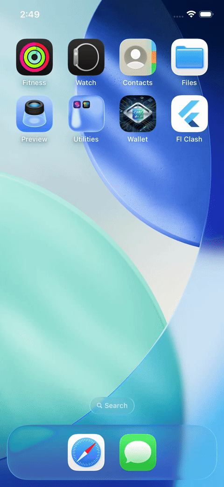
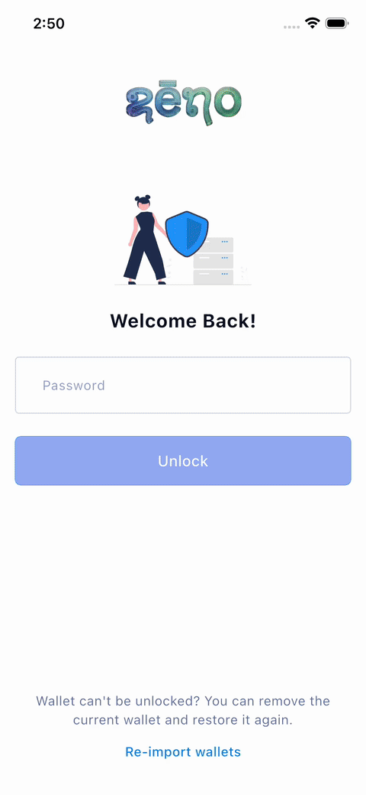
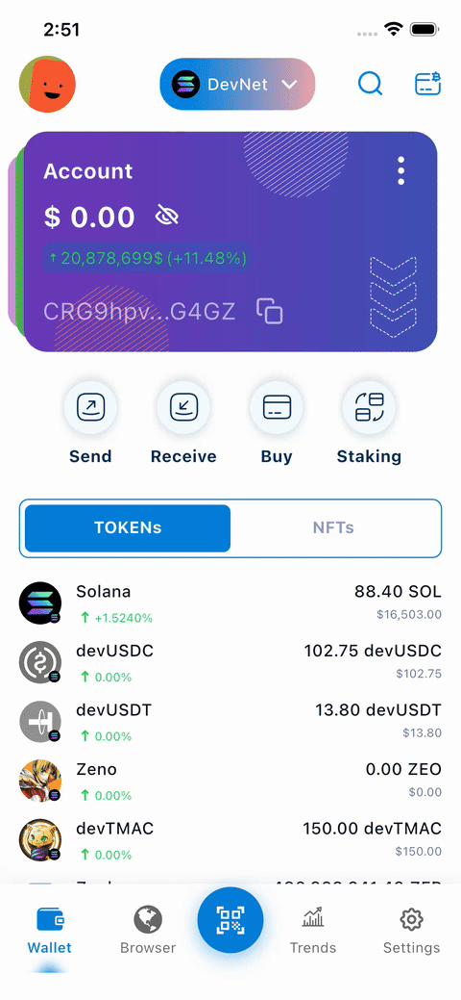

# Android Digital Wallet

A modern Android application implementing standard Clean Architecture with MVI pattern, built with Jetpack Compose.

## Table of Contents

- [I. Development Environment Setup](#i-development-environment-setup)
- [II. Architecture](#ii-architecture)
  1. [Clean Architecture](#1-clean-architecture)
  2. [MVI Pattern](#2-mvi-pattern)
  3. [Project Structure](#3-project-structure)
- [III. Demos](#iii-demos)
- [IV. Tech Stack & Libraries](#iv-tech-stack--libraries)
- [V. References](#v-references)
- [VI. License](#vi-license)

---

## I. Development Environment Setup

This guide explains how to set up your development environment.

### 1. Prerequisites

- **Java JDK**: 17 or higher.
- **Android Studio**: Latest Koala or higher.
- **Dart SDK**: Required for code generation tools.

### 2. Code Generation (Mason)

This project uses [Mason][1] for automating feature creation.

> **See the [Mason Guide](docs/MASON_GUIDE.md) for full instructions on creating features and screens.**

Quick setup:
```bash
# Install Mason CLI
dart pub global activate mason_cli

# Get bricks
mason get
```

---

## II. Architecture

This project is built on **Clean Architecture** combined with **MVI Pattern**, organized by **Feature First** structure and fully implemented with Jetpack Compose.

### 1. Clean Architecture

The project is divided into three layers:

- **Presentation**: UI (Compose), ViewModels, States, Events. Depend only on Domain.
- **Domain**: Entities, Use Cases, Repository Interfaces. Pure Kotlin, no Android dependencies.
- **Data**: Repository Implementations, DTOs, API inputs, Database.

### 2. MVI Pattern

We use a Unidirectional Data Flow (UDF):

1.  **UI** fires an **Event** (e.g., `UserClickedButton`).
2.  **ViewModel** processes the Event, often triggering a **Use Case**.
3.  **UseCase** returns data/result.
4.  **ViewModel** reduces the result into a new **State**.
5.  **UI** observes and renders the **State**.

### 3. Feature First Principle

The project is organized by **Feature**, not by Layer.

-   **High Cohesion**: All code related to a feature (Data, Domain, Presentation) lives in one module (e.g., `features/home`).
-   **Decoupled**: Features are independent modules, making them easy to test, reuse, or remove.
-   **Scalable**: New features are added as new modules without impacting existing code.

### 4. Project Structure

```text
android_digital_wallet/
├── app/                  # Application module, DI root, Navigation host
├── buildSrc/             # Build logic & Dependency management (Kotlin DSL)
├── features/             # Business Logic Modules
│   ├── authentication/
│   ├── home/
│   ├── wallet/
│   ├── scanner/
│   ├── transactions/
│   ├── trends/
│   ├── settings/
│   └── ...
├── libraries/            # Shared components & utilities
│   ├── framework/        # Base classes (MVI, ViewModels)
│   ├── jetframework/     # UI Design System & Compose Utils
│   └── testing/          # Unit & Instrument test helpers
└── bricks/               # Mason code generation templates
```


- **`buildSrc`**: Centralized dependency management using Kotlin DSL.
- **`app`**: Main application module, handling DI roots and navigation.
- **`features/`**: Feature modules (e.g., `home`, `payment`, `authentication`).
- **`libraries/`**: Core shared modules:
    - `framework`: Base classes (MVI, BaseViewModel), Extensions.
    - `jetframework`: Compose-specific utilities, Design System.
    - `testing`: Test utilities and rule sets.

---

## III. Demos

<table>
  <tr>
    <td align="center"><b>Splash & Onboard</b></td>
    <td align="center"><b>Wallet List</b></td>
    <td align="center"><b>Token Details</b></td>
  </tr>
  <tr>
    <td></td>
    <td></td>
    <td></td>
  </tr>
  <tr>
    <td></td>
    <td></td>
    <td></td>
  </tr>
</table>

---

## IV. Tech Stack & Libraries

### Core & Architecture
*   [Kotlin][2] - First-class language for Android.
*   [Jetpack Compose][3] - Modern UI toolkit.
*   [Coroutines][4] & [Flow][5] - Asynchronous programming.
*   [Hilt][6] - Dependency Injection.
*   [Navigation Compose][7] - Modern navigation.
*   [Room][8] - Local database.

### Networking & Data
*   [Retrofit][9] - Type-safe HTTP client.
*   [OkHttp][10] - HTTP client & Interceptors.
*   [Moshi][11] - JSON parsing.
*   [Coil][12] - Image loading.

### UI & Utilities
*   [Material 3][13] - Design system.
*   [Timber][14] - Logging.

### Testing
*   [MockK][15] - Mocking library.
*   [Turbine][16] - Flow testing.
*   [Robolectric][17] - Unit testing framework.
*   [JaCoCo][18] - Code coverage.

### Code Quality
*   [Ktlint][19] - Kotlin linter.
*   [Detekt][20] - Static code analysis.
*   [Spotless][21] - Code formatter.

---

## V. References

*   [Guide to App Architecture][22]
*   [Jetpack Compose Documentation][3]
*   [The Clean Architecture][23]
*   [Setup Jacoco for an Android Multiple Module Project][24]
*   [Change Android Retrofit's Base Url at runtime][25]
*   [Change Android Brightness][26]
*   [Play Youtube videos on Androids][27]
*   [Setup Jacoco for Android Project][28]
*   [Callbacks in Android Application][29]

[0]: https://www.azul.com/downloads/?package=jdk#zulu
[1]: https://github.com/felangel/mason
[2]: https://kotlinlang.org/
[3]: https://developer.android.com/jetpack/compose
[4]: https://kotlinlang.org/docs/coroutines-overview.html
[5]: https://kotlinlang.org/docs/flow.html
[6]: https://dagger.dev/hilt/
[7]: https://developer.android.com/jetpack/compose/navigation
[8]: https://developer.android.com/training/data-storage/room
[9]: https://square.github.io/retrofit/
[10]: https://square.github.io/okhttp/
[11]: https://github.com/square/moshi
[12]: https://coil-kt.github.io/coil/compose/
[13]: https://m3.material.io/
[14]: https://github.com/JakeWharton/timber
[15]: https://mockk.io/
[16]: https://github.com/cashapp/turbine
[17]: http://robolectric.org/
[18]: https://www.eclemma.org/jacoco/
[19]: https://pinterest.github.io/ktlint/
[20]: https://detekt.dev/
[21]: https://github.com/diffplug/spotless
[22]: https://developer.android.com/topic/architecture
[23]: http://blog.cleancoder.com/uncle-bob/2012/08/13/the-clean-architecture.html
[24]: https://viblo.asia/p/setup-jacoco-for-an-android-multiple-module-projectclean-architect-project-4dbZNNoqZYM
[25]: https://viblo.asia/p/change-retrofits-base-url-at-runtime-ORNZqDLMK0n
[26]: https://viblo.asia/p/change-android-application-brightness-like-a-boss-djeZ1ok85Wz
[27]: https://viblo.asia/p/how-to-play-youtube-videos-in-an-android-webview-with-just-a-few-lines-of-code-RQqKL9mbZ7z
[28]: https://viblo.asia/p/setup-jacoco-for-android-project-gGJ59zB9KX2
[29]: https://viblo.asia/p/calbacks-trong-ung-dung-android-RnB5pk87lPG

---

## VI. License

```
Copyright 2026 DanhDue ExOICTIF

Licensed under the Apache License, Version 2.0 (the "License");
you may not use this file except in compliance with the License.
You may obtain a copy of the License at

   http://www.apache.org/licenses/LICENSE-2.0

Unless required by applicable law or agreed to in writing, software
distributed under the License is distributed on an "AS IS" BASIS,
WITHOUT WARRANTIES OR CONDITIONS OF ANY KIND, either express or implied.
See the License for the specific language governing permissions and
limitations under the License.
```
