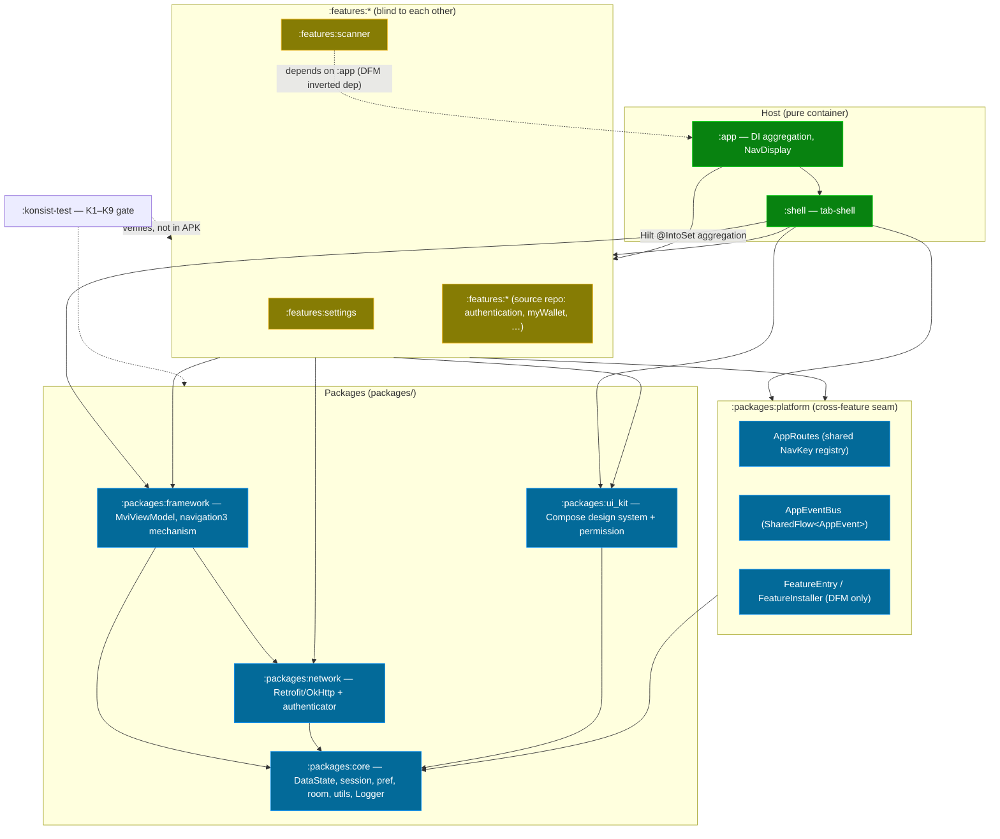

# Architecture: Clean Architecture + MVI

*(Feature-First Organization — Android edition)*

This document is the **authoritative architecture guide** for this template and for projects
generated from it.

> **Canonical cross-platform source.** The layer rules and MVI contract are defined once, for
> the whole product family, in the sibling repository at
> `bloc_digital_wallet/.worktrees/flutter_super_app_template/docs/architecture/ARCHITECTURE.md`.
> This Android edition follows that document section-for-section and only remaps platform
> terms:
>
> | Flutter | Android |
> |---|---|
> | Widget | `@Composable` |
> | BLoC | `MviViewModel` |
> | `Either<Failure, T>` | `DataState<T>` / `NetworkResponse<T>` |
> | `context.t` | `stringResource(...)` |
> | `context.appThemes` | `MaterialTheme` |
> | `get_it` / `injectable` | Hilt (`@Inject` / `@Module` / `@IntoSet`) |
> | `mason make pac_mvi_feature` | `mason make mvi_feature` |
> | `melos genAlls` | `./gradlew` tasks (KSP runs in-build) |
> | pure Dart domain | pure Kotlin domain (no `android.*` / `androidx.*`) |

---

## Table of Contents

- [I. Clean Architecture + MVI Diagram](#i-clean-architecture--mvi-diagram)
  - [1. Core Concepts](#1-core-concepts)
  - [2. Data Flow Diagram](#2-data-flow-diagram)
  - [3. Layer Dependency Rules](#3-layer-dependency-rules)
- [II. MVI Mechanism](#ii-mvi-mechanism)
  - [1. Action / State / Event](#1-action--state--event)
  - [2. Data Flow](#2-data-flow)
- [III. Feature-First Organization & Architecture Layers](#iii-feature-first-organization--architecture-layers)
  - [1. Directory Structure of a Feature Module](#1-directory-structure-of-a-feature-module)
  - [2. Architecture Layer Details](#2-architecture-layer-details)
  - [3. Module Map & Dependency Graph](#3-module-map--dependency-graph)
  - [4. Cross-Feature Communication Rules](#4-cross-feature-communication-rules)
    - [4.1 DeepLink Router Engine](#41-deeplink-router-engine)
  - [5. Usage with Mason](#5-usage-with-mason)
- [IV. Modern Android Stack](#iv-modern-android-stack)
- [V. Code Examples & Best Practices](#v-code-examples--best-practices)
  - [1. Contract Definition (Action/State/Event)](#1-contract-definition-actionstateevent)
  - [2. ViewModel Implementation](#2-viewmodel-implementation)
  - [3. Screen Implementation](#3-screen-implementation)
  - [4. Navigation Contribution](#4-navigation-contribution)
  - [5. Critical Rules](#5-critical-rules)
- [VI. References](#vi-references)
- [VII. Summary](#vii-summary)

---

## I. Clean Architecture + MVI Diagram

### 1. Core Concepts

| Principle | Description |
|-----------|-------------|
| **Dependency Rule** | `Presentation → Domain ← Data`. Domain knows nothing about the outer layers. |
| **Separation of Concerns** | UI, business logic, and data handling are strictly separated. |
| **Testability** | Each layer is tested independently; every feature builds and tests without `:app`. |
| **Pure Domain** | The domain layer is pure Kotlin — no `android.*` / `androidx.*` imports. |

### 2. Data Flow Diagram

```mermaid
graph LR
    subgraph Presentation_Layer ["Presentation"]
        View["Screen (@Composable)"]
        ViewModel["MviViewModel"]
    end

    subgraph Domain_Layer ["Domain"]
        UseCase["Use Case"]
        RepoInterface(["Repository Interface"])
    end

    subgraph Data_Layer ["Data"]
        RepoImpl["Repository Impl"]
        DataSource["Remote / Local Data Source"]
    end

    View -- "1. dispatch(Action)" --> ViewModel
    ViewModel -- "2. invoke UseCase" --> UseCase
    UseCase -- "2a. call Repository interface" --> RepoInterface
    RepoInterface -. "implemented by" .-> RepoImpl
    RepoImpl -- "2b. call Data Source" --> DataSource

    DataSource -- "3a. return DTO" --> RepoImpl
    RepoImpl -- "3b. map DTO to entity" --> UseCase
    UseCase -- "3. return DataState / Result" --> ViewModel

    ViewModel -- "4. reduce { State }" --> View
    ViewModel -. "5. sendEvent(Event)" .-> View

    classDef interface fill:#fffde7,stroke:#fbc02d,stroke-width:1px,stroke-dasharray: 5 5;
    class RepoInterface interface;
    style Presentation_Layer fill:#C7FDCB,stroke:#02CC0C,stroke-width:2px;
    style Data_Layer fill:#A7DAF2,stroke:#088DF3,stroke-width:2px;
    style Domain_Layer fill:#F4F0C0,stroke:#fbc02d,stroke-width:2px;
```



### 3. Layer Dependency Rules

> [!IMPORTANT]
> **Important Rules**
>
> 1. **Dependency Rule:** `Presentation → Domain ← Data`. Presentation MUST NOT touch Data
>    directly. Domain MUST NOT import anything from Presentation or Data.
> 2. **No Android in Domain:** the domain layer is pure Kotlin. An
>    `import android.*` / `import androidx.*` under `..domain..` is an architecture violation.
> 3. **Unidirectional Data Flow:** data flows in one loop —
>    `Screen → MviViewModel → Domain → Data → Domain → MviViewModel → Screen`.

```text
Allowed dependencies:
  Presentation → Domain
  Data         → Domain
  Domain       → (nothing in other layers)

Forbidden:
  Domain → Presentation
  Domain → Data
  Domain → android.* / androidx.*
  Presentation → Data (must go through Domain)
```

These rules are enforced by the Konsist rules **K2** (layer imports) and **K3** (pure-Kotlin
domain) in `:konsist-test` — see [§III.4](#4-cross-feature-communication-rules).

---

## II. MVI Mechanism

### 1. Action / State / Event

Three components with fixed naming and responsibilities. The base class is
`com.danhdue.framework.base.mvi.MviViewModel<STATE, ACTION, EVENT>`.

| Component | Type | Direction | Meaning & Responsibility |
| :--- | :--- | :--- | :--- |
| **Action** | INPUT | Screen ➡️ ViewModel | User intent. Triggers processing logic (button tap, text change). Dispatched through the single entry point `dispatch(action)`. |
| **State** | DATA | ViewModel ➡️ Screen | Persistent UI state. An immutable `data class`, exposed as `StateFlow<STATE>`, collected with `collectAsStateWithLifecycle()`. |
| **Event** | OUTPUT | ViewModel ➡️ Screen | One-time side effect (navigation, snackbar, dialog). Delivered once through a buffered `Channel`, consumed in a `LaunchedEffect`. |

- **Action** — `sealed interface {Feature}Action`; cases named `{Verb}{Noun}` (`OpenProfile`,
  `Logout`). Emitted with `viewModel.dispatch(...)`.
- **State** — `data class {Feature}State(...)` with defaulted fields. Updated inside the
  ViewModel with `reduce { copy(...) }` (atomic) or `setState(...)`.
- **Event** — `sealed interface {Feature}Event`; cases named `NavigateTo{X}` / `Show{X}`.
  Emitted with `sendEvent(...)` (single collector) or `emitSharedEvent(...)` (analytics /
  multi-collector).

`MviViewModel` also exposes a `viewState: StateFlow<ViewState<STATE>>` wrapper
(`Loading` / `Error` / `Content`) for screens that need a loading or error scaffold without
losing the underlying `uiState` data.

### 2. Data Flow

```text
User interaction (tap, type, …)
    ↓
Screen calls viewModel.dispatch(Action)
    ↓
MviViewModel.onAction(action)  — the ONLY method the Screen calls
    ↓
ViewModel invokes a UseCase (Domain)
    ↓
UseCase calls the Repository interface
    ↓
Repository Impl (Data) chooses local / remote, calls the Data Source
    ↓
Data Source returns a DTO;  apiCall { } wraps IO as DataState<T>
    ↓
Repository maps DTO → domain entity
    ↓
UseCase returns DataState<Entity> (or kotlin.Result for non-IO logic)
    ↓
ViewModel reduce { copy(...) }  → new State
    ↓
ViewModel sendEvent(Event)      → optional one-time effect
    ↓
Screen re-composes from State (collectAsStateWithLifecycle)
    ↓
Screen reacts to Event in LaunchedEffect (navigate / snackbar / dialog)
```

`MvvmViewModel` (the supertype of `MviViewModel`) provides `execute(callFlow: Flow<DataState<T>>)`
which runs `startLoading()` → collects → routes `DataState.Error` to `handleError(...)` and
`DataState.Success` to the caller. This is why `:core` (home of `DataState`) is an `api`
dependency of `:framework`.

---

## III. Feature-First Organization & Architecture Layers

### 1. Directory Structure of a Feature Module

A feature module is a Gradle module at `features/{name}/` applying the
`commons.android-feature` convention plugin. `mason make mvi_feature` scaffolds it.

```text
features/{name}/src/main/kotlin/com/{org}/{name}/
├── data/            🔵  internal — RepositoryImpl, DataSource (remote/local),
│   ├── di/                       model/ (DTOs, @Json), mappers/ (DTO ⇄ entity)
│   ├── mappers/
│   ├── model/
│   └── repository/
├── domain/          🟡  public   — pure Kotlin
│   ├── di/
│   ├── model/                    entities (no library annotations)
│   ├── repository/               repository interfaces
│   └── usecase/                  {Verb}{Noun}UseCase (single responsibility)
└── presentation/    🟢  public   — Compose UI + MVI
    ├── di/
    ├── model/                    {Feature}UiModel
    ├── {sub}/                    one folder per screen:
    │   ├── {Sub}Action.kt
    │   ├── {Sub}State.kt
    │   ├── {Sub}Event.kt
    │   ├── {Sub}ViewModel.kt     : MviViewModel<State, Action, Event>
    │   └── {Sub}Screen.kt        @Composable {Sub}Root + private {Sub}Screen
    ├── {Feature}Route.kt         data object : NavKey — feature-private unless used
    │                             cross-feature (then it moves to :platform AppRoutes)
    └── {Feature}NavigationModule.kt
                                  @Module @InstallIn(ActivityRetainedComponent::class)
                                  — @Provides @IntoSet EntryProviderInstaller
                                  (the ONE point a feature is visible to the host)
```

### 2. Architecture Layer Details

#### 🟢 Presentation Layer (UI & State)

| Component | Responsibility |
|-----------|----------------|
| **Screen (`@Composable`)** | Render UI from `State`. "Dumb view" — no business logic, no IO. Emits `Action`s. A stateful `{Sub}Root` collects the ViewModel; a stateless private `{Sub}Screen` takes `state` + `onAction`. |
| **MviViewModel** | Holds `State`, processes `Action`s through the single `onAction()`, calls the domain, emits `Event`s. `@HiltViewModel`, constructor-injected use cases. |
| **Contract** | The `{Feature}Action` / `{Feature}State` / `{Feature}Event` triad — the protocol between Screen and ViewModel. |

#### 🟡 Domain Layer (Business Logic — the core)

| Component | Responsibility |
|-----------|----------------|
| **Entity** | Pure Kotlin `data class`. No `@Json` / `@Entity` / `@Parcelize`. |
| **Repository Interface** | The data-access contract. Returns `DataState<T>` for IO, or `kotlin.Result<T>` for local-only logic. |
| **UseCase** | One business operation. `class GetXUseCase @Inject constructor(...)` with `suspend operator fun invoke(...)`. |

> ⚠️ **The domain layer must be pure Kotlin.** An `import androidx.*` under `..domain..` is a
> bug — Konsist K3 fails the build.

#### 🔵 Data Layer (Implementation & Infrastructure)

| Component | Responsibility |
|-----------|----------------|
| **Model (DTO)** | Matches the API response / DB row 1:1. Moshi `@JsonClass(generateAdapter = true)`; Room `@Entity`. |
| **DataSource** | Remote (Retrofit service) or local (Room DAO, DataStore). |
| **Repository Impl** | Implements the domain interface, picks the cache strategy, maps DTO → entity, converts errors to `Failure` via `apiCall { }`. `internal` — never leaves the module (Konsist K4, enabled later). |

### 3. Module Map & Dependency Graph

The former god-module `libraries/framework` was split into five package modules (in `packages/`) that
mirror the Flutter `packages/` set. Every module — features included — depends only on these,
never on another feature.

| Module | Package | Role | Project dependencies |
|---|---|---|---|
| `:packages:core` | `com.danhdue.core` | Dependency floor. `DataState` / `NetworkResponse` call-adapter, `DispatcherProvider`, `extension/*`, `pref/*` (DataStore + Tink), `room/*` (`BaseDao`, converters), `SessionManager`, `usecase/*`, `Logger` contract, `AppInitializer`. **Compose-free.** | *none* |
| `:packages:framework` | `com.danhdue.framework` | `MviViewModel` / `MvvmViewModel` / `BaseViewState`; the navigation3 mechanism — `Navigator` (`@ActivityRetainedScoped` backstack), `NestedNavigator` + `LocalNestedNavigator`, `ObserveBackstackForFlipper`; app-lifecycle plumbing. | `api(:packages:core)`, `implementation(:packages:network)` |
| `:packages:network` | `com.danhdue.network` | Retrofit / OkHttp / Moshi wiring, interceptors, `apiCall` / `Failure`, `HttpStatusCode`, Flipper network tooling, token authenticator. | `api(:packages:core)` |
| `:packages:ui_kit` | `com.danhdue.uikit` | Shared Compose design system (`ui/theme`, `ui/widgets`), Compose helpers, runtime-permission handlers. | `implementation(:packages:core)` |
| `:packages:platform` | `com.danhdue.platform` | Cross-feature seam: `AppRoutes` (shared `NavKey` registry), `AppEventBus` (`SharedFlow<AppEvent>`), `EntryProviderInstaller` typealias + `LocalEntryProviderInstallers`, `FeatureEntry` / `FeatureInstaller` (DFM only). | *none* — Compose-runtime only |
| `:shell` | `com.danhdue.shell` | Host tab-shell: `ShellViewModel`, bottom nav, per-tab nested nav, 5 seeded tab backstacks. | packages + 5 `:features:*` (tab seeds) |
| `:app` | `com.danhdue.androiddigitalwallet` | Thin composition root: Hilt aggregation (`Set<EntryProviderInstaller>`), `NavDisplay`, `Application`, entry `Activity`. | packages + every `:features:*` |
| `:features:*` | `com.danhdue.{feature}` | One product feature, three layers. **Blind to every other feature.** | `:packages:core`, `:packages:framework`, `:packages:network`, `:packages:ui_kit`, `:packages:platform` — via the `commons.android-feature` convention |
| `:libraries:testutils` | `com.danhdue.libraries.testutils` | Shared test rules, base test classes, MockWebServer helpers. | *(test-only)* |
| `:konsist-test` | `com.danhdue.konsist` | JVM/JUnit architecture gate (rules K1–K9). Never shipped in the APK. | *(reads the source tree)* |



**Konsist-verified invariants:** every solid arrow points down toward `:core`; no feature
points at another feature; only `:app` / `:shell` aggregate multiple features; the dashed
`:features:scanner → :app` edge is the Dynamic-Feature-Module-mandated inverted dependency,
exempted by rule **K8** through `android.dynamicFeatures`.

### 4. Cross-Feature Communication Rules

Features never import one another. All cross-feature traffic goes through `:platform`:

| Channel | Location | Shape | Who uses it |
|---|---|---|---|
| **`AppRoutes`** (NavKey registry) | `:platform` | `@Serializable data object XxxRoute : NavKey`; navigate with `Navigator.navigateTo(...)` / `NestedNavigator.navigate(...)` | any module — a `NavKey` leaks no implementation |
| **`AppEventBus`** | `:platform` | `MutableSharedFlow<AppEvent>` broadcast; `publish(e)` / `inline fun <reified T> on(): Flow<T>` | any module — publish / subscribe one event type |
| **`EntryProviderInstaller`** (Hilt `@IntoSet`) | mechanism in `:framework`, contributed per feature | feature `@Provides @IntoSet EntryProviderInstaller`; host consumes `Set<EntryProviderInstaller>` into `NavDisplay` | feature provides, host consumes — the host never imports the feature |
| **`FeatureEntry`** + `ServiceLoader` | `:platform` interface, impl in the DFM feature; the `META-INF/services` registration file is **aggregated in `:app`** (one line per on-demand FQCN — bundletool forbids two feature splits sharing a root resource) | runtime-loaded `EntryProviderInstaller` after `SplitCompat.install()`; `:shell` skips entries whose split is not installed | **on-demand DFM only** — install-time features use Hilt multibinding |
| **`DeepLinkRouter`** + `DeepLinkResolver` | `:platform` engine + per-feature resolvers | Tier-1 `AppDeepLinks` registry + Tier-2 `DeepLinkResolver` multibinding; resolves URI into `DeepLinkCommand` for `:shell` execution | any module, external intent, push notification, or ADB |
| **Direct composition** | `:app`, `:shell` | Hilt aggregation + `NavDisplay` + tab-shell | **host only** (Konsist K6) |

There is no request/response channel between two features. When a feature needs a typed
result from another feature's business logic, invert the dependency: put the interface in
`:core` and let the other feature implement it.

Lifecycle event vocabulary (in `AppEvent`): `ShellTabVisibilityChanged(tabIndex, isVisible)`
(published by `:shell`), `AppLifecycleChanged(state)` (published by an app-root lifecycle
observer), `UserLoggedOut` (published by `:network`'s 401 interceptor).

#### 4.1 DeepLink Router Engine

The template provides a governed, decoupled **DeepLink Router Engine** adhering to Clean Architecture and strict module boundaries.

##### The Two Tiers
Routing is split into two governance tiers so features never depend on each other:
- **Tier 1 (Platform Entry Registry — `AppDeepLinks.entryPoints`)**:
  Located in `:platform`. Declares known feature routing slugs, root entry `NavKey`s, optional tab indices, DFM split names, and coarse authentication gates:
  ```kotlin
  FeatureEntryPoint(
      feature = "settings",
      entryRoute = AppRoutes.SettingsRoute,
      tab = 2,
      requiresAuth = false,
  )
  ```
- **Tier 2 (Feature Subpath Resolvers — `DeepLinkResolver`)**:
  Owned by individual feature modules. Each feature contributes a resolver implementing `DeepLinkResolver` in `presentation/di/` (enforced by Konsist rule **K10**):
  - **Install-time features**: Provided via Hilt `@Provides @IntoSet DeepLinkResolver` in a `SingletonComponent` module (e.g. `SettingsDeepLinkResolver`).
  - **On-demand DFM features**: Contributed at runtime via `FeatureEntry.resolver()` (e.g. `ScannerFeatureEntry.resolver() = ScannerDeepLinkResolver()`).

##### Adding Deep Links
1. **To an existing feature**:
   Add a path branch to the feature's `*DeepLinkResolver`:
   ```kotlin
   override fun resolve(link: DeepLink): DeepLinkTarget? =
       if (link.feature != FEATURE) null
       else when (link.segments) {
           emptyList<String>() -> DeepLinkTarget(destination = AppRoutes.SettingsRoute)
           listOf("profile") -> DeepLinkTarget(destination = ProfileRoute)
           else -> null
       }
   ```
2. **To a new feature**:
   Running `mason make mvi_feature --name <Feature>` automatically:
   - Creates `<Feature>DeepLinkResolver` in `presentation/di/` resolving `myapp://<feature>`.
   - Appends `<Feature>Route` to `AppRoutes.kt`.
   - Appends a `FeatureEntryPoint` to `AppDeepLinks.kt` with `tab = null`.
   - *Note*: If the feature is hosted in a bottom navigation tab, update `tab = <tabIndex>` in `AppDeepLinks.kt`.

##### Placement & Backstack Synthesis
Resolvers return a `DeepLinkTarget(destination, placement, requiresAuth)`. If `placement` is null, the engine derives the placement from Tier 1:
- If `tab != null`: derives `Placement.InTab(tab, parents = listOf(entryRoute))`. Navigates to tab and pushes the destination on top of the root route.
- If `tab == null`: derives `Placement.RootFullScreen`. Displays over the tab shell.
Resolvers can explicitly override placement using `Placement.InTab`, `Placement.RootFullScreen`, or `Placement.ReplaceTab`.

##### Guard Pipeline
Deep link resolution passes through a chain of `DeepLinkGuard` implementations:
- **`AuthGuard`**: If a link targets a destination requiring authentication (`requiresAuth = true`) while the user is signed out (`SessionManager.isLoggedIn == false`), `AuthGuard` pauses the link, persists it in `PendingDeepLinkStore`, and emits `DeepLinkCommand.NavigateToLogin`.
- **Replay**: Upon successful login, `ShellViewModel` retrieves the stored link from `PendingDeepLinkStore` and re-dispatches it automatically.

##### Ingress Surfaces
The engine processes deep links from four distinct sources:
1. **Custom Scheme (`myapp://...`)**: Ingress via `MainActivity` intent filter.
2. **Android App Links (`https://app.example.com/...`)**: Ingress via `MainActivity` intent filter with `android:autoVerify="true"`.
3. **Push Notifications**: Constructed using `DeepLinkIntentFactory.createPendingIntent(context, uri)` targeting `MainActivity` as an immutable `PendingIntent`.
4. **Programmatic In-App Dispatch**: Calling `deepLinkRouter.dispatch("myapp://...")`.

##### Security Posture (HLD §4.6)
- **Untrusted Input**: All URI path segments and query parameters must be treated as untrusted user input. Resolvers and ViewModels must validate data before use.
- **Scheme Hijacking Risk**: Custom schemes (`myapp://`) can be claimed by other apps on the device without verification. Sensitive actions (e.g. transfers, password reset, auth tokens) must **strictly** use verified HTTPS App Links.
- **Defence-in-Depth Authentication**: The `requiresAuth` gate provides UI redirection for UX convenience; it does **not** replace server-side token authentication on API requests.
- **Allowlist Safety**: Any unregistered feature or unmapped subpath yields `DeepLinkCommand.Failed(Reason.UNSUPPORTED_LINK)`, safely alerting the user without crashing or leaking state.

For complete App Links verification and `assetlinks.json` configuration, refer to **[`docs/APP_LINKS_SETUP.md`](../APP_LINKS_SETUP.md)**.

**Enforcement.** Konsist (`./gradlew :konsist-test:test`) plus a Gradle guard in
`commons.android-feature`:

| Rule | Checks | Status |
|---|---|---|
| K1 | a feature does not import another feature (unless whitelisted) | report-only → fail (later phase) |
| K2 | `..presentation..` ⇏ `..data..`; `..domain..` ⇏ `..presentation..` / `..data..` | **enforced** |
| K3 | `..domain..` has no `android.*` / `androidx.*` import | **enforced** |
| K4 | top-level declarations under `..features..data..` are `internal` | report-only (later phase) |
| K5 | naming: `*ViewModel : MviViewModel`, `*UseCase`, `*Action`/`*State`/`*Event`, `*Screen` `@Composable`, `*Route : NavKey`, `*RepositoryImpl` in `data`, `*NavigationModule` is a Hilt module | **enforced** (with baseline) |
| K6 | only `:app` / `:shell` aggregate more than one feature | report-only (later phase) |
| K7 | `:core` imports nothing from `:framework` / `:network` / `:ui_kit` / `:platform` / `:shell` / a feature | **enforced** |
| K8 | a feature does not import `com.danhdue.androiddigitalwallet.*` (host internals) — except a module in `android.dynamicFeatures` | **enforced** |
| K9 | a `*Route : NavKey` used cross-feature is declared in `:platform`, not in a feature | report-only (later phase) |
| K10 | `*DeepLinkResolver` implements `DeepLinkResolver` and lives in `..presentation.di..` | **enforced** |

The Gradle guard additionally fails the sync if a `features/*/build.gradle.kts` declares
another `:features:*` module as a dependency.

### 5. Usage with Mason

| Command | Description |
|---------|-------------|
| `mason make mvi_feature --name X --package com.org.x --screen Main` | Create a new feature module (data / domain / presentation, auto-wired) |
| `mason make mvi_feature --name X ... --delivery on-demand` | Create it as an on-demand Dynamic Feature Module split |
| `mason make mvi_subfeature --module x --name Detail` | Add a screen (Action/State/Event/ViewModel/Screen/UiModel) to an existing module |
| `mason make remove_feature --name X` | Remove a feature module and unwind every wire point |
| `mason make remove_subfeature --module x --name Detail` | Remove a screen from a module |

`mvi_feature` wires the new module into `settings.gradle.kts`, generates `{X}Route : NavKey`
and `{X}NavigationModule` (`@Provides @IntoSet EntryProviderInstaller`), and — for
`install-time` delivery — adds `implementation(project(":features:x"))` to `:app` (and
`:shell`), after which Hilt multibinding aggregates the entry automatically. It never touches
another feature.

| Manual step | Automated? |
|---|---|
| Creating files | ✅ Mason |
| Registering the module in `settings.gradle.kts` | ✅ hook |
| Wiring `@IntoSet EntryProviderInstaller` into the host | ✅ (Hilt multibinding, no code change) |
| Cross-feature route into `:platform AppRoutes` | ✅ when `--delivery on-demand`, prompt otherwise |
| Dependency injection of new repositories / use cases | ✅ Hilt `@Inject` constructors (no manual registry) |
| Code generation (Hilt, Moshi, Room) | ✅ KSP, in-build |
| Formatting | ✅ `./gradlew spotlessApply` |

---

## IV. Modern Android Stack

| Category | Libraries | Purpose |
|----------|-----------|---------|
| **UI** | Jetpack Compose (Material 3), `androidx.compose.material-icons`, Coil | Declarative UI, theming, image loading |
| **State Management** | `MviViewModel` (project base) on `androidx.lifecycle.ViewModel` + Kotlin `StateFlow` / `Channel` / `SharedFlow` | MVI: Action / State / Event, single `onAction()` entry point |
| **Navigation** | AndroidX **navigation3** (`navigation3-runtime` / `-ui`, `lifecycle-viewmodel-navigation3`), `NavDisplay`, `EntryProviderInstaller` | Type-safe `NavKey` backstack; per-tab nested navigators; feature entries via Hilt `@IntoSet` |
| **Dependency Injection** | Dagger **Hilt** (`@Inject`, `@Module`, `@InstallIn`, `@IntoSet`) — one flat `SingletonComponent` | Constructor injection, multibinding aggregation |
| **Networking** | Retrofit, OkHttp, Moshi, `NetworkResponse` call-adapter, Chucker (debug) | Type-safe API clients; `apiCall { }` → `DataState<T>` / `Failure` |
| **Storage** | Room (KSP), DataStore Preferences, `security-crypto` + Tink, Paging 3 | Local persistence, encrypted prefs, paged lists |
| **Async** | Kotlin Coroutines & Flow; `DispatcherProvider` | Structured concurrency, testable dispatchers |
| **Code Generation** | **KSP** (Hilt, Moshi, Room) — never KAPT; **Mason** for feature scaffolding | Compile-time DI / JSON / DB; one-command feature creation |
| **Observability** | Timber, Firebase Crashlytics, Flipper (debug), LeakCanary (debug), OpenTelemetry | Logging, crash reporting, network/nav inspection |
| **Quality Gates** | **Konsist** (architecture), detekt, Spotless, JaCoCo | Layer / boundary / naming enforcement, static analysis, formatting, coverage |
| **Testing** | JUnit 4, MockK, Turbine, Robolectric, OkHttp MockWebServer, `:libraries:testutils` | Unit tests, Flow assertions, JVM Android tests |
| **Build** | Gradle Kotlin DSL, `buildSrc` convention plugins (`commons.android-library` / `-compose` / `-feature` / `dagger-hilt`), `Versions.kt` + `Deps.kt` | Centralized versions (no hardcoding), per-module conventions |

---

## V. Code Examples & Best Practices

All examples are real code from `features/settings` and `shell`.

### 1. Contract Definition (Action/State/Event)

```kotlin
// features/settings/presentation/SettingsAction.kt
sealed interface SettingsAction {
    data object OpenProfile : SettingsAction
    data object Logout : SettingsAction
}

// features/settings/presentation/SettingsState.kt
data class SettingsState(
    val isLoading: Boolean = false,
    val items: List<SettingsUiModel> = emptyList(),
)

// features/settings/presentation/SettingsEvent.kt
sealed interface SettingsEvent {
    data object NavigateToProfile : SettingsEvent
    data object NavigateToLogin : SettingsEvent
}

// features/settings/presentation/SettingsRoute.kt
@Serializable
data object SettingsRoute : NavKey
```

### 2. ViewModel Implementation

`shell/src/main/kotlin/com/danhdue/shell/ShellViewModel.kt` — a live `MviViewModel` subclass:

```kotlin
@HiltViewModel
class ShellViewModel @Inject constructor() :
    MviViewModel<ShellState, ShellAction, ShellEvent>(
        initialState = ShellState(),
    ) {
    override fun onAction(action: ShellAction) {
        when (action) {
            is ShellAction.TabSelected ->
                reduce { copy(selectedTab = action.tab) }

            is ShellAction.NavigateInTab ->
                reduce { copy(walletBackStack = walletBackStack + action.destination) }

            is ShellAction.PopInTab ->
                reduce {
                    if (walletBackStack.size > 1) copy(walletBackStack = walletBackStack.dropLast(1))
                    else this
                }
        }
    }
}
```

A ViewModel that performs IO combines a use case with the `execute(...)` helper inherited
from `MvvmViewModel` — it runs `startLoading()`, routes `DataState.Error` to `handleError`,
and hands `DataState.Success` to the caller (schematic):

```kotlin
@HiltViewModel
class ExampleViewModel @Inject constructor(
    private val getExample: GetExampleUseCase,          // suspend operator fun invoke(): Flow<DataState<Example>>
) : MviViewModel<ExampleState, ExampleAction, ExampleEvent>(ExampleState()) {

    override fun onAction(action: ExampleAction) = when (action) {
        ExampleAction.Load -> load()
    }

    private fun load() = safeLaunch {
        execute(getExample()) { example ->             // Flow<DataState<Example>>
            reduce { copy(isLoading = false, example = example) }
        }
    }
}
```

> `features/settings`'s own `SettingsViewModel` still extends `androidx.lifecycle.ViewModel`
> directly; its migration to `MviViewModel` is tracked as the settings pilot in a later phase
> and is carried in `konsist-test/konsist_baseline.txt` under rule K5 until then.

### 3. Screen Implementation

`features/settings/presentation/SettingsScreen.kt` — a stateful `Root` + a stateless
`Screen`:

```kotlin
@Composable
fun SettingsRoot(
    viewModel: SettingsViewModel = hiltViewModel(),
    onEvent: (SettingsEvent) -> Unit,
) {
    val state by viewModel.state.collectAsStateWithLifecycle()
    val currentOnEvent by rememberUpdatedState(onEvent)

    LaunchedEffect(Unit) {
        viewModel.event.collect { event -> currentOnEvent(event) }
    }

    SettingsScreen(state = state, onAction = viewModel::onAction)
}

@Composable
private fun SettingsScreen(
    state: SettingsState,
    onAction: (SettingsAction) -> Unit,
) {
    if (state.isLoading) {
        CircularProgressIndicator()
    } else {
        Column {
            Button(onClick = { onAction(SettingsAction.OpenProfile) }) { Text("Go to Profile") }
            Button(onClick = { onAction(SettingsAction.Logout) }) { Text("Logout") }
        }
    }
}
```

### 4. Navigation Contribution

`features/settings/presentation/di/SettingsNavigationModule.kt` — the one point a feature is
visible to the host:

```kotlin
@Module
@InstallIn(ActivityRetainedComponent::class)
object SettingsNavigationModule {
    @Provides
    @IntoSet
    fun provideSettingsEntries(navigator: Navigator): EntryProviderInstaller = {
        entry<SettingsRoute> {
            val nestedNavigator = LocalNestedNavigator.current
            SettingsRoot(
                onEvent = { event ->
                    when (event) {
                        SettingsEvent.NavigateToProfile -> nestedNavigator.navigate(ProfileRoute)
                        SettingsEvent.NavigateToLogin -> navigator.navigateAndClearBackStack(LoginRoute)
                    }
                },
            )
        }
    }
}
```

The host collects every `@IntoSet` `EntryProviderInstaller` into a Hilt `Set`, publishes it
through `LocalEntryProviderInstallers`, and feeds it to `NavDisplay`. The host never imports
`com.danhdue.settings`.

### 5. Critical Rules

#### 🌐 Localization (mandatory)

```kotlin
Text(stringResource(R.string.settings_title))   // ✅
Text("Settings")                                // ❌ hardcoded string
```

#### 🎨 Theming (mandatory)

```kotlin
MaterialTheme.colorScheme.primary               // ✅
Color(0xFF6200EE)                               // ❌ hardcoded colour
```

#### ✅ Single entry point (mandatory)

```kotlin
viewModel.dispatch(SettingsAction.OpenProfile)  // ✅
viewModel.openProfile()                         // ❌ second entry point
```

#### ✅ After every change (mandatory)

```bash
./gradlew spotlessApply
./gradlew :konsist-test:test detekt spotlessCheck testDebugUnitTest assembleDebug
```

---

## VI. References

### 1. Cross-platform source of truth
- `bloc_digital_wallet/.worktrees/flutter_super_app_template/docs/architecture/ARCHITECTURE.md` (sibling repository) — the canonical layer & MVI rules for the whole product family.

### 2. Epic design
- [`.devtool/epic/android_super_app_template/2026-09-02-android-super-app-template-design.md`](../../.devtool/epic/android_super_app_template/2026-09-02-android-super-app-template-design.md) — target architecture, §4 module map, §6 governance.
- [`.devtool/epic/android_super_app_template/android_super_app_template.en.md`](../../.devtool/epic/android_super_app_template/android_super_app_template.en.md) — high-level architecture (§4.1) and cross-feature channels (§4.4).

### 3. In-repo
- [`../../PROJECT_RULES.md`](../../PROJECT_RULES.md) — coding standards.
- [`../../AGENTS.md`](../../AGENTS.md) — project context for tooling.
- `konsist-test/src/test/kotlin/com/danhdue/konsist/` — the K1–K9 rule bodies.

### 4. External
- [Clean Architecture — Robert C. Martin](https://blog.cleancoder.com/uncle-bob/2012/08/13/the-clean-architecture.html)
- [Now in Android — modularization guidance](https://developer.android.com/topic/modularization)
- [Konsist](https://docs.konsist.lemonappdev.com/)
- [Mason](https://docs.brickhub.dev/)

---

## VII. Summary

### 1. Architecture at a glance

| Aspect | Implementation |
|--------|----------------|
| **Architecture** | Clean Architecture (3 layers) + MVI |
| **Structure** | Feature-first in `features/*`; packages in `:packages:core` / `:packages:framework` / `:packages:network` / `:packages:ui_kit` / `:packages:platform` |
| **State management** | `MviViewModel<State, Action, Event>`, single `onAction()` |
| **DI** | Hilt, one flat `SingletonComponent`, `@IntoSet` multibinding for feature navigation |
| **Navigation** | navigation3 `NavDisplay` + `Navigator` / `NestedNavigator`; cross-feature `NavKey`s in `:platform AppRoutes` |
| **Cross-feature comms** | `AppRoutes` + `AppEventBus` + `@IntoSet EntryProviderInstaller`; features never import each other |
| **Code generation** | KSP (Hilt / Moshi / Room); Mason for features |
| **Enforcement** | Konsist K1–K9 + a Gradle guard + CI |

### 2. Key principles

1. **Unidirectional Data Flow** — `Screen → MviViewModel → Domain → Data → Domain → MviViewModel → Screen`.
2. **Separation of Concerns** — each layer has one responsibility.
3. **Immutability** — States, Actions, Events, Entities, DTOs are immutable.
4. **Single Entry Point** — a ViewModel exposes only `dispatch()` / `onAction()`.
5. **Pure Domain** — no `android.*` / `androidx.*` in the domain layer.
6. **Feature-First** — code is organized by feature, not by layer.
7. **`:core` is the floor** — every module depends on `:core`; `:core` depends on nothing.
8. **Features are blind to each other** — all cross-feature traffic goes through `:platform`.

### 3. Quick commands

```bash
# Create a new feature
mason make mvi_feature --name Payments --package com.danhdue.payments --screen Main

# Add a screen to a feature
mason make mvi_subfeature --module payments --name History

# Full local gate (matches CI)
./gradlew :konsist-test:test detekt spotlessCheck testDebugUnitTest assembleDebug

# Auto-format
./gradlew spotlessApply
```

---

**This architecture ensures: Scalability • Testability • Maintainability • Consistency.**
