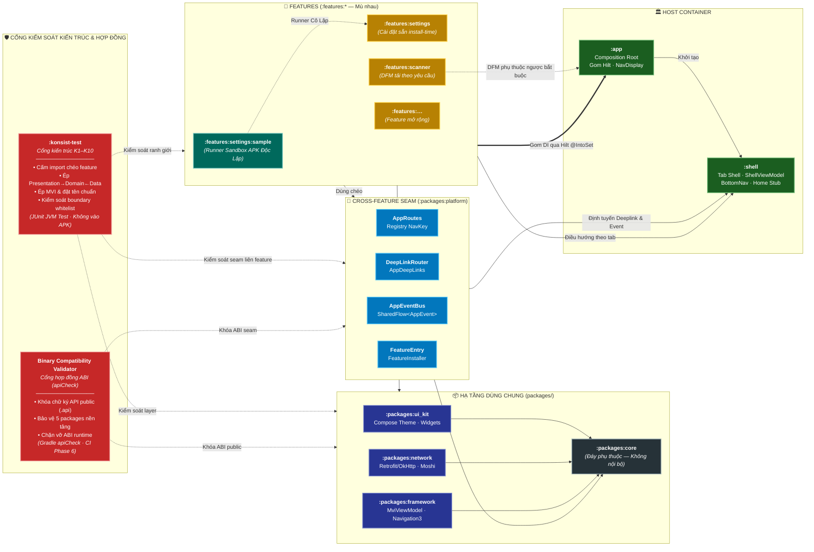

# Kiến Trúc: Clean Architecture + MVI

*(Tổ chức Feature-First — Phiên bản Android)*

> 🌐 **Language / Ngôn ngữ:** 🇬🇧 [English](ARCHITECTURE.en.md) | 🇻🇳 **Tiếng Việt**

Tài liệu này là **hướng dẫn kiến trúc chuẩn mực (authoritative guide)** cho template này và cho các dự án được khởi tạo từ template.

> **Nguồn tham chiếu đa nền tảng chuẩn mực (Canonical Cross-platform Source).** Các quy tắc layer và hợp đồng MVI được định nghĩa thống nhất cho toàn bộ hệ sinh thái sản phẩm tại repository anh em:
> `bloc_digital_wallet/.worktrees/flutter_super_app_template/docs/architecture/ARCHITECTURE.md`.
> Phiên bản Android này bám sát tài liệu trên theo từng mục và chỉ ánh xạ lại các thuật ngữ theo nền tảng:
>
> | Flutter | Android |
> |---|---|
> | Widget | `@Composable` |
> | BLoC | `MviViewModel` |
> | `Either<Failure, T>` | `DataState<T>` / `NetworkResponse<T>` |
> | `context.t` | `stringResource(...)` |
> | `context.appThemes` | `MaterialTheme` |
> | `get_it` / `injectable` | Hilt (`@Inject` / `@Module` / `@IntoSet`) |
> | `mason make pac_mvi_feature` | `mason make mvi_feature` |
> | `melos genAlls` | Các task `./gradlew` (KSP biên dịch trực tiếp khi build) |
> | Domain Dart thuần | Domain Kotlin thuần (cấm `android.*` / `androidx.*`) |

---

## Mục lục

- [I. Sơ Đồ Clean Architecture + MVI](#i-sơ-đồ-clean-architecture--mvi)
  - [1. Các khái niệm cốt lõi](#1-các-khái-niệm-cốt-lõi)
  - [2. Sơ đồ luồng dữ liệu](#2-sơ-đồ-luồng-dữ-liệu)
  - [3. Quy tắc phụ thuộc giữa các layer](#3-quy-tắc-phụ-thuộc-giữa-các-layer)
- [II. Cơ Chế MVI](#ii-cơ-chế-mvi)
  - [1. Action / State / Event](#1-action--state--event)
  - [2. Luồng dữ liệu](#2-luồng-dữ-liệu)
- [III. Tổ Chức Feature-First & Các Layer Kiến Trúc](#iii-tổ-chức-feature-first--các-layer-kiến-trúc)
  - [1. Cấu trúc thư mục của một Feature Module](#1-cấu-trúc-thư-mục-của-một-feature-module)
  - [2. Chi tiết các Layer Kiến trúc](#2-chi-tiết-các-layer-kiến-trúc)
  - [3. Bản đồ Module & Đồ thị Phụ thuộc](#3-bản-đồ-module--đồ-thị-phụ-thuộc)
  - [4. Các quy tắc giao tiếp Cross-Feature](#4-các-quy-tắc-giao-tiếp-cross-feature)
    - [4.1 DeepLink Router Engine](#41-deeplink-router-engine)
    - [4.2 Super App Governance: 4 Trụ Cột & 8 Tiêu Chí](#42-super-app-governance-4-trụ-cột--8-tiêu-chí)
    - [4.3 Sandbox Development: Standalone Mini App Runners](#43-sandbox-development-standalone-mini-app-runners)
    - [4.4 Binary Compatibility Validator (BCV) & Quản Trị Hợp Đồng ABI](#44-binary-compatibility-validator-bcv--quản-trị-hợp-đồng-abi)
    - [4.5 Cấu Hình Tri-Mode (enterprise, lean, plugin)](#45-cấu-hình-tri-mode-enterprise-lean-plugin)
    - [4.6 Flutter Plugin Native Devbed (:plugin + :sample)](#46-flutter-plugin-native-devbed-plugin--sample)
  - [5. Sử dụng với Mason](#5-sử-dụng-với-mason)
- [IV. Stack Công Nghệ Android Hiện Đại](#iv-stack-công-nghệ-android-hiện-đại)
- [V. Ví Dụ Code & Best Practices](#v-ví-dụ-code--best-practices)
  - [1. Định nghĩa Hợp đồng (Action/State/Event)](#1-định-nghĩa-hợp-đồng-actionstateevent)
  - [2. Triển khai ViewModel](#2-triển-khai-viewmodel)
  - [3. Triển khai Screen](#3-triển-khai-screen)
  - [4. Đóng góp Navigation](#4-đóng-góp-navigation)
  - [5. Các quy tắc trọng yếu](#5-các-quy-tắc-trọng-yếu)
- [VI. Tài Liệu Tham Khảo](#vi-tài-liệu-tham-khảo)
- [VII. Tổng Kết](#vii-tổng-kết)

---

## I. Sơ Đồ Clean Architecture + MVI

### 1. Các khái niệm cốt lõi

| Nguyên tắc | Mô tả |
|------------|-------|
| **Dependency Rule (Quy tắc phụ thuộc)** | `Presentation → Domain ← Data`. Domain hoàn toàn không biết gì về các layer bên ngoài. |
| **Separation of Concerns (Phân tách mối bận tâm)** | Tách bạch tuyệt đối giữa giao diện (UI), logic nghiệp vụ (business logic) và xử lý dữ liệu (data). |
| **Testability (Khả năng kiểm thử độc lập)** | Từng layer có thể test độc lập; mọi feature đều có thể build và test unit mà không cần nạp `:app`. |
| **Pure Domain (Domain thuần túy)** | Layer domain viết bằng Kotlin thuần — tuyệt đối không chứa import `android.*` / `androidx.*`. |

### 2. Sơ đồ luồng dữ liệu

```mermaid
graph LR
    subgraph Presentation_Layer ["Presentation"]
        View["Screen (@Composable)"]
        ViewModel["MviViewModel"]
    end

    subgraph Domain_Layer ["Domain"]
        UseCase["Use Case"]
        RepoInterface(["Repository Interface"])
    end

    subgraph Data_Layer ["Data"]
        RepoImpl["Repository Impl"]
        DataSource["Remote / Local Data Source"]
    end

    View -- "1. dispatch(Action)" --> ViewModel
    ViewModel -- "2. invoke UseCase" --> UseCase
    UseCase -- "2a. gọi interface Repository" --> RepoInterface
    RepoInterface -. "được triển khai bởi" .-> RepoImpl
    RepoImpl -- "2b. gọi Data Source" --> DataSource

    DataSource -- "3a. trả về DTO" --> RepoImpl
    RepoImpl -- "3b. map DTO sang entity" --> UseCase
    UseCase -- "3. trả về DataState / Result" --> ViewModel

    ViewModel -- "4. reduce { State }" --> View
    ViewModel -. "5. sendEvent(Event)" .-> View

    classDef interface fill:#fffde7,stroke:#fbc02d,stroke-width:1px,stroke-dasharray: 5 5;
    class RepoInterface interface;
    style Presentation_Layer fill:#C7FDCB,stroke:#02CC0C,stroke-width:2px;
    style Data_Layer fill:#A7DAF2,stroke:#088DF3,stroke-width:2px;
    style Domain_Layer fill:#F4F0C0,stroke:#fbc02d,stroke-width:2px;
```



### 3. Quy tắc phụ thuộc giữa các layer

> [!IMPORTANT]
> **Các quy tắc bắt buộc**
>
> 1. **Quy tắc phụ thuộc:** `Presentation → Domain ← Data`. Presentation KHÔNG ĐƯỢC đụng trực tiếp tới Data. Domain KHÔNG ĐƯỢC import bất kỳ thành phần nào từ Presentation hay Data.
> 2. **Không mang Android vào Domain:** Layer domain là Kotlin thuần túy. Bất kỳ `import android.*` hoặc `import androidx.*` bên trong `..domain..` đều bị tính là vi phạm kiến trúc nghiêm trọng.
> 3. **Luồng dữ liệu một chiều (Unidirectional Data Flow):** Dữ liệu di chuyển theo đúng một vòng khép kín:
>    `Screen → MviViewModel → Domain → Data → Domain → MviViewModel → Screen`.

```text
Các phụ thuộc ĐƯỢC PHÉP:
  Presentation → Domain
  Data         → Domain
  Domain       → (không phụ thuộc layer khác)

Các phụ thuộc BỊ CẤM:
  Domain → Presentation
  Domain → Data
  Domain → android.* / androidx.*
  Presentation → Data (bắt buộc phải đi qua Domain)
```

Những quy tắc này được kiểm soát tự động bởi các rule Konsist **K2** (layer imports) và **K3** (pure-Kotlin domain) trong `:konsist-test` — xem chi tiết tại [§III.4](#4-các-quy-tắc-giao-tiếp-cross-feature).

---

## II. Cơ Chế MVI

### 1. Action / State / Event

Ba thành phần cốt lõi với quy ước đặt tên và trách nhiệm rõ ràng. Lớp cơ sở là:
`com.danhdue.framework.base.mvi.MviViewModel<STATE, ACTION, EVENT>`.

| Thành phần | Kiểu | Chiều | Ý nghĩa & Trách nhiệm |
| :--- | :--- | :--- | :--- |
| **Action** | INPUT | Screen ➡️ ViewModel | Ý định của người dùng (User intent). Kích hoạt logic xử lý (bấm nút, nhập text). Được gửi qua một cửa ngõ duy nhất `dispatch(action)`. |
| **State** | DATA | ViewModel ➡️ Screen | Trạng thái bền vững của giao diện (Persistent UI state). Là một `data class` bất biến, phát ra dưới dạng `StateFlow<STATE>`, quan sát bằng `collectAsStateWithLifecycle()`. |
| **Event** | OUTPUT | ViewModel ➡️ Screen | Tác vụ phụ xảy ra một lần (One-time side effect: điều hướng, snackbar, dialog). Phát qua một `Channel` đệm và tiêu thụ bên trong `LaunchedEffect`. |

- **Action** — `sealed interface {Feature}Action`; các case đặt tên theo mẫu `{Động từ}{Danh từ}` (`OpenProfile`, `Logout`). Gửi qua `viewModel.dispatch(...)`.
- **State** — `data class {Feature}State(...)` có giá trị mặc định cho các trường. Cập nhật bên trong ViewModel qua `reduce { copy(...) }` (nguyên tử) hoặc `setState(...)`.
- **Event** — `sealed interface {Feature}Event`; các case đặt tên `NavigateTo{X}` / `Show{X}`. Phát qua `sendEvent(...)` (cho 1 collector) hoặc `emitSharedEvent(...)` (cho analytics / nhiều collector).

`MviViewModel` đồng thời cung cấp wrapper `viewState: StateFlow<ViewState<STATE>>` (`Loading` / `Error` / `Content`) cho các màn hình cần khung hiển thị loading hoặc lỗi tổng thể mà không làm mất dữ liệu `uiState` bên dưới.

### 2. Luồng dữ liệu

```text
Tương tác của người dùng (chạm, gõ phím, ...)
    ↓
Screen gọi viewModel.dispatch(Action)
    ↓
MviViewModel.onAction(action)  — hàm DUY NHẤT mà Screen được phép gọi
    ↓
ViewModel thực thi một UseCase (Domain)
    ↓
UseCase gọi giao diện Repository interface
    ↓
Repository Impl (Data) chọn nguồn local / remote, gọi Data Source
    ↓
Data Source trả về DTO;  apiCall { } bọc IO thành DataState<T>
    ↓
Repository ánh xạ DTO → domain entity
    ↓
UseCase trả về DataState<Entity> (hoặc kotlin.Result đối với logic không-IO)
    ↓
ViewModel gọi reduce { copy(...) }  → cập nhật State mới
    ↓
ViewModel gọi sendEvent(Event)      → phát sinh side effect một lần (tùy chọn)
    ↓
Screen re-compose dựa trên State (qua collectAsStateWithLifecycle)
    ↓
Screen phản hồi Event trong LaunchedEffect (điều hướng / hiện thông báo snackbar / dialog)
```

`MvvmViewModel` (lớp cha của `MviViewModel`) cung cấp hàm `execute(callFlow: Flow<DataState<T>>)` tự động thực hiện: `startLoading()` → collect luồng → chuyển `DataState.Error` về `handleError(...)` và trả `DataState.Success` cho bên gọi. Đây là lý do `:core` (nơi định nghĩa `DataState`) được khai báo là phụ thuộc `api` của `:framework`.

---

## III. Tổ Chức Feature-First & Các Layer Kiến Trúc

### 1. Cấu trúc thư mục của một Feature Module

Một feature module là một Gradle module đặt tại `features/{name}/` sử dụng convention plugin `commons.android-feature`. Khi được khởi tạo, các feature install-time đồng thời tích hợp một sandbox application module độc lập tại `features/{name}/sample/` áp dụng `commons.android-sample`.

```text
features/{name}/
├── sample/                  🔴  standalone — Runner sandbox độc lập (:features:{name}:sample)
│   ├── src/main/
│   │   ├── AndroidManifest.xml   (Khai báo Activity khởi chạy độc lập)
│   │   ├── res/values/strings.xml
│   │   └── kotlin/com/{org}/features/{name}/sample/
│   │       ├── {Name}SampleApp.kt        (Entry runner với @HiltAndroidApp)
│   │       ├── {Name}SampleActivity.kt   (Cửa sổ Compose độc lập tải {Name}Route)
│   │       └── di/{Name}SampleModule.kt  (Testbed overrides & mock navigation bindings)
│   └── build.gradle.kts                  (plugins { id("commons.android-sample") })
└── src/main/kotlin/com/{org}/{name}/
    ├── data/                🔵  internal — RepositoryImpl, DataSource (remote/local),
    │   ├── di/                       model/ (DTOs, @Json), mappers/ (DTO ⇄ entity)
    │   ├── mappers/
    │   ├── model/
    │   └── repository/
    ├── domain/              🟡  public   — Kotlin thuần túy
    │   ├── di/
    │   ├── model/                    entities (không chứa annotation thư viện)
    │   ├── repository/               repository interfaces
    │   └── usecase/                  {Động từ}{Danh từ}UseCase (đơn nhiệm)
    └── presentation/        🟢  public   — Compose UI + MVI
        ├── di/
        ├── model/                    {Feature}UiModel
        ├── {sub}/                    mỗi thư mục tương ứng một màn hình:
        │   ├── {Sub}Action.kt
        │   ├── {Sub}State.kt
        │   ├── {Sub}Event.kt
        │   ├── {Sub}ViewModel.kt     : MviViewModel<State, Action, Event>
        │   └── {Sub}Screen.kt        @Composable {Sub}Root + private {Sub}Screen
        ├── {Feature}Route.kt         data object : NavKey — nội bộ feature trừ khi dùng
        │                             cross-feature (khi đó dời lên :platform AppRoutes)
        └── {Feature}NavigationModule.kt
                                      @Module @InstallIn(SingletonComponent::class)
                                      — @Provides @IntoSet EntryProviderInstaller
                                      — @Provides @IntoSet DeepLinkResolver
                                      (các điểm nối mà feature cung cấp cho host navigation)
```

### 2. Chi tiết các Layer Kiến trúc

#### 🟢 Presentation Layer (Giao diện & Trạng thái)

| Thành phần | Trách nhiệm |
|------------|-------------|
| **Screen (`@Composable`)** | Vẽ giao diện từ `State`. Là "View thuần túy" — không chứa business logic, không xử lý IO. Phát ra các `Action`. Một hàm stateful `{Sub}Root` thu thập ViewModel; một hàm private stateless `{Sub}Screen` nhận `state` + `onAction`. |
| **MviViewModel** | Giữ `State`, xử lý các `Action` thông qua một hàm `onAction()` duy nhất, kích hoạt domain, phát ra `Event`. Gắn `@HiltViewModel`, inject use case qua constructor. |
| **Contract** | Bộ ba `{Feature}Action` / `{Feature}State` / `{Feature}Event` — giao thức kết nối chuẩn mực giữa Screen và ViewModel. |

#### 🟡 Domain Layer (Logic nghiệp vụ — Trái tim của ứng dụng)

| Thành phần | Trách nhiệm |
|------------|-------------|
| **Entity** | Là `data class` Kotlin thuần túy. Tuyệt đối không chứa `@Json` / `@Entity` / `@Parcelize`. |
| **Repository Interface** | Hợp đồng truy xuất dữ liệu. Trả về `DataState<T>` đối với tác vụ IO, hoặc `kotlin.Result<T>` cho logic nội bộ. |
| **UseCase** | Đại diện cho một nghiệp vụ duy nhất. `class GetXUseCase @Inject constructor(...)` với `suspend operator fun invoke(...)`. |

> ⚠️ **Layer domain bắt buộc phải là pure Kotlin.** Mọi khai báo `import androidx.*` bên trong `..domain..` đều bị tính là lỗi — Konsist K3 sẽ chặn quá trình build.

#### 🔵 Data Layer (Triển khai kỹ thuật & Hạ tầng)

| Thành phần | Trách nhiệm |
|------------|-------------|
| **Model (DTO)** | Khớp cấu trúc 1:1 với phản hồi API hoặc bảng DB. Moshi `@JsonClass(generateAdapter = true)`; Room `@Entity`. |
| **DataSource** | Remote (Retrofit service) hoặc Local (Room DAO, DataStore). |
| **Repository Impl** | Triển khai interface domain, quyết định chiến lược caching, map DTO → entity, chuyển đổi ngoại lệ thành `Failure` qua `apiCall { }`. Đánh dấu `internal` — không rò rỉ ra ngoài module (enforce bởi Konsist K4). |

### 3. Bản đồ Module & Đồ thị Phụ thuộc

God-module `libraries/framework` trước đây đã được phân tách thành 5 package module nền tảng (nằm trong `packages/`), tương ứng với tập hợp `packages/` trong kiến trúc Flutter. Mọi module — bao gồm cả feature — chỉ được phép phụ thuộc vào các module này, tuyệt đối không phụ thuộc chéo vào feature khác.

| Module | Package | Vai trò | Các phụ thuộc dự án |
|---|---|---|---|
| `:packages:core` | `com.danhdue.core` | Đáy phụ thuộc (Dependency floor). `DataState` / `NetworkResponse` call-adapter, `DispatcherProvider`, `extension/*`, `pref/*` (DataStore + Tink), `room/*` (`BaseDao`, converters), `SessionManager`, `usecase/*`, `Logger` contract, `AppInitializer`. **Hoàn toàn không có Compose.** | *Không có* |
| `:packages:framework` | `com.danhdue.framework` | `MviViewModel` / `MvvmViewModel` / `BaseViewState`; cơ chế navigation3 — `Navigator` (backstack `@ActivityRetainedScoped`), `NestedNavigator` + `LocalNestedNavigator`; quản lý vòng đời ứng dụng. | `api(:packages:core)` |
| `:packages:network` | `com.danhdue.network` | Cấu hình Retrofit / OkHttp / Moshi, interceptors, `apiCall` / `Failure`, `HttpStatusCode`, token authenticator. | `api(:packages:core)` |
| `:packages:ui_kit` | `com.danhdue.uikit` | Thiết kế Compose dùng chung (`ui/theme`, `ui/widgets`), Compose helpers, quản lý runtime permissions. | `implementation(:packages:core)` |
| `:packages:platform` | `com.danhdue.platform` | Cầu nối cross-feature seam: `AppRoutes` (registry `NavKey`), `AppEventBus` (`SharedFlow<AppEvent>`), `EntryProviderInstaller` typealias + `LocalEntryProviderInstallers`, `FeatureEntry` / `FeatureInstaller` (cho DFM). | *Không có* — chỉ runtime Compose |
| `:shell` | `com.danhdue.shell` | Host tab-shell: `ShellViewModel`, thanh bottom nav, nested navigation theo từng tab, 5 tab backstacks được khởi tạo sẵn. | packages + 5 `:features:*` (hạt giống tab) |
| `:app` | `com.danhdue.androiddigitalwallet` | Composition root mỏng: Gom Hilt (`Set<EntryProviderInstaller>`), `NavDisplay`, `Application`, `Activity` chính. | packages + toàn bộ `:features:*` |
| `:features:*` | `com.danhdue.{feature}` | Mỗi sản phẩm một module, gồm 3 layer. **Hoàn toàn mù các feature khác.** | `:packages:core`, `:packages:framework`, `:packages:network`, `:packages:ui_kit`, `:packages:platform` — thông qua convention plugin `commons.android-feature` |
| `:features:*:sample` | `com.danhdue.features.{feature}.sample` | Ứng dụng APK sandbox độc lập. Cấu hình qua `commons.android-sample`. Hỗ trợ hot-reload cục bộ và debug cô lập mà không cần build toàn bộ `:app`. | Target `:features:*`, `:packages:platform`, `:libraries:testutils` |
| `:libraries:testutils` | `com.danhdue.libraries.testutils` | Shared test rules, base test classes, MockWebServer helpers. | *(Chỉ dùng cho testing)* |
| `:konsist-test` | `com.danhdue.konsist` | Cổng kiểm soát kiến trúc JVM/JUnit (rules K1–K10). Không bao giờ đóng gói vào APK. | *(Quét cây mã nguồn)* |



**Các bất biến được Konsist bảo chứng:** Mọi mũi tên nét liền đều hướng xuống `:core`; không có feature nào phụ thuộc trực tiếp vào feature khác; chỉ `:app` / `:shell` được phép tổng hợp nhiều feature; đường nét đứt `:features:scanner → :app` là phụ thuộc ngược bắt buộc của Dynamic Feature Module, được miễn trừ hợp lệ qua rule **K8** bằng cấu hình `android.dynamicFeatures`.

### 4. Các quy tắc giao tiếp Cross-Feature

Các feature tuyệt đối không import lẫn nhau. Mọi tương tác cross-feature đều phải đi qua `:platform`:

| Kênh giao tiếp | Vị trí | Dạng thức | Đối tượng sử dụng |
|---|---|---|---|
| **`AppRoutes`** (Registry NavKey) | `:platform` | `@Serializable data object XxxRoute : NavKey`; điều hướng bằng `Navigator.navigateTo(...)` / `NestedNavigator.navigate(...)` | Mọi module — một `NavKey` không để lộ chi tiết triển khai |
| **`AppEventBus`** | `:platform` | Broadcast `MutableSharedFlow<AppEvent>`; `publish(e)` / `inline fun <reified T> on(): Flow<T>` | Mọi module — phát / nhận sự kiện theo kiểu dữ liệu |
| **`EntryProviderInstaller`** (Hilt `@IntoSet`) | Cơ chế trong `:framework`, đóng góp theo từng feature | Feature cung cấp `@Provides @IntoSet EntryProviderInstaller`; host tiêu thụ `Set<EntryProviderInstaller>` đưa vào `NavDisplay` | Feature cung cấp, host gom lại — host không import class UI của feature |
| **`FeatureEntry`** + `ServiceLoader` | Interface trong `:platform`, triển khai trong DFM feature; file đăng ký `META-INF/services` được **tổng hợp tập trung tại `:app`** (mỗi dòng là một FQCN — bundletool cấm các split dùng chung root resource) | Nạp `EntryProviderInstaller` tại runtime sau khi gọi `SplitCompat.install()`; `:shell` bỏ qua các entry mà split chưa được cài đặt | **Chỉ dành cho on-demand DFM** — các feature install-time dùng cơ chế Hilt multibinding |
| **`DeepLinkRouter`** + `DeepLinkResolver` | Engine tại `:platform` + các resolver theo từng feature | Tier-1 registry `AppDeepLinks` + Tier-2 multibinding `DeepLinkResolver`; giải mã URI thành `DeepLinkCommand` để `:shell` thực thi | Mọi module, intent bên ngoài, push notification, hoặc lệnh ADB |
| **Direct composition** | `:app`, `:shell` | Hilt aggregation + `NavDisplay` + tab-shell | **Chỉ dành cho host** (Konsist K6) |

Không có kênh request/response trực tiếp giữa hai feature. Khi một feature cần kết quả có kiểu dữ liệu từ logic nghiệp vụ của feature khác, hãy áp dụng nguyên lý đảo ngược phụ thuộc (Dependency Inversion): đặt interface tại `:core` và để feature kia đảm nhận việc triển khai (implement).

Từ vựng sự kiện vòng đời (trong `AppEvent`): `ShellTabVisibilityChanged(tabIndex, isVisible)` (phát bởi `:shell`), `AppLifecycleChanged(state)` (phát bởi observer vòng đời tại app-root), `UserLoggedOut` (phát bởi interceptor 401 của `:network`).

#### 4.1 DeepLink Router Engine

Template cung cấp **DeepLink Router Engine** chuẩn mực, tách rời hoàn toàn, tuân thủ Clean Architecture và ranh giới module nghiêm ngặt.

##### Hai tầng quản trị (The Two Tiers)
Định tuyến được chia thành 2 tầng phân quyền để đảm bảo các feature không bao giờ phụ thuộc lẫn nhau:
- **Tier 1 (Registry Cửa ngõ Nền tảng — `AppDeepLinks.entryPoints`)**:
  Nằm tại `:platform`. Khai báo định danh feature (slugs), `NavKey` gốc, chỉ số tab tùy chọn, tên DFM split, và kiểm tra điều kiện xác thực:
  ```kotlin
  FeatureEntryPoint(
      feature = "settings",
      entryRoute = AppRoutes.SettingsRoute,
      tab = 2,
      requiresAuth = false,
  )
  ```
- **Tier 2 (Bộ Giải mã Subpath của Feature — `DeepLinkResolver`)**:
  Do từng feature module sở hữu. Mỗi feature đóng góp một resolver triển khai `DeepLinkResolver` trong `presentation/di/` (được kiểm tra bởi rule Konsist **K10**):
  - **Feature install-time**: Cung cấp qua Hilt `@Provides @IntoSet DeepLinkResolver` trong một module `SingletonComponent` (ví dụ: `SettingsDeepLinkResolver`).
  - **Feature on-demand DFM**: Đóng góp tại runtime thông qua `FeatureEntry.resolver()` (ví dụ: `ScannerFeatureEntry.resolver() = ScannerDeepLinkResolver()`).

##### Bổ sung Deep Link
1. **Cho feature hiện có**:
   Thêm nhánh xử lý path vào `*DeepLinkResolver` của feature:
   ```kotlin
   override fun resolve(link: DeepLink): DeepLinkTarget? =
       if (link.feature != FEATURE) null
       else when (link.segments) {
           emptyList<String>() -> DeepLinkTarget(destination = AppRoutes.SettingsRoute)
           listOf("profile") -> DeepLinkTarget(destination = ProfileRoute)
           else -> null
       }
   ```
2. **Cho feature mới**:
   Chạy lệnh `mason make mvi_feature --name <Feature>` sẽ tự động:
   - Sinh `<Feature>DeepLinkResolver` tại `presentation/di/` để giải quyết `myapp://<feature>`.
   - Bổ sung `<Feature>Route` vào `AppRoutes.kt`.
   - Bổ sung một `FeatureEntryPoint` vào `AppDeepLinks.kt` với `tab = null`.
   - *Lưu ý*: Nếu feature được hiển thị trên thanh bottom navigation, hãy cập nhật `tab = <tabIndex>` trong `AppDeepLinks.kt`.

##### Xác định Vị trí & Tổng hợp Backstack (Placement & Backstack Synthesis)
Các resolver trả về `DeepLinkTarget(destination, placement, requiresAuth)`. Nếu `placement` là null, engine sẽ tự suy luận vị trí từ cấu hình Tier 1:
- Nếu `tab != null`: suy luận thành `Placement.InTab(tab, parents = listOf(entryRoute))`. Chuyển sang tab tương ứng và đẩy màn hình đích lên trên màn hình gốc của tab.
- Nếu `tab == null`: suy luận thành `Placement.RootFullScreen`. Hiển thị tràn màn hình đè lên tab shell.
Resolver có thể ghi đè vị trí một cách chủ động bằng `Placement.InTab`, `Placement.RootFullScreen`, hoặc `Placement.ReplaceTab`.

##### Chuỗi Bộ Lọc Bảo Vệ (Guard Pipeline)
Luồng giải quyết deep link đi qua chuỗi các triển khai `DeepLinkGuard`:
- **`AuthGuard`**: Nếu một link dẫn tới màn hình yêu cầu xác thực (`requiresAuth = true`) trong khi người dùng chưa đăng nhập (`SessionManager.isLoggedIn == false`), `AuthGuard` sẽ tạm hoãn link, lưu vào `PendingDeepLinkStore`, và phát ra lệnh `DeepLinkCommand.NavigateToLogin`.
- **Phát lại (Replay)**: Sau khi đăng nhập thành công, `ShellViewModel` lấy link đã lưu từ `PendingDeepLinkStore` và tự động điều hướng tiếp tục.

##### Các Cửa Ngõ Tiếp Nhận (Ingress Surfaces)
Engine tiếp nhận và xử lý deep link từ 4 nguồn khác nhau:
1. **Custom Scheme (`myapp://...`)**: Tiếp nhận qua intent filter của `MainActivity`.
2. **Android App Links (`https://app.example.com/...`)**: Tiếp nhận qua intent filter của `MainActivity` có cấu hình `android:autoVerify="true"`.
3. **Push Notifications**: Khởi tạo thông qua `DeepLinkIntentFactory.createPendingIntent(context, uri)` trỏ tới `MainActivity` dưới dạng một `PendingIntent` bất biến.
4. **Điều hướng nội bộ bằng code (Programmatic In-App Dispatch)**: Gọi trực tiếp `deepLinkRouter.dispatch("myapp://...")`.

##### Khía Cạnh Bảo Mật (Security Posture - HLD §4.6)
- **Dữ liệu đầu vào không tin cậy (Untrusted Input)**: Toàn bộ path segments và query parameters trong URI phải được coi là dữ liệu người dùng không an toàn. Resolvers và ViewModels bắt buộc phải kiểm tra và xác thực dữ liệu trước khi sử dụng.
- **Nguy cơ chiếm đoạt Scheme (Scheme Hijacking Risk)**: Custom schemes (`myapp://`) có thể bị ứng dụng khác trên thiết bị khai báo trùng lặp mà không có cơ chế xác minh. Các thao tác nhạy cảm (chuyển tiền, đổi mật khẩu, token xác thực) **bắt buộc** phải sử dụng Android App Links HTTPS đã được xác minh.
- **Bảo mật đa tầng (Defence-in-Depth Authentication)**: Bộ lọc `requiresAuth` chỉ phục vụ mục đích chuyển hướng UI để tối ưu trải nghiệm người dùng (UX); cơ chế này **không thay thế** việc xác thực token phía server trên các request API.
- **An toàn qua Danh sách cho phép (Allowlist Safety)**: Mọi feature chưa đăng ký hoặc subpath không hợp lệ đều trả về `DeepLinkCommand.Failed(Reason.UNSUPPORTED_LINK)`, hiển thị thông báo lỗi an toàn cho người dùng mà không làm crash ứng dụng hay rò rỉ trạng thái.

Để cấu hình chi tiết xác minh App Links và file `assetlinks.json`, vui lòng xem **[`docs/APP_LINKS_SETUP.md`](../APP_LINKS_SETUP.md)**.

### 4.2 Super App Governance: 4 Trụ Cột & 8 Tiêu Chí

Để vận hành chuẩn mực như một nền tảng Super App cấp doanh nghiệp, kiến trúc áp dụng nghiêm ngặt **4 Trụ Cột Cốt Lõi** thông qua **8 Tiêu Chí Quản Trị**:

| Trụ cột | Tiêu chí | Yêu cầu & Cơ chế Thực thi | Trạng thái |
|---|---|---|:---:|
| **1. Container & Modules** | **1.1 Host App (App Vỏ)** | Container mỏng làm nhiệm vụ lắp ráp (`:app` & `:shell`), cung cấp hạ tầng dùng chung (Auth, Network, Storage, Navigation). Hoàn toàn không chứa logic nghiệp vụ của feature. | **100%** ✅ |
| | **1.2 Mini Apps (App Ruột)** | Mỗi năng lực nghiệp vụ được cô lập trong module `:features:*` riêng biệt. Hỗ trợ **Dynamic Feature Module (DFM)** tải theo yêu cầu (ví dụ: `:features:scanner`) tại runtime qua `SplitInstallManager` + Java `ServiceLoader`. | **100%** ✅ |
| **2. Centralized Comms & Routing** | **2.1 DeepLink Router Engine** | Các Mini App hoàn toàn mù thông tin của nhau. Tuyệt đối không import chéo feature. Mọi điều hướng đều thông qua `DeepLinkParser` & `DeepLinkRouter` thuần JVM với URL scheme (`myapp://`) hoặc App Links (`https://`). Kiểm soát bởi Konsist **K1** & **K9**. | **100%** ✅ |
| | **2.2 Event Bridge** | Giao tiếp xuyên ranh giới dựa trên `AppEventBus` stateless (`SharedFlow<AppEvent>`) tại `:packages:platform`. Các feature phát sự kiện decoupled mà không cần biết bên tiêu thụ. | **100%** ✅ |
| **3. State Isolation** | **3.1 Đóng gói Trạng thái Cục bộ** | Loại bỏ state toàn cục dễ vỡ. Mỗi Mini App quản lý vòng đời state của riêng mình qua `MviViewModel<State, Action, Event>` độc lập. Kiểm soát bởi Konsist **K5**. | **100%** ✅ |
| | **3.2 Phân tầng Dependency Injection** | Đảo ngược điều khiển (IoC) nghiêm ngặt. Host cung cấp các singleton; triển khai trong layer `data` được đánh dấu `internal` (Konsist **K4**). Mini Apps chỉ để lộ interface `domain` trong sáng và màn hình `presentation`. | **100%** ✅ |
| **4. Lifecycle Governance & CI/CD** | **4.1 Sandbox Development** | Mỗi Mini App là một môi trường thử nghiệm độc lập với runner APK `:sample` riêng (`commons.android-sample`). Lập trình viên build, chạy và test tính năng mà không cần biên dịch toàn bộ Super App. | **100%** ✅ |
| | **4.2 Quản trị Hợp đồng Internal API** | Public ABI của 5 packages nền tảng (`core`, `platform`, `network`, `framework`, `ui_kit`) được theo dõi bởi **Binary Compatibility Validator (BCV)**. Breaking change lập tức làm fail lệnh `./gradlew apiCheck` trong CI. | **100%** ✅ |

### 4.3 Sandbox Development: Standalone Mini App Runners

Để tối đa hóa tốc độ phát triển trong các tổ chức có nhiều team hoạt động song song, mỗi feature đều tích hợp một module ứng dụng `:sample` độc lập:
- **Convention Plugin (`commons.android-sample`)**:
  - Đặt tại `buildSrc/src/main/kotlin/commons/AndroidSampleConventionPlugin.kt`.
  - Cấu hình `com.android.application`, Hilt, Compose và các công cụ đo lường chất lượng.
  - Tự động tính toán `applicationId` độc lập:
    ```kotlin
    val featureName = target.parent?.name ?: target.name
    defaultConfig {
        applicationId = "com.danhdue.androiddigitalwallet.sample.$featureName"
        versionCode = 1
        versionName = "1.0.0-sample"
    }
    ```
  - Khai báo feature mục tiêu là phụ thuộc triển khai duy nhất (`implementation`).
- **Runner Tham Chiếu Mẫu (`:features:settings:sample`)**:
  - `SettingsSampleApp`: Ứng dụng runner gắn `@HiltAndroidApp`.
  - `SettingsSampleActivity`: ComponentActivity độc lập hiển thị `SettingsRoot`.
  - `SettingsSampleModule`: Cung cấp các DI binding testbed với mock navigation và quan sát state cô lập.
- **Quy trình Thực thi**:
  ```bash
  # Đóng gói APK độc lập
  ./gradlew :features:settings:sample:assembleDebug

  # Cài đặt trực tiếp lên máy ảo hoặc thiết bị thật
  ./gradlew :features:settings:sample:installDebug
  ```

### 4.4 Binary Compatibility Validator (BCV) & Quản Trị Hợp Đồng ABI

ABI của các package dùng chung được coi là hợp đồng giao thức bất biến:
- **Tích hợp Plugin**: `org.jetbrains.kotlinx.binary-compatibility-validator:0.17.0` cấu hình tại root `build.gradle.kts`.
- **Phạm vi Bảo vệ**: Khóa chặt 5 shared foundation packages:
  - `:packages:core` (`packages/core/api/core.api`)
  - `:packages:platform` (`packages/platform/api/platform.api`)
  - `:packages:network` (`packages/network/api/network.api`)
  - `:packages:framework` (`packages/framework/api/framework.api`)
  - `:packages:ui_kit` (`packages/ui_kit/api/ui_kit.api`)
- **Đánh dấu Nội bộ & Ngoại lệ (Exclusions)**:
  - Bỏ qua package `hilt_aggregated_deps` để ngăn các file trung gian sinh bởi KSP làm bẩn chữ ký hợp đồng.
  - Annotation `@InternalApi` tại `:packages:core` dùng để đánh dấu các khai báo nội bộ không cần kiểm tra public ABI.
- **Xác minh trong CI / Acceptance**:
  - `./gradlew apiCheck`: So sánh bytecode sau biên dịch với file `.api` đã lưu trong git. Được tích hợp vào task root `:check` và Phase 6 của `./scripts/acceptance_check.sh`.
  - `./gradlew apiDump`: Tái sinh lại các chữ ký `.api` khi có sự bổ sung API mới có chủ đích và đảm bảo tính tương thích ngược.

**Cơ chế thực thi (Enforcement).** Konsist (`./gradlew :konsist-test:test`) kết hợp cùng Gradle guard trong `commons.android-feature`:

| Quy tắc | Nội dung kiểm tra | Trạng thái |
|---|---|---|
| K1 | Một feature không được import feature khác (trừ khi có trong whitelist) | **Đang thực thi** (whitelist trống) |
| K2 | `..presentation..` ⇏ `..data..`; `..domain..` ⇏ `..presentation..` / `..data..` | **Đang thực thi** |
| K3 | `..domain..` không có import `android.*` / `androidx.*` | **Đang thực thi** |
| K4 | Các khai báo top-level bên trong `..features..data..` phải là `internal` | **Đang thực thi** |
| K5 | Quy ước đặt tên: `*ViewModel : MviViewModel`, `*UseCase`, `*Action`/`*State`/`*Event`, `*Screen` `@Composable`, `*Route : NavKey`, `*RepositoryImpl` trong `data`, `*NavigationModule` là Hilt module | **Đang thực thi** (có baseline) |
| K6 | Chỉ duy nhất `:app` / `:shell` được gom nhiều feature | **Đang thực thi** (whitelist trống) |
| K7 | `:core` không được import gì từ `:framework` / `:network` / `:ui_kit` / `:platform` / `:shell` / hay feature | **Đang thực thi** |
| K8 | Một feature không được import `com.danhdue.androiddigitalwallet.*` (nội bộ của host) — ngoại trừ module nằm trong `android.dynamicFeatures` | **Đang thực thi** |
| K9 | Một `*Route : NavKey` dùng cross-feature phải được khai báo trong `:platform`, không nằm trong feature | **Đang thực thi** |
| K10 | `*DeepLinkResolver` phải implement `DeepLinkResolver` và nằm trong `..presentation.di..` | **Đang thực thi** |

Ngoài ra, Gradle guard sẽ làm quá trình Gradle sync thất bại nếu phát hiện bất kỳ file `features/*/build.gradle.kts` nào khai báo phụ thuộc vào một module `:features:*` khác.

### 5. Sử dụng với Mason

| Lệnh | Mô tả |
|------|-------|
| `mason make mvi_feature --name X --package com.org.x --screen Main` | Tạo mới một feature module (đầy đủ data / domain / presentation, tự động nối dây) |
| `mason make mvi_feature --name X ... --delivery on-demand` | Tạo feature dưới dạng một Dynamic Feature Module split tải theo yêu cầu |
| `mason make mvi_subfeature --module x --name Detail` | Thêm một màn hình mới (Action/State/Event/ViewModel/Screen/UiModel) vào module có sẵn |
| `mason make remove_feature --name X` | Gỡ bỏ hoàn toàn một feature module và hoàn tác toàn bộ các điểm kết nối |
| `mason make remove_subfeature --module x --name Detail` | Xóa một màn hình khỏi module |

`mvi_feature` sẽ tự động đăng ký module vào `settings.gradle.kts`, sinh `{X}Route : NavKey`, `{X}NavigationModule` (`@Provides @IntoSet EntryProviderInstaller`), và — với chế độ `install-time` — thêm `implementation(project(":features:x"))` vào `:app` (và `:shell`), sau đó Hilt multibinding sẽ tự động tổng hợp entry. Lệnh này không bao giờ tác động tới các feature khác.

| Thao tác thủ công | Tự động hóa? |
|---|---|
| Khởi tạo các file code | ✅ Mason |
| Đăng ký module trong `settings.gradle.kts` | ✅ hook |
| Gom `@IntoSet EntryProviderInstaller` vào host | ✅ (Hilt multibinding, không sửa code) |
| Đăng ký route cross-feature vào `:platform AppRoutes` | ✅ khi dùng `--delivery on-demand`, ngược lại có thông báo nhắc |
| Dependency injection cho repository / use case mới | ✅ Constructor gắn `@Inject` của Hilt (không cần đăng ký thủ công) |
| Sinh mã tự động (Hilt, Moshi, Room) | ✅ KSP, tích hợp sẵn khi build |
### 4.5 Cấu Hình Tri-Mode (enterprise, lean, plugin)

Template cung cấp 3 cấu hình thực thi chuẩn mực thông qua `scripts/configure_mode.sh` và `scripts/rename_project.sh --mode <profile>`:

| Cấu hình | Module Hoạt Động | Trường Hợp Sử Dụng | Đặc Điểm Chính |
|---|---|---|---|
| **`enterprise`** (Mặc định) | 12 modules (`:app`, `:shell`, `:packages:*`, `:features:*`, `:libraries:testutils`, `:konsist-test`) | Super App Quy Mô Lớn / Production | DFM on-demand split (`:features:scanner`), Konsist gate (K1–K10), BCV ABI validation, Hilt `@IntoSet` multibindings. |
| **`lean`** | 9 modules (`:app`, `:shell`, `:packages:*`, `:features:settings`, `:libraries:testutils`) | Tạo Mẫu Tính Năng / MVP Độc Lập | Tạm tắt DFM, Konsist gate và BCV để Gradle sync siêu tốc và phản hồi tối đa. |
| **`plugin`** | 2 modules (`:plugin`, `:sample`) | Phát Triển Native Plugin Cho Flutter | Không phụ thuộc Hilt, Pure Dagger 2, chạy background WorkManager không cần `FlutterEngine`, runner app tương tác độc lập. |

Chuyển đổi chế độ bất kỳ lúc nào:
```bash
./scripts/configure_mode.sh enterprise|lean|plugin [--prune]
```

### 4.6 Flutter Plugin Native Devbed (`:plugin` + `:sample`)

Khi phát triển tính năng native Android cho Flutter Plugins:
1. **Kiến Trúc Pure Dagger 2**: Module `:plugin` không dùng Hilt để giữ tính độc lập nền tảng, hoạt động không cần lớp `Application`.
2. **Thực Thi Headless**: Worker nền (`DataSyncWorker`) và Pigeon Host API hoạt động hoàn toàn độc lập với Flutter UI hoặc `FlutterEngine`.
3. **Bộ Chạy `:sample` Độc Lập**: Lập trình viên Android có thể build, debug và kiểm thử giao diện Compose (`MyPluginScreen`) trực tiếp từ Android Studio mà không cần cài Flutter SDK.
4. **Bộ Mason Bricks Chuyên Dụng**:
   - `mason make native_plugin --name <name> --package <pkg> [--has_ui true|false]`
   - `mason make add_native_ui --name <name> --package <pkg>`

---

## IV. Stack Công Nghệ Android Hiện Đại

| Nhóm công nghệ | Thư viện | Mục đích sử dụng |
|----------------|----------|------------------|
| **UI** | Jetpack Compose (Material 3), `androidx.compose.material-icons`, Coil | Khai báo giao diện (declarative UI), theme hệ thống, nạp hình ảnh |
| **State Management** | `MviViewModel` (lớp cơ sở dự án) dựa trên `androidx.lifecycle.ViewModel` + Kotlin `StateFlow` / `Channel` / `SharedFlow` | Quản lý trạng thái theo mô hình MVI: Action / State / Event, điểm vào duy nhất `onAction()` |
| **Navigation** | AndroidX **navigation3** (`navigation3-runtime` / `-ui`, `lifecycle-viewmodel-navigation3`), `NavDisplay`, `EntryProviderInstaller` | Backstack an toàn kiểu với `NavKey`; nested navigation theo tab; đóng góp entry tính năng qua Hilt `@IntoSet` |
| **Dependency Injection** | Dagger **Hilt** (`@Inject`, `@Module`, `@InstallIn`, `@IntoSet`) — một `SingletonComponent` phẳng duy nhất | Constructor injection, tổng hợp multibinding |
| **Networking** | Retrofit, OkHttp, Moshi, `NetworkResponse` call-adapter, Chucker (debug) | Client API an toàn kiểu dữ liệu; `apiCall { }` → `DataState<T>` / `Failure` |
| **Storage** | Room (KSP), DataStore Preferences, `security-crypto` + Tink, Paging 3 | Lưu trữ dữ liệu cục bộ, mã hóa preferences, phân trang danh sách |
| **Async** | Kotlin Coroutines & Flow; `DispatcherProvider` | Lập trình bất đồng bộ có cấu trúc (Structured concurrency), dispatcher dễ dàng kiểm thử |
| **Code Generation** | **KSP** (Hilt, Moshi, Room) — tuyệt đối không dùng KAPT; **Mason** để scaffold feature | Sinh mã lúc biên dịch cho DI / JSON / DB; tạo tính năng chỉ bằng một dòng lệnh |
| **Observability** | Timber, Firebase Crashlytics, LeakCanary (debug), Chucker (debug), OpenTelemetry | Ghi log, báo cáo sự cố crash, giám sát lưu lượng mạng, phát hiện rò rỉ bộ nhớ |
| **Quality Gates** | **Konsist** (kiến trúc), **Binary Compatibility Validator (BCV)** (hợp đồng ABI), detekt, Spotless, JaCoCo | Kiểm soát layer / ranh giới / quy tắc đặt tên, ổn định ABI public, phân tích tĩnh, chuẩn hóa code style, đo lường độ bao phủ test |
| **Testing** | JUnit 4, MockK, Turbine, Robolectric, OkHttp MockWebServer, `:libraries:testutils` | Unit tests, kiểm thử Flow bất đồng bộ, JVM Android tests |
| **Build** | Gradle Kotlin DSL, các convention plugin trong `buildSrc` (`commons.android-library` / `-compose` / `-feature` / `-sample` / `dagger-hilt`), `Versions.kt` + `Deps.kt` | Quản lý phiên bản tập trung (không hardcode), áp dụng quy ước theo từng module, cấu hình runner sandbox độc lập |

---

## V. Ví Dụ Code & Best Practices

Tất cả các ví dụ dưới đây đều là code thực tế được trích xuất từ `features/settings` và `:shell`.

### 1. Định nghĩa Hợp đồng (Action/State/Event)

```kotlin
// features/settings/presentation/SettingsAction.kt
sealed interface SettingsAction {
    data object OpenProfile : SettingsAction
    data object Logout : SettingsAction
}

// features/settings/presentation/SettingsState.kt
data class SettingsState(
    val isLoading: Boolean = false,
    val items: List<SettingsUiModel> = emptyList(),
)

// features/settings/presentation/SettingsEvent.kt
sealed interface SettingsEvent {
    data object NavigateToProfile : SettingsEvent
    data object NavigateToLogin : SettingsEvent
}

// features/settings/presentation/SettingsRoute.kt
@Serializable
data object SettingsRoute : NavKey
```

### 2. Triển khai ViewModel

`shell/src/main/kotlin/com/danhdue/shell/ShellViewModel.kt` — một lớp con kế thừa trực tiếp từ `MviViewModel`:

```kotlin
@HiltViewModel
class ShellViewModel @Inject constructor() :
    MviViewModel<ShellState, ShellAction, ShellEvent>(
        initialState = ShellState(),
    ) {
    override fun onAction(action: ShellAction) {
        when (action) {
            is ShellAction.TabSelected ->
                reduce { copy(selectedTab = action.tab) }

            is ShellAction.NavigateInTab ->
                reduce { copy(walletBackStack = walletBackStack + action.destination) }

            is ShellAction.PopInTab ->
                reduce {
                    if (walletBackStack.size > 1) copy(walletBackStack = walletBackStack.dropLast(1))
                    else this
                }
        }
    }
}
```

Một ViewModel thực hiện tác vụ IO sẽ kết hợp use case cùng với helper `execute(...)` kế thừa từ `MvvmViewModel` — helper này sẽ chạy `startLoading()`, định tuyến `DataState.Error` sang `handleError`, và trả `DataState.Success` về cho caller (sơ đồ nguyên lý):

```kotlin
@HiltViewModel
class ExampleViewModel @Inject constructor(
    private val getExample: GetExampleUseCase,          // suspend operator fun invoke(): Flow<DataState<Example>>
) : MviViewModel<ExampleState, ExampleAction, ExampleEvent>(ExampleState()) {

    override fun onAction(action: ExampleAction) = when (action) {
        ExampleAction.Load -> load()
    }

    private fun load() = safeLaunch {
        execute(getExample()) { example ->             // Flow<DataState<Example>>
            reduce { copy(isLoading = false, example = example) }
        }
    }
}
```

> `SettingsViewModel` trong `features/settings` hiện tại vẫn kế thừa trực tiếp từ `androidx.lifecycle.ViewModel`; việc chuyển đổi sang `MviViewModel` đang được theo dõi như một phần thử nghiệm (pilot) và tạm thời nằm trong `konsist-test/konsist_baseline.txt` dưới rule K5.

### 3. Triển khai Screen

`features/settings/presentation/SettingsScreen.kt` — cấu trúc gồm một hàm stateful `Root` kết hợp cùng một hàm stateless `Screen`:

```kotlin
@Composable
fun SettingsRoot(
    viewModel: SettingsViewModel = hiltViewModel(),
    onEvent: (SettingsEvent) -> Unit,
) {
    val state by viewModel.state.collectAsStateWithLifecycle()
    val currentOnEvent by rememberUpdatedState(onEvent)

    LaunchedEffect(Unit) {
        viewModel.event.collect { event -> currentOnEvent(event) }
    }

    SettingsScreen(state = state, onAction = viewModel::onAction)
}

@Composable
private fun SettingsScreen(
    state: SettingsState,
    onAction: (SettingsAction) -> Unit,
) {
    if (state.isLoading) {
        CircularProgressIndicator()
    } else {
        Column {
            Button(onClick = { onAction(SettingsAction.OpenProfile) }) { Text("Go to Profile") }
            Button(onClick = { onAction(SettingsAction.Logout) }) { Text("Logout") }
        }
    }
}
```

### 4. Đóng góp Navigation

`features/settings/presentation/di/SettingsNavigationModule.kt` — điểm kết nối duy nhất mà một feature để lộ ra cho host:

```kotlin
@Module
@InstallIn(ActivityRetainedComponent::class)
object SettingsNavigationModule {
    @Provides
    @IntoSet
    fun provideSettingsEntries(navigator: Navigator): EntryProviderInstaller = {
        entry<SettingsRoute> {
            val nestedNavigator = LocalNestedNavigator.current
            SettingsRoot(
                onEvent = { event ->
                    when (event) {
                        SettingsEvent.NavigateToProfile -> nestedNavigator.navigate(ProfileRoute)
                        SettingsEvent.NavigateToLogin -> navigator.navigateAndClearBackStack(LoginRoute)
                    }
                },
            )
        }
    }
}
```

Host sẽ thu thập toàn bộ các `@IntoSet` `EntryProviderInstaller` vào một `Set` của Hilt, phân phối qua `LocalEntryProviderInstallers`, và nạp vào `NavDisplay`. Host tuyệt đối không import các class UI thuộc `com.danhdue.settings`.

### 5. Các quy tắc trọng yếu

#### 🌐 Đa ngôn ngữ (Bắt buộc)

```kotlin
Text(stringResource(R.string.settings_title))   // ✅
Text("Settings")                                // ❌ cấm hardcode chuỗi ký tự
```

#### 🎨 Quản lý Theme (Bắt buộc)

```kotlin
MaterialTheme.colorScheme.primary               // ✅
Color(0xFF6200EE)                               // ❌ cấm hardcode mã màu
```

#### ✅ Điểm vào duy nhất (Bắt buộc)

```kotlin
viewModel.dispatch(SettingsAction.OpenProfile)  // ✅
viewModel.openProfile()                         // ❌ cấm tạo thêm điểm vào thứ hai
```

#### ✅ Sau mỗi lần chỉnh sửa code (Bắt buộc)

```bash
./gradlew spotlessApply
./gradlew :konsist-test:test detekt spotlessCheck apiCheck testDebugUnitTest assembleDebug
```

---

## VI. Tài Liệu Tham Khảo

### 1. Nguồn chuẩn mực đa nền tảng
- `bloc_digital_wallet/.worktrees/flutter_super_app_template/docs/architecture/ARCHITECTURE.md` (repository anh em) — quy tắc layer và hợp đồng MVI chuẩn mực cho toàn bộ hệ sinh thái sản phẩm.

### 2. Thiết kế Epic
- [`.devtool/epic/android_super_app_template/2026-09-02-android-super-app-template-design.md`](../../.devtool/epic/android_super_app_template/2026-09-02-android-super-app-template-design.md) — kiến trúc mục tiêu, §4 bản đồ module, §6 quy chuẩn quản trị.
- [`.devtool/epic/android_super_app_template/android_super_app_template.vi.md`](../../.devtool/epic/android_super_app_template/android_super_app_template.vi.md) — kiến trúc tổng thể (§4.1) và các kênh cross-feature (§4.4).
- [`.devtool/epic/deeplink_router_engine/2026-09-10-deeplink-router-engine-design.md`](../../.devtool/epic/deeplink_router_engine/2026-09-10-deeplink-router-engine-design.md) — kiến trúc DeepLink Router Engine, §4 thiết kế thành phần, §6 quy chuẩn quản trị.
- [`.devtool/epic/deeplink_router_engine/deeplink_router_engine.vi.md`](../../.devtool/epic/deeplink_router_engine/deeplink_router_engine.vi.md) — tổng quan epic DeepLink Router Engine và ma trận nghiệm thu.
- [`.devtool/epic/sandbox_and_contract_governance/sandbox_and_contract_governance.vi.md`](../../.devtool/epic/sandbox_and_contract_governance/sandbox_and_contract_governance.vi.md) — tổng quan epic Sandbox Development & BCV Contract Governance và ma trận nghiệm thu.

### 3. Nội bộ Repository
- [`../../PROJECT_RULES.md`](../../PROJECT_RULES.md) — quy chuẩn viết code.
- [`../../AGENTS.md`](../../AGENTS.md) — ngữ cảnh dự án dành cho AI tooling.
- `konsist-test/src/test/kotlin/com/danhdue/konsist/` — mã nguồn kiểm tra các rule K1–K10.
- `packages/*/api/*.api` — chữ ký ABI public được kiểm soát bởi Binary Compatibility Validator.

### 4. Tài liệu bên ngoài
- [Clean Architecture — Robert C. Martin](https://blog.cleancoder.com/uncle-bob/2012/08/13/the-clean-architecture.html)
- [Now in Android — Hướng dẫn module hóa](https://developer.android.com/topic/modularization)
- [Binary Compatibility Validator (BCV)](https://github.com/Kotlin/binary-compatibility-validator)
- [Konsist](https://docs.konsist.lemonappdev.com/)
- [Mason](https://docs.brickhub.dev/)

---

## VII. Tổng Kết

### 1. Toàn cảnh kiến trúc

| Khía cạnh | Triển khai thực tế |
|-----------|---------------------|
| **Mô hình kiến trúc** | Clean Architecture (3 layer) + MVI |
| **Cấu trúc thư mục** | Tổ chức Feature-first trong `features/*`; các packages nền tảng tại `:packages:core` / `:packages:framework` / `:packages:network` / `:packages:ui_kit` / `:packages:platform` |
| **Quản lý trạng thái** | `MviViewModel<State, Action, Event>`, điểm vào duy nhất `onAction()` |
| **Dependency Injection** | Hilt, một `SingletonComponent` phẳng duy nhất, gom navigation và deeplink resolver bằng `@IntoSet` multibinding |
| **Điều hướng (Navigation)** | navigation3 `NavDisplay` + `Navigator` / `NestedNavigator`; các `NavKey` cross-feature đặt tại `:platform AppRoutes` |
| **Giao tiếp Cross-feature** | `AppRoutes` + `AppEventBus` + `@IntoSet EntryProviderInstaller` + `DeepLinkRouter`; các feature tuyệt đối không import lẫn nhau |
| **Kiểm thử Sandbox** | Ứng dụng APK Mini App runner độc lập (`:features:*:sample`) thông qua convention plugin `commons.android-sample` |
| **Quản trị hợp đồng ABI** | Khóa chặt ABI public bằng JetBrains **Binary Compatibility Validator (BCV 0.17.0)** |
| **Sinh mã tự động** | KSP (Hilt / Moshi / Room); Mason cho việc scaffold tính năng |
| **Cơ chế thực thi** | Konsist K1–K10 + BCV `apiCheck` + Gradle guard + CI tự động (`acceptance_check.sh` Phase 0–6) |

### 2. 10 Nguyên tắc cốt lõi

1. **Luồng dữ liệu một chiều** — `Screen → MviViewModel → Domain → Data → Domain → MviViewModel → Screen`.
2. **Phân tách mối bận tâm** — mỗi layer chỉ đảm nhiệm một trách nhiệm duy nhất.
3. **Tính bất biến (Immutability)** — States, Actions, Events, Entities, DTOs đều là bất biến.
4. **Điểm vào duy nhất** — ViewModel chỉ cung cấp `dispatch()` / `onAction()`.
5. **Domain thuần túy** — tuyệt đối không mang `android.*` / `androidx.*` vào domain.
6. **Feature-First** — mã nguồn được tổ chức theo tính năng, không tổ chức theo layer.
7. **`:core` là đáy phụ thuộc** — mọi module đều phụ thuộc vào `:core`; `:core` không phụ thuộc module nào khác trong dự án.
8. **Các feature hoàn toàn mù nhau** — toàn bộ tương tác cross-feature phải đi qua `:platform`.
9. **Phát triển Sandbox cô lập** — mỗi Mini App đều có thể phát triển và chạy thử độc lập qua runner APK `:sample`.
10. **Bảo vệ hợp đồng nghiêm ngặt** — mọi vi phạm public ABI đều bị chặn lại ngay từ CI trước khi merge PR.

### 3. Các lệnh thao tác nhanh

```bash
# Khởi tạo một feature mới (kèm sẵn runner sandbox :sample)
mason make mvi_feature --name Payments --package com.danhdue.payments --screen Main

# Thêm một màn hình mới vào feature
mason make mvi_subfeature --module payments --name History

# Chạy thử Mini App độc lập trên sandbox
./gradlew :features:settings:sample:assembleDebug

# Kiểm tra tương thích Binary và chữ ký hợp đồng ABI
./gradlew apiCheck

# Cập nhật chữ ký API mới vào các file .api (khi có bổ sung tương thích ngược)
./gradlew apiDump

# Chạy toàn bộ cổng kiểm soát chất lượng cục bộ (khớp chuẩn CI)
./gradlew :konsist-test:test detekt spotlessCheck apiCheck testDebugUnitTest assembleDebug

# Chạy trọn bộ suite nghiệm thu acceptance tự động (Phases 0–6)
./scripts/acceptance_check.sh

# Tự động định dạng mã nguồn chuẩn phong cách
./gradlew spotlessApply
```

---

**Kiến trúc này đảm bảo: Khả năng mở rộng (Scalability) • Dễ dàng kiểm thử (Testability) • Dễ bảo trì (Maintainability) • Tính nhất quán (Consistency) • Quản trị hợp đồng chặt chẽ (Contract Governance).**
