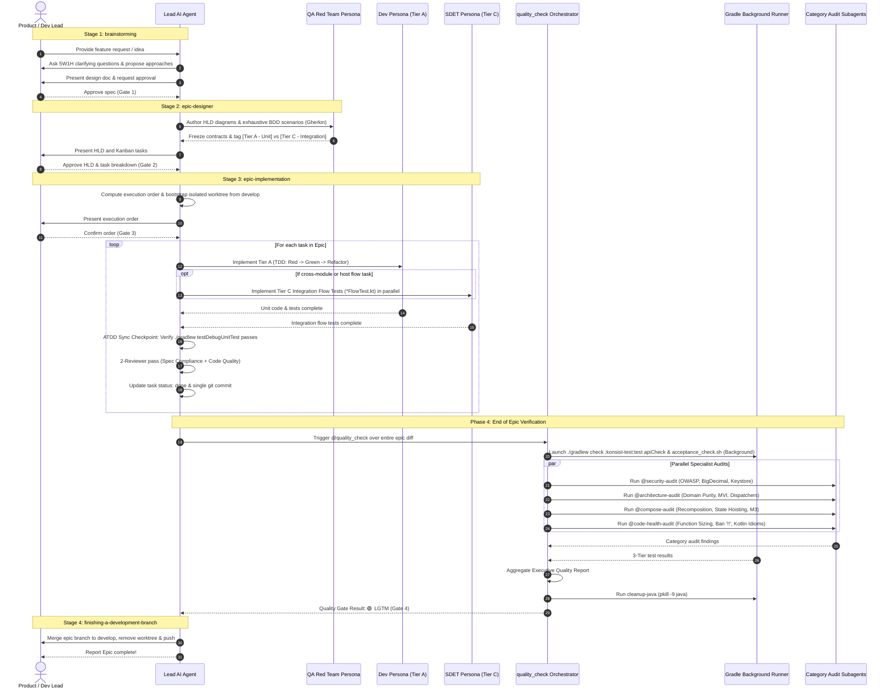

# End-to-End Epic Lifecycle & Governance Architecture

> **Authoritative Specification**: This document details the complete end-to-end process flow for implementing any feature or epic in the `android_digital_wallet` project, from initial brainstorming to verified production merge.

---

## 📑 Table of Contents

1. [Architectural Overview](#-architectural-overview)
2. [Master End-to-End Process Flow (Diagram)](#-master-end-to-end-process-flow-diagram)
3. [Sequence Timeline Diagram](#-sequence-timeline-diagram)
4. [The 4 Lifecycle Stages](#-the-4-lifecycle-stages)
   - [Stage 1: Inception & Collaborative Spec (`superpowers:brainstorming`)](#stage-1-inception--collaborative-spec-superpowersbrainstorming)
   - [Stage 2: Epic Architecture & Task Breakdown (`epic-designer`)](#stage-2-epic-architecture--task-breakdown-epic-designer)
   - [Stage 3: Epic Execution in Isolated Worktree (`epic-implementation`)](#stage-3-epic-execution-in-isolated-worktree-epic-implementation)
   - [Stage 4: Branch Integration & Completion (`superpowers:finishing-a-development-branch`)](#stage-4-branch-integration--completion-superpowersfinishing-a-development-branch)
5. [The 5 Governance Quality Gates](#-the-5-governance-quality-gates)

---

## 🌟 Architectural Overview

The development lifecycle enforces **Strict Separation of Concerns**, **Adversarial Independence** in testing, and **Deterministic Quality Gates**. Every epic follows a 4-stage pipeline:

```
[brainstorming] ──(Spec Approved)──> [epic-designer] ──(HLD Approved)──> [epic-implementation] ──(@quality_check LGTM)──> [finishing-a-development-branch]
```

Key guarantees:
1. **Zero Coding Before Approved Design**: No code is written until requirements and architecture are approved.
2. **Adversarial QA Red Team**: Test scenarios (BDD) are authored 100% independently from implementation code to eliminate confirmation bias.
3. **Isolated Worktrees**: Every epic executes in a dedicated git worktree (`.worktrees/<epic_dir>`) branching strictly from `develop`.
4. **Dual-Track Parallel Verification**: Gradle 3-Tier tests execute in the background while 4 semantic audit skills (`security-audit`, `architecture-audit`, `compose-audit`, `code-health-audit`) run in the foreground.
5. **Clean Environment Guarantee**: `cleanup-java` (`pkill -9 java`) always terminates background Gradle daemons upon completion.

---

## 🗺️ Master End-to-End Process Flow (Diagram)

```mermaid
flowchart TD
    %% ================= STAGE 1 =================
    subgraph STAGE1["STAGE 1: INCEPTION & COLLABORATIVE SPEC (superpowers:brainstorming)"]
        direction TB
        B1["Explore Project Context & 5W1H"] --> B2["Propose 2-3 Architectural Approaches<br/>(Trade-offs & Recommendations)"]
        B2 --> B3["Iterative Design Presentation"]
        B3 --> B4["Write Spec: docs/superpowers/specs/<YYYY-MM-DD>-<topic>-design.md"]
        B4 --> GATE1{"Gate 1:<br/>User Approves Spec?"}
        GATE1 -->|Revise| B3
    end

    %% ================= STAGE 2 =================
    subgraph STAGE2["STAGE 2: HLD & KANBAN TASK BREAKDOWN (epic-designer)"]
        direction TB
        D1["Create Epic Dir: .devtool/epic/<epic_dir>/<br/>(Relocate source spec into dir)"] --> D2["Author HLD (.en.md & synced .vi.md)<br/>(Context, Use Cases, Sequence Diagrams)"]
        D2 --> D3["Decompose into Atomic Kanban Tasks:<br/>.devtool/features/task_<n>_<slug>.md"]
        D3 --> D4["QA Red Team Persona:<br/>Author Exhaustive BDD Scenarios (Gherkin)<br/>⚠️ 100% Decoupled from Code - Contract Freeze"]
        D4 --> D5["Tag Scenarios: [Tier A - Unit] & [Tier C - Integration]<br/>+ Generate bdd_scenarios.md"]
        D5 --> GATE2{"Gate 2:<br/>User Approves HLD & Tasks?"}
        GATE2 -->|Revise| D2
    end

    %% ================= STAGE 3 =================
    subgraph STAGE3["STAGE 3: EPIC IMPLEMENTATION (epic-implementation)"]
        direction TB
        
        %% Phase 0 & 1
        subgraph P01["Phase 0 & 1: Context Reload & Isolated Worktree"]
            P0["Phase 0: Context Reload<br/>(Autonomous read of HLD & task_*.md)"] --> P1A["Phase 1: Compute Execution Order<br/>compute_execution_order.py <epic_slug>"]
            P1A --> GATE3{"Gate 3:<br/>User Confirms Order?"}
            GATE3 -->|Adjust| P1A
            GATE3 -->|Confirmed| P1B["Create Isolated Worktree from develop:<br/>git worktree add .worktrees/<epic_dir> -b epic/<epic_slug> develop<br/>+ bootstrap_worktree.sh"]
        end

        %% Phase 2
        subgraph P2["Phase 2: Sequential Task Loop (1 Task = 1 Commit)"]
            T_START["Pick Next Task<br/>(Live update: status: in-progress)"] --> PARALLEL_FORK{"Task Split into<br/>Tier A & Tier C?"}
            
            subgraph PARALLEL_DEV["Parallel Execution (dispatching-parallel-agents)"]
                direction LR
                subgraph TRACK_A["Dev Persona (Tier A)"]
                    A_TDD["TDD Loop:<br/>1. RED (Failing Unit Tests)<br/>2. GREEN (Minimal Code)<br/>3. REFACTOR (Spotless/Detekt)"]
                end
                subgraph TRACK_C["SDET Persona (Tier C)"]
                    C_FLOW["Integration Flow Tests:<br/>*FlowTest.kt (:app / :shell)<br/>(DI, Navigation, Auth Gating, DFM)"]
                end
            end

            PARALLEL_FORK -->|Yes (Contract Frozen)| PARALLEL_DEV
            PARALLEL_FORK -->|Sequential Task| A_TDD

            TRACK_A --> ATDD_SYNC["ATDD Sync Checkpoint:<br/>Merge branches & verify tests pass: ./gradlew testDebugUnitTest"]
            TRACK_C --> ATDD_SYNC

            ATDD_SYNC --> REVIEW["2 Reviewers:<br/>Spec Compliance + Code Quality<br/>(Live update: status: review)"]
            REVIEW --> REV_PASS{"Reviewers Pass?"}
            REV_PASS -->|Issues Found / Fix Loop| A_TDD
            REV_PASS -->|Approved| T_DONE["Update status: done<br/>Single Atomic Commit: [EPIC_NAME] <task_title>"]
        end

        %% Phase 3
        subgraph P3["Phase 3: Doc Sync on Divergence"]
            DIV{"Diverged from HLD?"}
            SYNC_DOC["Update Mermaid in .en.md & .vi.md<br/>Separate commit: [EPIC_NAME] docs: sync HLD..."]
        end

        %% Check tasks
        MORE_TASKS{"More tasks in order?"}

        %% Phase 4
        subgraph P4["Phase 4: End of Epic Verification (@quality_check)"]
            direction TB
            QC_START["Trigger Master Gate: @quality_check"] --> QC_TRACKS{"Parallel Dispatch"}
            
            subgraph QC_T1["Track 1: Gradle 3-Tier Suite (Background Task)"]
                T1_A["Tier A: ./gradlew testDebugUnitTest"]
                T1_B["Tier B: ./gradlew :konsist-test:test apiCheck detekt spotlessCheck"]
                T1_C["Tier C: ./scripts/acceptance_check.sh"]
                T1_A --> T1_B --> T1_C
            end

            subgraph QC_T2["Track 2: Specialist Audits (4 Parallel Subagents)"]
                AUD1["@security-audit (OWASP & BigDecimal)"]
                AUD2["@architecture-audit (Domain Purity & MVI)"]
                AUD3["@compose-audit (Stability & Material3)"]
                AUD4["@code-health-audit (SRP & Ban '!!')"]
            end

            QC_TRACKS ==> QC_T1
            QC_TRACKS ==> QC_T2

            QC_T1 ==> QC_MERGE["Synthesize Unified Executive Quality Report"]
            QC_T2 ==> QC_MERGE
            QC_MERGE --> QC_CLEAN["Resource Cleanup: cleanup-java (pkill -9 java)"]
            QC_CLEAN --> GATE4{"Final Status: 🟢 LGTM?"}
        end
    end

    %% ================= STAGE 4 =================
    subgraph STAGE4["STAGE 4: BRANCH FINISHING & INTEGRATION (superpowers:finishing-a-development-branch)"]
        FINISH["Merge epic/<epic_slug> into develop<br/>Remove worktree: git worktree remove .worktrees/<epic_dir><br/>Push to remote"]
        SUCCESS(["🎉 EPIC SUCCESSFULLY COMPLETED & MERGED"])
    end

    %% ================= CONNECTIONS =================
    GATE1 -->|Approved| D1
    GATE2 -->|Approved| P0
    P1B --> T_START
    T_DONE --> DIV
    DIV -->|Yes| SYNC_DOC --> MORE_TASKS
    DIV -->|No| MORE_TASKS
    MORE_TASKS -->|Yes, next task| T_START
    MORE_TASKS -->|No, all done| QC_START
    GATE4 -->|Blockers found| A_TDD
    GATE4 -->|🟢 LGTM| FINISH
    FINISH --> SUCCESS
```

---

## ⏱️ Sequence Timeline Diagram



---

## 🔍 The 4 Lifecycle Stages

### Stage 1: Inception & Collaborative Spec (`superpowers:brainstorming`)
- **Skill**: [`superpowers:brainstorming`](file:///Users/danhdueexoictif/AllProjects/digital_wallet/android_digital_wallet/.agents/skills/brainstorming/SKILL.md)
- **Goal**: Clarify user intent, eliminate unexamined assumptions, explore 2-3 architectural approaches with clear trade-offs, and draft an initial design spec.
- **Output**: `docs/superpowers/specs/YYYY-MM-DD-<topic>-design.md`.
- **Gate 1**: User reviews and approves the spec document.

---

### Stage 2: Epic Architecture & Task Breakdown (`epic-designer`)
- **Skill**: [`epic-designer`](file:///Users/danhdueexoictif/AllProjects/digital_wallet/android_digital_wallet/.agents/skills/epic-designer/SKILL.md)
- **Goal**:
  1. Relocate source spec into `.devtool/epic/<epic_dir>/` for single-directory cohesion.
  2. Generate canonical High-Level Design: `<epic_dir>.en.md` and synchronized translation `<epic_dir>.vi.md`, containing Mermaid Architecture, Use Case flowcharts, and Sequence Diagrams.
  3. **Adversarial QA Red Team**: Derive exhaustive BDD scenarios (Gherkin syntax) completely decoupled from implementation code to prevent confirmation bias. Tag each scenario with `[Tier A - Unit]` or `[Tier C - Integration]`.
  4. Generate living documentation contract: `bdd_scenarios.md`.
  5. Decompose requirements into atomic Kanban task files: `.devtool/features/task_<n>_<slug>.md`.
- **Gate 2**: User approves HLD and Kanban task breakdown.

---

### Stage 3: Epic Execution in Isolated Worktree (`epic-implementation`)
- **Skill**: [`epic-implementation`](file:///Users/danhdueexoictif/AllProjects/digital_wallet/android_digital_wallet/.agents/skills/epic-implementation/SKILL.md)
- **Core Principle**: *One worktree, one task at a time, one commit per task, docs stay truthful.*
- **Phases**:
  - **Phase 0 (Context Reload)**: Autonomous read of canonical HLD `.en.md` and all `task_*.md` files.
  - **Phase 1 (Execution Plan & Worktree)**:
    - Run `compute_execution_order.py <epic_slug>` to calculate dependency topological levels.
    - **Gate 3**: User confirms the execution order.
    - Bootstrap isolated git worktree branching explicitly from `develop`:
      `git worktree add .worktrees/<epic_dir> -b epic/<epic_slug> develop`.
  - **Phase 2 (Sequential Task Execution)**:
    - Track task status live on disk (`status: "in-progress"` $\rightarrow$ `"review"` $\rightarrow$ `"done"`).
    - Tri-Persona Execution:
      - **Tier A (Dev Persona)**: TDD (Red $\rightarrow$ Green $\rightarrow$ Refactor) for feature modules.
      - **Tier C (SDET Persona)**: Integration Flow Tests (`*FlowTest.kt` in `:app` / `:shell`) for Host App composition, Navigation, and Auth Gating.
      - Dispatched concurrently via `dispatching-parallel-agents` under strict Contract Freeze and Disjoint File Sets.
      - **ATDD Sync Checkpoint**: Merge and assert all tests pass cleanly.
    - Spec Compliance & Code Quality Reviewers pass.
    - Exactly **one commit per task**: `git commit -m "[EPIC_NAME] <task_title>"`.
  - **Phase 3 (Doc Sync on Divergence)**: If code diverged from HLD, update Mermaid diagrams in both `.en.md` and `.vi.md`, committing separately.
  - **Phase 4 (End of Epic Verification - Master Gatekeeper)**:
    - Invoke **[`@quality_check`](file:///Users/danhdueexoictif/AllProjects/digital_wallet/android_digital_wallet/.agents/skills/quality_check/SKILL.md)** over the entire epic diff:
      - **Track 1 (Background Gradle 3-Tier Suite)**: Tier A Unit tests (`testDebugUnitTest`), Tier B Konsist K1–K10 / BCV ABI / Detekt / Spotless, Tier C Acceptance harness (`acceptance_check.sh`).
      - **Track 2 (Foreground Specialist Audits)**: Parallel execution of `@security-audit`, `@architecture-audit`, `@compose-audit`, and `@code-health-audit`.
      - Synthesize **Unified Executive Quality Report**.
      - Terminate all Gradle daemon threads via `cleanup-java` (`pkill -9 java`).
    - **Gate 4**: Final verdict must be **🟢 LGTM**.

---

### Stage 4: Branch Integration & Completion (`superpowers:finishing-a-development-branch`)
- **Skill**: [`superpowers:finishing-a-development-branch`](file:///Users/danhdueexoictif/AllProjects/digital_wallet/android_digital_wallet/.agents/skills/finishing-a-development-branch/SKILL.md)
- **Goal**: Merge `epic/<epic_slug>` cleanly into `develop`, remove the temporary worktree (`git worktree remove .worktrees/<epic_dir>`), push changes to remote, and mark epic as complete.

---

## 🛡️ The 5 Governance Quality Gates

| Gate | Checkpoint | Enforcement Mechanism | Failure Action |
| :--- | :--- | :--- | :--- |
| **Gate 1** | **Spec Approval** | Human User Review | Brainstorming loop continues; no HLD or coding allowed. |
| **Gate 2** | **HLD & Task Breakdown Approval** | Human User Review | HLD/tasks revised; worktree creation blocked. |
| **Gate 3** | **Execution Order Confirmation** | Human User Review | Execution order recomputed or manually adjusted. |
| **Gate 4** | **Per-Task Two-Reviewer Pass** | Spec Compliance & Code Quality Subagents | Fix loop: status reverts to `in-progress`; commit blocked. |
| **Gate 5** | **End-of-Epic Master Quality Gate** | **`@quality_check`** (3-Tier Suite + 4 Specialist Audits + `cleanup-java`) | Blocker remediation in Phase 2; branch finish blocked until 🟢 LGTM. |
