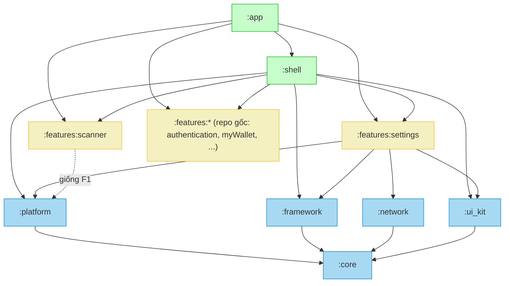

# Epic: Android Super App Template — Chuẩn hoá kiến trúc Native Android

**Ngày**: 2026-09-02
**Trạng thái**: Draft — chờ review
**Epic name (dự kiến)**: `android_super_app_template`

## Nguồn tham chiếu

| Tài liệu | Vai trò |
|---|---|
| `bloc_digital_wallet/.worktrees/flutter_super_app_template/docs/architecture/ARCHITECTURE.md` | **Kim chỉ nam layer & MVI** — quy tắc `Presentation → Domain ← Data`, Unidirectional Data Flow, naming Action/State/Event, Feature-First Organization. Bản Android bám 1:1 tài liệu này, chỉ đổi thuật ngữ nền tảng (Widget→Composable, BLoC→ViewModel, `Either<Failure,T>`→`DataState<T>`/`NetworkResponse`). |
| `bloc_digital_wallet/.devtool/epic/super_app_governance/super_app_governance.en.md` | **Khung governance 4 trụ / 8 tiêu chí** đã áp cho Flutter. Bản gốc của khung này vốn viết theo hơi hướng Android (Dynamic Feature Module, Dagger/Hilt) — nên áp ngược lại project native còn khớp *hơn* Flutter. |
| `bloc_digital_wallet/.worktrees/flutter_super_app_template/` (branch `epic/flutter-super-app-template`) | **Bản mẫu cấu trúc**: `packages/{core,framework,network,ui_kit,platform}`, `lib/shell/`, `scripts/check_module_boundaries.sh` + `module_boundary_whitelist.txt`, `scripts/rename_project.sh`, bricks. Bản Android dịch sang Gradle module + Konsist. |
| `android_digital_wallet` (repo này, branch `develop`) | Hiện trạng: Feature-First Clean Architecture + MVI đã chạy, `buildSrc` convention plugin (Hilt/Compose/detekt/spotless), 8 feature module, **god-module `libraries/framework`**, **chưa có CI**, `features/home` phụ thuộc thẳng 5 feature khác. |

---

## 1. Mục tiêu (Goals)

Chuẩn hoá `android_digital_wallet` đạt **4 trụ cột / 8 tiêu chí** của khung Super App Governance (đã áp cho Flutter), rồi **trích xuất một template native Android** clone-và-đổi-tên. Giữ nguyên nghiệp vụ digital wallet trong repo gốc; template là bản cắt gọn.

| # | Mục tiêu | Bám tài liệu |
|---|---|---|
| **G1** | Giữ nguyên **Clean Architecture + MVI + Feature-First** đúng như `ARCHITECTURE.md` Flutter: `Presentation → Domain ← Data`, Domain thuần Kotlin (cấm `android.*`), Unidirectional Data Flow, single entry point `onAction()`, naming `*Action/*State/*Event/*ViewModel/*UseCase/*Screen/*Repository`. | ARCHITECTURE.md §I–III, §V.4 |
| **G2** | **Tách god-module `libraries/framework`** thành 5 module hạ tầng khớp 1:1 `packages/` Flutter: `:core`, `:framework`, `:network`, `:ui_kit`, `:platform`. Mọi module native — kể cả feature — chỉ phụ thuộc các module này, không phụ thuộc nhau. | super_app_governance trụ 1.1–1.2 |
| **G3** | **Host (`:app` + `:shell`) là container thuần**: chỉ gom DI, dựng NavHost, tab-shell. Không chứa business logic feature. `features/home` (đang ôm logic shell + phụ thuộc 5 feature) bị giải thể: phần tab-shell → `:shell`, phần còn lại → stub page. | super_app_governance trụ 1.1 |
| **G4** | **Giao tiếp cross-feature tập trung, feature "mù" nhau**: `:platform` chứa `DeepLinkRoutes` (registry hằng route) + `AppEventBus` (`SharedFlow` typed broadcast). Cấm mọi `import` chéo giữa `:features:*`. | super_app_governance trụ 2.1–2.2 |
| **G5** | **State isolation**: mỗi feature giữ `MviViewModel` riêng (đã có, dời sang `:framework`). DI Hilt **phẳng** (`SingletonComponent`) + **kỷ luật export**: class trong `..features..data..` phải `internal`, chỉ `domain/**` + `presentation/**` được `public`. | super_app_governance trụ 3.1–3.2 |
| **G6** | **Governance ép bằng cấu trúc, không dựa tự giác**: (a) **Konsist** (`:konsist-test`, JUnit) kiểm layer + boundary + naming + export; (b) guard trong `commons.android-feature` fail lúc Gradle sync nếu feature khai báo phụ thuộc feature khác; (c) **GitHub Actions** chạy cả bộ. Whitelist `konsist_boundary_whitelist.txt` thu dần. | super_app_governance trụ 4.1–4.2 |
| **G7** | **Thêm feature mới chỉ cần 1 lệnh Mason**, tự wire vào `settings.gradle.kts` + NavHost + `:platform`, không đụng feature khác. Sửa hook brick `mvi_feature`/`mvi_subfeature`; giữ brick cũ. | ARCHITECTURE.md §III.3 |
| **G8** | **Trích template native**: giữ hạ tầng + `:shell` + 3 feature `home` (stub) / `scanner` (rỗng) / `settings` (thật) — đúng bộ 3 feature bản Flutter. Xoá `authentication/myWallet/transactions/trends/splash` + `domain/authenticator` + asset đặc thù ví. `scripts/rename_project.sh` là cửa vào duy nhất sau khi clone. | template_flutter epic |
| **G9** | **Sandbox development**: mỗi feature build/test độc lập (`:features:x:testDebugUnitTest` chạy không cần `:app`). Runner UI độc lập từng feature ghi nhận là gap đã biết, không thuộc phạm vi epic (giống Flutter criterion 4.1). | super_app_governance trụ 4.1 |

## 2. Non-Goals

- **Dynamic Feature Module / Play Feature Delivery** (mini-app tải lúc runtime). Epic này chỉ giải quyết cô lập *logic lúc build* — feature vẫn compile vào 1 APK. Ghi nhận là hướng mở rộng sau.
- **Hilt scoped/hierarchical component**: DI giữ 1 `SingletonComponent` phẳng; Dependency Inversion đạt bằng kỷ luật `internal`/export + interface đặt ở `:core`, không viết lại DI runtime.
- **Contract-versioning formal** (semver API của `:platform`): một Gradle build ⇒ breaking change fail compile mọi module phụ thuộc, bắt tại compile-time trong CI — đủ cho tiêu chí 4.2.
- **Đổi nghiệp vụ digital wallet** trong repo gốc — chỉ cắt khi trích template, không migrate.
- **Xoá brick cũ** (`mvi_feature`/`mvi_subfeature`/`remove_feature`/`remove_subfeature`) — giữ lại, chỉ sửa hook (khớp quyết định bên Flutter).
- **iOS / KMP** — ngoài phạm vi.

## 3. Nguyên tắc bao trùm

1. **App build & chạy được ở MỌI bước.** Migration chia phase nhỏ, mỗi phase là 1 PR review được, không có trạng thái "hỏng giữa chừng".
2. **`ARCHITECTURE.md` Flutter là nguồn chân lý về layer.** Bản Android không phát minh quy tắc mới; chỉ ánh xạ thuật ngữ. Sau Phase 1 sẽ có `docs/architecture/ARCHITECTURE.md` bản Android viết song song, cùng cấu trúc mục lục.
3. **Konsist ép layer, không phải review thủ công.** Rule vi phạm = CI đỏ. Migration tăng dần qua whitelist thu nhỏ.
4. **`:core` là nền bắt buộc cho mọi module. `:framework` chỉ cho module có UI/state.** (Đúng quy luật "ai gọi core / ai gọi framework" của spec Flutter.)
5. **Namespace**: native không có "vendor plugin package" như 2 plugin Flutter — `rename_project.sh` đổi toàn bộ `com.danhdue.androiddigitalwallet.*` → tên mới, không giữ namespace cố định nào.

---

## 4. Kiến trúc đích

### 4.1 Bản đồ module (khớp 1:1 `packages/` Flutter)

```
:core        ← libraries/framework  (không Compose)
               DataState / NetworkResponse, DispatcherProvider, extension/*,
               SessionManager, pref/ (CacheStore, SecureCacheStore, AeadManager),
               room/ (BaseDao, converter), Logger contract, base/app/AppInitializer,
               utils/, usecase/ (DataStateUseCase, LocalUseCase, ReturnUseCase, FlowPagingUseCase)
:framework   ← libraries/framework/base  — phụ thuộc :core
               MviViewModel, MvvmViewModel, BaseViewState, navigation/ (Navigator,
               NestedNavigator, EntryProviderInstaller, CommonRoutes)
:network     ← libraries/framework/network + di/NetworkCoreModule  — phụ thuộc :core
               Retrofit/OkHttp, calladapter/, interceptor/, environment/, moshi/,
               HandleError, HttpStatusCode, NetworkHelper, flipper/
               (+ token authenticator gộp từ domain/authenticator)
:ui_kit      ← libraries/components + libraries/jetframework  — phụ thuộc :core
               design system Compose, permission/
:platform    MỚI — phụ thuộc :core (chỉ vậy)
               DeepLinkRoutes (object hằng route), AppEventBus (SharedFlow<AppEvent>),
               AppEvent sealed base
:shell       MỚI — Host-only — phụ thuộc :core :framework :ui_kit :platform + mọi :features:*
               ShellViewModel, ShellScreen, bottom nav, tab host, home stub page
               (bóc từ features/home)
:app         composition root mỏng: gom Hilt, dựng NavHost 1 chỗ từ mọi feature graph,
               Application, entry Activity
:features:*  phụ thuộc CHỈ :core :framework :network :ui_kit :platform
               — KHÔNG bao giờ phụ thuộc :features:* khác
:libraries:testutils   giữ nguyên
:konsist-test          MỚI — module JUnit, không ship vào APK
```

`libraries/` cũ bị rút hết: `framework`→ tách 3, `components`+`jetframework`→ `:ui_kit`, chỉ `testutils` ở lại (có thể đổi path thành `:testutils`).

### 4.2 Sơ đồ phụ thuộc



Bất biến kiểm chứng được: mũi tên đặc luôn đổ về `:core`; không feature nào trỏ sang feature khác; chỉ `:app`/`:shell` được gom nhiều feature.

### 4.3 Layer trong 1 feature (nguyên văn `ARCHITECTURE.md` §III)

```
features/{name}/src/main/kotlin/com/{org}/{name}/
├── data/         🔵  internal — RepositoryImpl, DataSource (remote/local), model (DTO @Json), mappers, di/
├── domain/       🟡  public   — entities (pure Kotlin), repository (interface), usecase/, di/
└── presentation/ 🟢  public   — {sub}/{Sub}Action|State|Event|ViewModel|Screen, model/ (UiModel), di/,
                                 {name}NavGraph.kt (NavGraphBuilder extension — điểm feature lộ ra ngoài)
```

Quy tắc (Konsist ép): `presentation` không import `data`; `domain` không import `presentation`/`data`; `domain` cấm `android.*`; `data/**` không có class `public`/`open`.

---

## 5. Trụ 2 — Giao tiếp cross-feature

| Kênh | Ở đâu | Hình dạng | Ai dùng | Enforce |
|---|---|---|---|---|
| **`DeepLinkRoutes`** | `:platform` | `object` chứa hằng `const val SETTINGS = "settings"` + route builder; điều hướng: `navController.navigate(DeepLinkRoutes.SETTINGS)` | mọi module | không cần — hằng route không lộ implementation |
| **`AppEventBus`** | `:platform` | `MutableSharedFlow<AppEvent>` (replay=0, broadcast); `fun publish(e: AppEvent)` / `inline fun <reified T> on(): Flow<T>` | mọi module | không cần — publish/subscribe 1 kiểu event không phải import nội bộ feature |
| **Direct composition** | `:app`, `:shell` | import compile-time + gom NavHost + Hilt aggregation | **chỉ Host** | Konsist: chỉ `:app`/`:shell` được import nhiều `com.{org}.features.*` |

- `AppEvent`: `sealed interface` trong `:platform`. Feature khai subtype riêng trong `presentation/` của mình (data contract, import chéo được — cùng tư thế import 1 domain entity, đúng như ghi chú trong `app_event_bus.dart` Flutter).
- **Từ vựng lifecycle tối thiểu** (mirror bộ Flutter đề xuất): `ShellTabVisibilityChanged(tabIndex, isVisible)`, `AppLifecycleChanged(state)`, `UserLoggedOut`. `:shell` publish 2 cái đầu; một `AppLifecycleObserver` (LifecycleObserver ở Application/root) publish cái giữa; interceptor 401 của `:network` publish `UserLoggedOut`.
- **Router**: giữ Compose Navigation (`addNavigationDependencies()`). Mỗi feature expose `fun NavGraphBuilder.{name}Graph(navController)`; `:app` dựng 1 `NavHost` gọi mọi `*Graph`. Điều hướng chéo = `navController.navigate(hằng ở :platform)`.
- **Không có** kênh request/response giữa 2 feature (giống Flutter). Khi cần kết quả typed từ business logic feature khác → Dependency Inversion: interface đặt ở `:core`, feature kia implement.

---

## 6. Trụ 4 — Governance & CI

### 6.1 Konsist (`:konsist-test`, JUnit, không vào APK)

| # | Rule | Whitelist? |
|---|---|---|
| K1 | File trong `com.{org}.features.X` không import `com.{org}.features.Y` (X≠Y) | ✅ `konsist_boundary_whitelist.txt`, format `X→Y`, thu dần mỗi phase |
| K2 | `..presentation..` không import `..data..`; `..domain..` không import `..presentation..`/`..data..` | ❌ |
| K3 | `..domain..` không import `android.*` / `androidx.*` (Domain thuần Kotlin) | ❌ (baseline nếu có vi phạm cũ) |
| K4 | Class/fun top-level trong `..features..data..` không `public`/`open` (mặc định `internal`) | ❌ baseline |
| K5 | Naming: `*ViewModel : MviViewModel`, `*UseCase`, bộ `*Action/*State/*Event`, `*Screen` `@Composable`, `*Repository`(interface ở domain) / `*RepositoryImpl`(ở data) | ❌ |
| K6 | Chỉ `:app` / `:shell` được import nhiều hơn 1 `com.{org}.features.*` package | ❌ |
| K7 | `:core` không import `com.{org}.{framework,network,ui_kit,platform,features,shell}` (core là đáy) | ❌ |

Chạy: `./gradlew :konsist-test:test`. Konsist đọc AST nên bắt cả import aliased/transitive mà regex bỏ sót.

### 6.2 Guard Gradle (bổ trợ, fail sớm)

Trong `commons.android-feature`: sau `dependencies {}`, `afterEvaluate` kiểm — nếu `configurations["implementation"].dependencies` chứa `ProjectDependency` trỏ `:features:*` khác → `throw GradleException`. Chặn ngay lúc sync, trước cả khi Konsist chạy. (Konsist bắt ở tầng import; guard bắt ở tầng khai báo build — 2 tầng khác nhau.)

### 6.3 GitHub Actions — `.github/workflows/ci.yml`

1 job, trigger `pull_request` + push `develop`:

```
- actions/checkout
- actions/setup-java (temurin 17)
- gradle/actions/setup-gradle  (cache ~/.gradle, build)
- ./gradlew :konsist-test:test detekt spotlessCheck testDebugUnitTest assembleDebug
- upload reports (detekt/lint/test) làm artifact
```

Tiêu chí 4.2 (contract): bước `assembleDebug` = breaking change API public của `:core`/`:platform` fail compile mọi module phụ thuộc → chặn merge tại compile-time.

---

## 7. Mason bricks

- **Sửa hook `post_gen`** của `mvi_feature`: (a) thêm `include(":features:{{name}}")` vào `settings.gradle.kts`; (b) thêm hằng route vào `DeepLinkRoutes` (`:platform`); (c) thêm `{{name}}Graph(navController)` vào `NavHost` của `:app`; (d) thêm `FEATURE_{{NAME}}` vào `:app` + `:shell` build.gradle. **Không** đụng feature khác.
- `mvi_subfeature`: giữ, chỉ chỉnh path package `com/{org}/{name}` khớp cấu trúc mới.
- Giữ `remove_feature`/`remove_subfeature`, cập nhật để gỡ đúng các điểm wire mới.
- Brick mới `platform_event` (nhỏ, tuỳ chọn): sinh 1 `AppEvent` subtype + chỗ publish mẫu. Có thể để Phase sau.

---

## 8. Trích template (Phase 3)

| Giữ | Xoá |
|---|---|
| `:core :framework :network :ui_kit :platform :shell :app :konsist-test :libraries:testutils` | `features/{authentication, myWallet, transactions, trends, splash}` |
| `features/settings` (thật) | `domain/authenticator` (token → gộp vào `:network` ở Phase 1) |
| `features/scanner` (rỗng, regen từ `mvi_feature`) | asset/res đặc thù ví, `screenshots/` |
| `features/home` → **stub page trong `:shell`** (không còn là module) | brick không liên quan (nếu có) |

- Shell 3 tab: **home** (stub ngay trong `:shell`), **scanner** (module rỗng), **settings** (module thật). Tab mặc định = settings (index cuối) — khớp bản Flutter.
- `scripts/rename_project.sh`: đổi `applicationId` + `namespace` mọi `build.gradle.kts`, Kotlin package `com.danhdue.androiddigitalwallet` → mới (dùng `git mv` cây thư mục + thay import), `AppConfig.kt`, label `AndroidManifest.xml`, `rootProject.name` trong `settings.gradle.kts`. Guard tree sạch + `--force`. Cuối script chạy `./gradlew help` (hoặc `assembleDebug`) verify.
- `docs/` + `.agent/` + `AGENTS.md` + `PROJECT_RULES.md`: gỡ tham chiếu "digital wallet", reset về generic.

---

## 9. Lộ trình (Hướng A — incremental, thực hiện tuần tự)

Worktree `.worktrees/android_super_app_template`, branch `epic/android-super-app-template`. Mỗi phase = 1+ file `task_N_*.md` dưới `.devtool/epic/android_super_app_template/`, do `epic-designer` chẻ nhỏ.

### Phase 0 — Nền móng (không đổi hành vi)
- Tạo `:platform` (rỗng: `DeepLinkRoutes` seed từ route hiện có, `AppEventBus`, `AppEvent`).
- Tạo `:konsist-test` + rule K1–K7; **seed `konsist_boundary_whitelist.txt`** bằng mọi cạnh chéo hiện tại: `home→myWallet`, `home→transactions`, `home→scanner`, `home→trends`, `home→settings`.
- Guard trong `commons.android-feature` (chế độ *warn* ở phase này, *fail* từ Phase 2).
- `.github/workflows/ci.yml`.
- Sửa hook brick (chưa dùng, chuẩn bị sẵn).
- **Ra**: CI xanh trên cấu trúc cũ, whitelist đầy.

### Phase 1 — Tách god-module
- `libraries/framework` → `:core` + `:framework` + `:network`; `libraries/{components,jetframework}` → `:ui_kit`; `domain/authenticator` → `:network`.
- Cập nhật mọi `build.gradle.kts` (`FRAMEWORK`/`COMPONENT`/`JET_FRAMEWORK` → `CORE`/`FRAMEWORK`/`NETWORK`/`UI_KIT`), sửa import toàn repo.
- Bật rule K2/K7 (layer + core-đáy).
- Viết `docs/architecture/ARCHITECTURE.md` bản Android (song song mục lục Flutter).
- **Ra**: `./gradlew assembleDebug` xanh, app chạy y hệt, module map mới.

### Phase 2 — Shell + pilot `settings`
- Bóc `:shell` từ `features/home`; `:app` thành composition root mỏng; xoá module `features/home` (→ stub trong `:shell`). Whitelist xoá 4 dòng `home→*` (trừ `home→settings` chuyển thành `:shell→settings`, hợp lệ).
- Pilot `settings`: điều hướng tới/từ settings đi qua `DeepLinkRoutes`; chứng minh `AppEventBus` end-to-end (settings publish 1 event, `:shell` subscribe).
- Guard Gradle chuyển sang *fail*.
- Bật K4/K6 (export discipline + host privilege).
- **Ra**: whitelist còn ≤1 dòng; feature điều hướng qua route constant.

### Phase 3 — Dọn nốt + trích template + kiểm thử
- Migrate feature còn lại off cross-import (repo gốc) → whitelist rỗng, bật K1 *fail*.
- Cắt domain → template 3 feature (`home` stub / `scanner` / `settings`).
- `scripts/rename_project.sh` + dọn `docs`/`.agent`/`AGENTS.md`.
- **Kiểm thử nghiệm thu**: worktree mới → `rename_project.sh acme_wallet com.acme.wallet` → `mason make mvi_feature --name payments` → `./gradlew :konsist-test:test assembleDebug` **xanh** + app chạy.

---

## 10. Giả định · Rủi ro · Phụ thuộc

**Giả định**
- Compose Navigation hiện tại đủ cho mô hình "1 NavHost ở `:app` + graph extension mỗi feature". (Kiểm ở Phase 2; nếu không, cân nhắc navigation3 hoặc route-string thuần.)
- Hilt phẳng `SingletonComponent` không cần scope theo feature cho tới hết template.

**Rủi ro**
| Rủi ro | Giảm thiểu |
|---|---|
| Tách `libraries/framework` kéo theo sửa import diện rộng, dễ vỡ build | Phase 1 làm 1 lần, có `assembleDebug` + test cũ làm lưới; chia PR theo module đích (`:core` trước, rồi `:network`, rồi `:framework`) |
| Konsist chậm / nhiều false-positive lúc seed | Bắt đầu ở chế độ baseline (`.konsist` baseline file), siết dần; chạy song song job CI |
| `features/home` ôm nhiều logic hơn dự kiến khi bóc `:shell` | Task riêng ở Phase 2, review kỹ; phần không thuộc shell → stub, không port |
| `rename_project.sh` sót chỗ hard-code package | Bước verify `assembleDebug` cuối script; test nghiệm thu Phase 3 |
| Repo chưa từng có CI → setup GitHub Actions runner/secret | Phase 0 chỉ chạy job không cần secret (không có Firebase/signing trong CI vòng đầu) |

**Phụ thuộc**
- Không phụ thuộc epic Flutter đang chạy — độc lập repo. Chỉ *đọc* `bloc_digital_wallet` để tham chiếu.
- Cần quyền tạo `.github/workflows/` + bật Actions cho repo.
- `mason` CLI đã có (`mason.yaml` tồn tại).

---

## 11. Self-review (đã rà)

- **Placeholder**: không còn TBD/TODO.
- **Mâu thuẫn**: `home→settings` — Phase 2 nói "xoá 4 dòng, dòng thứ 5 chuyển thành `:shell→settings`". Nhất quán vì `:shell` là Host, được phép. Ghi rõ ở §9 Phase 2.
- **Scope**: đủ lớn → epic. Đã chẻ 4 phase, mỗi phase ra `task_*.md` qua `epic-designer`.
- **Nhập nhằng**: "god-module `:core` có gánh cả Room+pref không?" → §4.1 chốt: có, gộp vào `:core` để khớp đúng 5 module Flutter (`packages/core` Flutter cũng ôm storage). Tách `:storage` riêng để ngỏ, không làm bây giờ.
- **Helicopter view**: ranh giới `:core`/`:framework`/`:network` bám đúng cách Flutter chia (`core` ← `framework`/`network`); `:ui_kit` = components+jetframework hợp lý (đều Compose, cùng tầng); `:platform` chỉ 2 thứ (router+bus) đúng như `packages/platform` Flutter.
