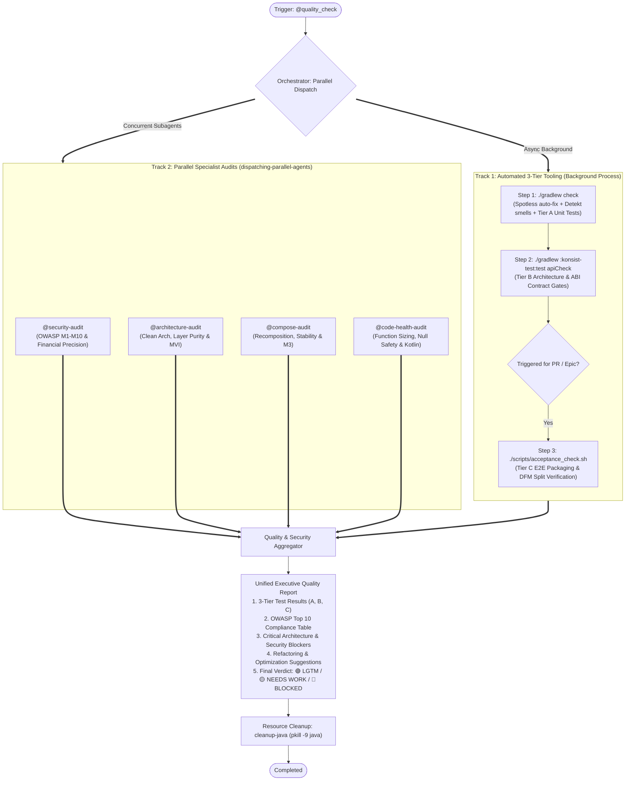
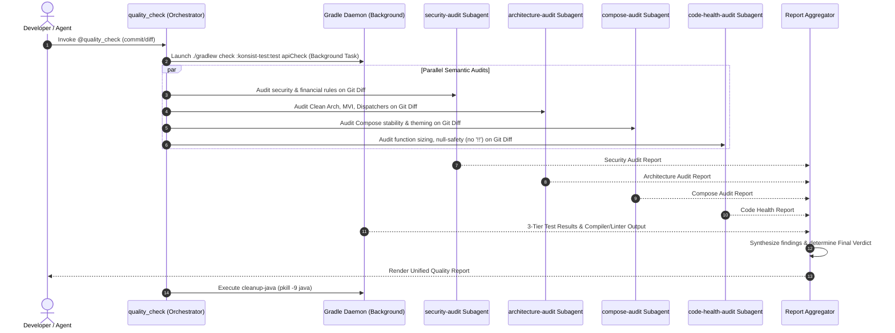

# Parallel Quality Gate & Modular Category Audit Skills — Design Specification

- **Date**: 2026-09-11
- **Status**: Proposed
- **Author**: Antigravity & DanhDueExoictif
- **Target Repo**: `android_digital_wallet`

---

## 📑 Table of Contents & Skill Matrix

This design splits quality and review responsibilities into **4 specialized Category Audit Skills** coordinated by **1 Central Orchestrator Skill (`quality_check`)**, replacing the legacy monolithic `pr_review` skill.

| Skill | Category / Domain | What It Actually Checks | Execution Mode |
| :--- | :--- | :--- | :--- |
| **[`quality_check`](file:///Users/danhdueexoictif/AllProjects/digital_wallet/android_digital_wallet/.agents/skills/quality_check/SKILL.md)** | **Master Orchestrator & Quality Gatekeeper** | Coordinates parallel execution of background Gradle 3-Tier tests and foreground audit subagents. Gathers findings, generates the final Executive Quality Report, and performs memory cleanup (`cleanup-java`). | Orchestrator |
| **`security-audit`** | **Fintech & OWASP Mobile Security** | - OWASP Mobile Top 10 (2024) (M1–M10) - Financial Precision: strictly `BigDecimal` / `Long` (cents), bans `Double`/`Float` for currency - PII Logging detection: bans card numbers, tokens, balances in logs - Android Keystore, `SecureCacheStore`, `EncryptedSharedPreferences` - Network security: TLS 1.2+, Certificate Pinning, bans trust-all certs | Standalone or Parallel |
| **`architecture-audit`** | **Clean Architecture & MVI State Machine** | - Domain Purity: zero imports of `android.*`, `androidx.*` - Feature Isolation: zero cross-feature implementation dependencies - MVI Immutability: `data class` with `val`, atomic state updates via `reduce {}` - Coroutine Dispatcher Discipline: strictly injected dispatchers, bans hardcoded `Dispatchers.IO` - Command Query Separation (CQS): functions either execute or query, never both | Standalone or Parallel |
| **`compose-audit`** | **Jetpack Compose Performance & Design System** | - Recomposition Stability: identifies unstable parameters causing recompositions - Proper usage of `@Stable`, `@Immutable`, `remember`, `derivedStateOf` - State Hoisting: Stateless Composables emitting lambdas `(Action) -> Unit` - Design System: Material3 token compliance, bans hardcoded hex colors (`0xFF...`) | Standalone or Parallel |
| **`code-health-audit`** | **Clean Code, Kotlin Idioms & Safety** | - Function Sizing: max 20 lines per function, max 2 arguments (SRP) - Null-safety: strictly bans force-unwrap operator `!!` - Naming Conventions: MVI semantic actions/states, no magic numbers/strings - Kotlin-First: data classes, extension functions, sealed interfaces, structured concurrency | Standalone or Parallel |
| **[`pr_review`](file:///Users/danhdueexoictif/AllProjects/digital_wallet/android_digital_wallet/.agents/skills/pr_review/SKILL.md)** | **Unified Alias** | Lightweight router that redirects directly to `quality_check` with PR diff context. | Alias / Route |

---

## 🏗 System Architecture & Execution Diagrams

### Diagram 1: Parallel Execution & Aggregation Pipeline
When triggered, `quality_check` launches the automated Gradle test runner in the background while concurrently dispatching the 4 specialist audit subagents over the Git Diff:

### Diagram 2: Sequence Lifecycle (Timeline)
Shows how wall-clock time is minimized by overlapping slow build/test tasks with semantic code analysis:

---

## 🔍 Detailed Specification of Category Skills

### 1. `security-audit` (`.agents/skills/security-audit/SKILL.md`)
* **Role**: Mobile Fintech Security Auditor.
* **Target Files**: All files in Git Diff, particularly Data, Network, Storage, and Payment features.
* **Rule Sets**:
  1. **Financial Precision**: Money variables MUST be `BigDecimal` or `Long` (cents). Flag any `Double` or `Float`.
  2. **OWASP M1 (Credentials)**: No hardcoded secrets, API tokens, passwords.
  3. **OWASP M5 (Communication)**: Strict HTTPS, TLS 1.2+, Certificate Pinning (`CertificatePinner`), ban trust-all certs.
  4. **OWASP M6 (Privacy)**: Zero PII logging (PIN, CVV, Card number, Token). Require `FLAG_SECURE` on sensitive screens.
  5. **OWASP M9 (Storage)**: Sensitive data stored in `SecureCacheStore`, `EncryptedSharedPreferences`, or SQLCipher. Ban raw `SharedPreferences`.
  6. **OWASP M10 (Cryptography)**: AES-256-GCM, SHA-256+. Ban MD5, SHA-1, DES.

### 2. `architecture-audit` (`.agents/skills/architecture-audit/SKILL.md`)
* **Role**: Principal Clean Architecture Reviewer.
* **Target Files**: `packages/**`, `features/**`, `shell/**`.
* **Rule Sets**:
  1. **Domain Purity**: Domain layer must have ZERO dependencies on `android.*`, `androidx.*`, Compose, or third-party frameworks (only `@Inject` allowed).
  2. **Feature Isolation**: Feature A must NOT import or reference internal classes of Feature B. Inter-feature communication must use `:packages:platform` (`AppRoutes`, `AppEventBus`).
  3. **MVI Immutability**: All states must be immutable `data class` with `val`. Updates only via `copy()` or `reduce {}`.
  4. **Dispatcher Injection**: ViewModels/Repositories must inject `DispatcherProvider` or `CoroutineDispatcher`. Strictly ban hardcoded `Dispatchers.IO`. Ban `GlobalScope` and `runBlocking`.
  5. **Law of Demeter & CQS**: Functions must either perform an action or return data, never both.

### 3. `compose-audit` (`.agents/skills/compose-audit/SKILL.md`)
* **Role**: Jetpack Compose Performance & UI Architect.
* **Target Files**: `**/*Screen.kt`, `**/*View.kt`, `packages/ui_kit/**`.
* **Rule Sets**:
  1. **Recomposition Stability**: Detect unstable types passed to Composables. Mandate `@Stable` or `@Immutable` on UI state classes.
  2. **State Hoisting**: Screens must be split into Stateful (ViewModel holder) and Stateless `(state: State, onAction: (Action) -> Unit)`.
  3. **Effect Keys & Remember**: Ensure `LaunchedEffect` and `remember` have precise keys; flag recalculations inside recomposition.
  4. **Material3 Design System**: Enforce `MaterialTheme.colorScheme` and `typography`. Strictly ban hardcoded hex colors (`Color(0xFF...)`).

### 4. `code-health-audit` (`.agents/skills/code-health-audit/SKILL.md`)
* **Role**: Senior Kotlin Clean Code Specialist.
* **Target Files**: All `.kt` files in Git Diff.
* **Rule Sets**:
  1. **Function Size & SRP**: Max 20 lines per function. Max 2 parameters (if 3+, wrap in a data class).
  2. **Null-Safety Discipline**: STRICT BAN on force unwrap `!!`. Mandate `requireNotNull()`, `checkNotNull()`, or Elvis `?:`.
  3. **Naming Semantics**: Intention-revealing names. MVI actions use verb-first (`SubmitPayment`), states use condition (`BalanceLoaded`).
  4. **Kotlin-First Idioms**: Use data classes, extension functions, string templates `${...}`, and exhaustive `when` on sealed interfaces.

### 5. `quality_check` (`.agents/skills/quality_check/SKILL.md`)
* **Role**: Master Quality Orchestrator & Gatekeeper.
* **Execution**:
  - Handles CLI flags:
    - `@quality_check` (default): Runs 3-Tier tests in background + parallel 4 specialist audits on Git Diff.
    - `@quality_check --quick`: Runs only `./gradlew check :konsist-test:test` (fast test verification).
    - `@quality_check --full`: Runs all audits + `./scripts/acceptance_check.sh`.
  - Merges reports into standardized Markdown Output with Clear Final Verdict.
  - Executes `cleanup-java` (`pkill -9 java`).

### 6. `pr_review` (`.agents/skills/pr_review/SKILL.md`)
* **Role**: Seamless Route.
* **Content**: Redirects to `@quality_check` with context pointers to maintain backward compatibility.

---

## ⚡ Execution Rules & Parallel Guardrails

1. **Read-Only Audit Concurrency**: Category audits (`security-audit`, `architecture-audit`, `compose-audit`, `code-health-audit`) are strictly read-only static code inspections. They execute without file lock contention or Git merge conflicts.
2. **Deterministic Aggregation**: The Orchestrator aggregates issues into 3 severity levels:
   - 🔴 **BLOCKER (Must Fix)**: Compilation failure, test failure, architecture boundary leak, OWASP security violation, hardcoded secret, `!!` force unwrap, hardcoded `Dispatchers.IO`, non-BigDecimal currency.
   - 🟡 **WARNING (Should Fix)**: Composable instability, function length > 20 lines, missing `@Stable` annotation, missing unit test on non-trivial branch.
   - 🟢 **INFO / SUGGESTION**: Idiomatic Kotlin improvement, string template refactoring.
3. **Clean Environment Guarantee**: `cleanup-java` is always executed at completion to prevent lingering Gradle daemons from consuming RAM.
