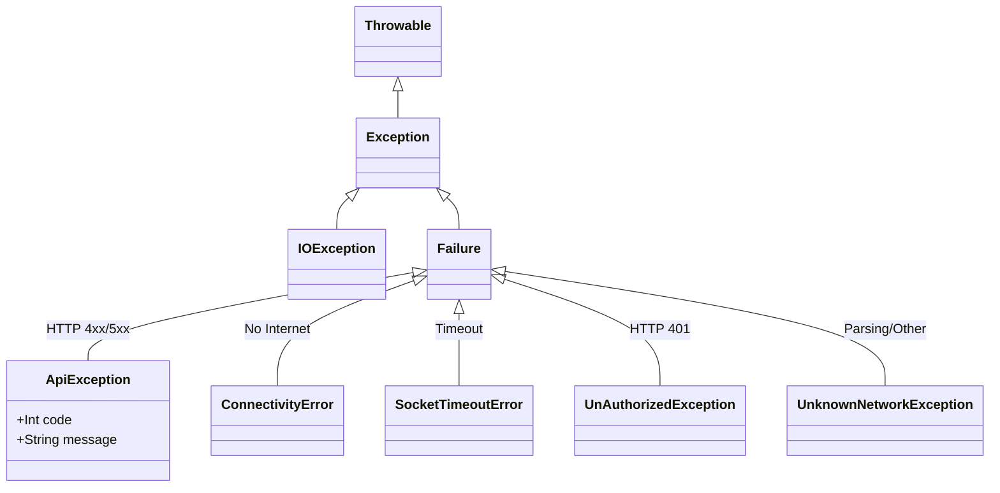

# 📘 Network Architecture Analysis: The Triple-Threat Solution
**Project:** Android Super App Template  
**Level:** Senior Architect  
**Tech Stack:** Hilt, Retrofit, OkHttp, Coroutines

---

## 1. Hybrid Dependency Injection (DI) Strategy
**Mechanism:** Provide `Retrofit.Builder` in `:network` and complete (build) the `Retrofit` instance in each Feature Module.

### ✅ Pros
- **Maximum Reusability:** Share heavy components (OkHttpClient, Connection Pool, Converters).
- **Flexible:** Each Feature (Auth, Payment) can have its own Base URL and Interceptor.
- **Encapsulation:** Clean framework, does not contain feature-specific information.

---

## 2. Dynamic Headers (via @Tag)
**Mechanism:** Use the `@Tag` Annotation in Retrofit to attach `FeatureConfig`. The Framework Interceptor will read this tag to write the corresponding Header.

### ✅ Pros
- **Centralized Control:** Easily change Header standards for the entire App in one place.
- **BE Optimization:** Supports API Gateway Routing and Monitoring.
- **Clean Code:** Eliminates repetitive manual Header declarations.

---

## 3. Custom CallAdapter: The Infrastructure Transformer
**Mechanism:** An intermediate layer that intervenes in the process of converting raw OkHttp results into structured data types `NetworkResponse<T>`.

### 🎯 3 Core Pillars
#### 3.1. Return Type Transformation
Retrofit defaults to returning `Call<T>`. CallAdapter acts as an "interpreter", allowing you to declare API functions extremely explicitly:
`suspend fun getBalance(): NetworkResponse<BalanceDto>`
At this point, the returned data is no longer just a "promise" but a clearly defined **State**.

#### 3.2. Centralized Error Handling
- **Exception Handling:** Automatically catches `IOException` (network loss) and converts it to `NetworkResponse.NetworkError`.
- **HTTP Error Code Separation:** Automatically parses `errorBody` from Server into `ApiError` containing business messages.
- **Consistency:** All Features have identical error data structures, helping UI handling synchronization.

#### 3.3. Simplify Repository Layer (Boilerplate Elimination)
Completely eliminates dependence on `try-catch` blocks. Code in the Repository is just data navigation logic through the `when (result)` structure.

---

## 4. NetworkResponse Extension Functions

`NetworkResponse` provides extension functions to handle results in a fluent and type-safe way:

### 4.1. Transformation Functions

```kotlin
// Map success body to another type
fun <R> map(transform: (T) -> R): NetworkResponse<R>

// Fold to a single result type
fun <R> fold(onSuccess: (T) -> R, onError: (Throwable) -> R): R
```

### 4.2. Side-Effect Functions (Chainable)

```kotlin
// Execute action on success
fun onSuccess(action: (T) -> Unit): NetworkResponse<T>

// Execute action on any error
fun onError(action: (Throwable) -> Unit): NetworkResponse<T>
```

### 4.3. Bridge to DataState

```kotlin
// Simple conversion
fun <T> NetworkResponse<T>.toDataState(): DataState<T>

// With domain transformation (most common)
fun <T, R> NetworkResponse<T>.toDataState(transform: (T) -> R): DataState<R>

// With suspend transformation (for caching)
suspend fun <T, R> NetworkResponse<T>.toDataStateSuspend(transform: suspend (T) -> R): DataState<R>
```

---

## 5. Token Management Strategy

### 5.1. Token Refresh Mechanism (TokenAuthenticator)
Uses `okhttp3.Authenticator` to handle `401 Unauthorized` responses directly at the network layer.

- **Automated Refresh:** Automatically attempts to refresh the access token using the stored refresh token.
- **Concurrency Safety:** Uses synchronization (`synchronized(this)`) to prevent multiple threads from refreshing the token simultaneously. It checks `isRequestTokenStale` to see if another thread already refreshed the token while waiting for the lock.
- **Staleness Check:** Before refreshing, checks if the token has already been updated by another matching thread.
- **Token Rotation:** Automatically captures and saves the new `refresh_token` from the response, ensuring the rolling window of the session is maintained.

### 5.2. Security Best Practices
- **Secure Storage:** Uses `SecureCacheStore` (wrapping `EncryptedSharedPreferences` / Google Tink) to store sensitive tokens.
- **Fail-Secure Logic:**
  - If refresh fails (e.g., token expired, revoked), `SecureCacheStore.clearAll()` is called immediately to wipe local credentials.
  - Infinite loops (e.g., server keeps returning 401 even after refresh) are detected (limit 3 attempts) and blocked.

### 5.3. Logout Strategy (SessionManager)
Dedicated `SessionManager` class to handle global session state transitions.

- **Global Event Bus:** Exposes a `logoutEvent` (SharedFlow) that can be observed by the UI layer (e.g., `MainActivity`).
- **Trigger Points:**
  - **Loop Detection:** If `TokenAuthenticator` hits the retry limit.
  - **Stale Session:** If no refresh token is found during a 401 intercept.
  - **Refresh Failure:** If the refresh API call fails.
- **Action:** Forces navigation to the Login screen and clears the navigation backstack (`navigator.navigateAndClearBackStack(LoginRoute)`).

---

## 6. Simplified Repository Pattern

### Before (40+ lines)
```kotlin
return when (val response = remoteDataSource.login(request)) {
    is NetworkResponse.Success -> DataState.Success(response.body.toDomain())
    is NetworkResponse.ApiError -> DataState.Error(Exception(response.body.toString()))
    is NetworkResponse.NetworkError -> DataState.Error(response.error)
    is NetworkResponse.UnknownError -> DataState.Error(response.error ?: Exception("Unknown error"))
}
```

### After (1 line)
```kotlin
return remoteDataSource.login(request).toDataState { it.toDomain() }
```

### Usage Examples

```kotlin
// Basic API call with transformation
override suspend fun getUser(id: String): DataState<User> =
    remoteDataSource.getUser(id).toDataState { it.toDomain() }

// With side effects (logging, analytics)
val result = remoteDataSource.fetchData()
    .onSuccess { data -> analytics.logSuccess(data) }
    .onError { error -> logger.logError(error) }
    .toDataState { it.toDomain() }

// Using fold for custom handling
val uiState = networkResponse.fold(
    onSuccess = { UiState.Content(it) },
    onError = { UiState.Error(it.message) }
)
```

---

## 7. Data Flow Lifecycle

To understand why this system is safe, look at the journey of a Request:

1. **Trigger:** ViewModel calls `repository.getData()`.
2. **Call Initiation:** Retrofit initiates request via OkHttp.
3. **Execution:** Request goes through `GlobalHeaderInterceptor` (reads `@Tag` to attach Header).
4. **Raw Response:** OkHttp receives raw results (or encounters connection errors).
5. **The Magic (CallAdapter Step):** 
   - If OkHttp throws `SocketTimeoutException` -> CallAdapter "catches" it and wraps it in `NetworkResponse.NetworkError`.
   - If Server returns `200 OK` -> CallAdapter wraps data in `NetworkResponse.Success(data)`.
   - If Server returns `401/500` -> CallAdapter parses error JSON and wraps it in `NetworkResponse.ApiError`.
6. **Bridge to Domain:** Repository uses `toDataState { dto.toDomain() }` to convert to domain layer.
7. **Delivery:** The final result is a `DataState` Object returned to the ViewModel. **No Exceptions leak out.**

---

## 8. Error Type Hierarchy

The system provides clear exception types that flow through the architecture:



| Exception Type | Description |
|:---|:---|
| `Failure.ApiException(code, message)` | HTTP Error from server (4xx, 5xx) |
| `Failure.UnknownNetworkException` | Unknown Error or Parsing Error |
| `Failure.ConnectivityError` | Network Connection Lost (IOException) |
| `Failure.SocketTimeoutError` | Timeout (SocketTimeoutException) |
| `Failure.UnAuthorizedException` | 401 Unauthorized (Exhausted retries) |

**Error Mapping Flow:**
(These conversions occur when Repository calls `toDataState()` to bridge transport → domain layers)

`OkHttp IOException` -> `NetworkResponse.NetworkError` -> `Failure.ConnectivityError`
`HTTP 401` -> `TokenAuthenticator` (Retry Fail) -> `Failure.UnAuthorizedException`
`HTTP 500` -> `NetworkResponse.ApiError` -> `Failure.ApiException`

Utility function to convert HTTP code to Failure:
```kotlin
fun httpCodeToFailure(code: Int, message: String?): Failure
```

---

## 9. 📊 Architecture Summary

| Feature | Traditional Solution | Proposed Solution (Senior) |
| :--- | :--- | :--- |
| **Error Handling** | Discrete `try-catch` at Repository. | **Automated:** Centralized error classification. |
| **Data Flow** | Raw data, prone to crash. | **Safe Flow:** Always return State (Success/Error). |
| **Repository Code** | 40+ lines processing `when` expression. | **1 line:** `toDataState { it.toDomain() }` |
| **Scalability** | Complex, prone to cascading errors. | **Scalable:** Add new feature extremely fast. |

---

## 10. 📁 Package Structure

```
network/
├── calladapter/
│   ├── NetworkResponse.kt           # Sealed class + extension functions
│   ├── NetworkResponseAdapter.kt    # Retrofit CallAdapter
│   ├── NetworkResponseAdapterFactory.kt
│   ├── NetworkResponseCall.kt       # Call wrapper
│   └── NetworkResponseExtensions.kt # Bridge to DataState
├── environment/
│   ├── Environment.kt
│   └── EnvironmentInterceptor.kt
├── interceptor/
│   ├── GlobalHeaderInterceptor.kt
│   └── HttpRequestInterceptor.kt
├── model/
│   └── FeatureConfig.kt
├── moshi/
│   └── EnumValueJsonAdapter.kt
├── ApiCallExtension.kt
├── DataState.kt                     # Domain layer result wrapper
├── HandleError.kt                   # Failure hierarchy + utilities
├── HttpStatusCode.kt
└── NetworkHelper.kt                 # OkHttp/Retrofit factories
```

## 11. DataState Definition

The `DataState` class is the standard wrapper for all Repository operations, determining the UI state.

```kotlin
sealed class DataState<out T> {
    data class Success<out T>(val data: T) : DataState<T>()
    data class Error(val exception: Failure) : DataState<Nothing>()
    object Loading : DataState<Nothing>()
}
```

**Key Differences from NetworkResponse:**
- `NetworkResponse` is a **Transport Layer** object (Retrofit specific).
- `DataState` is a **Domain Layer** object (UI/Business Logic specific).
- `NetworkResponse` contains raw DTOs.
- `DataState` usually contains Domain Models (mapped from DTOs).
